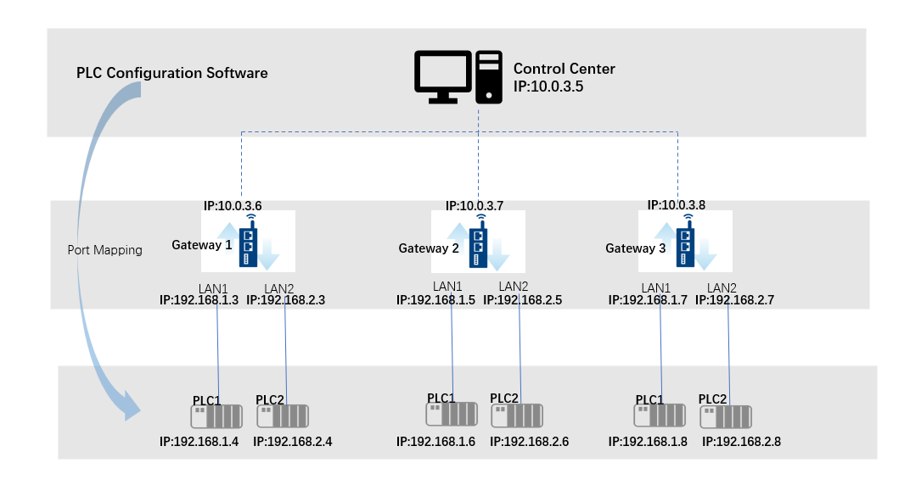
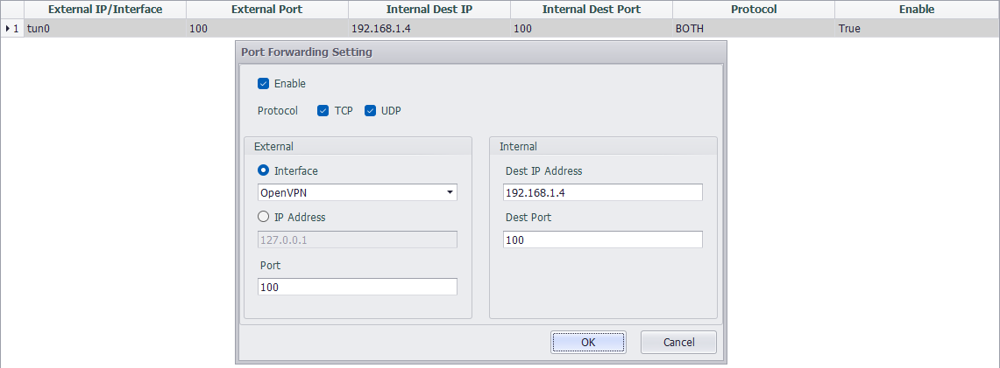
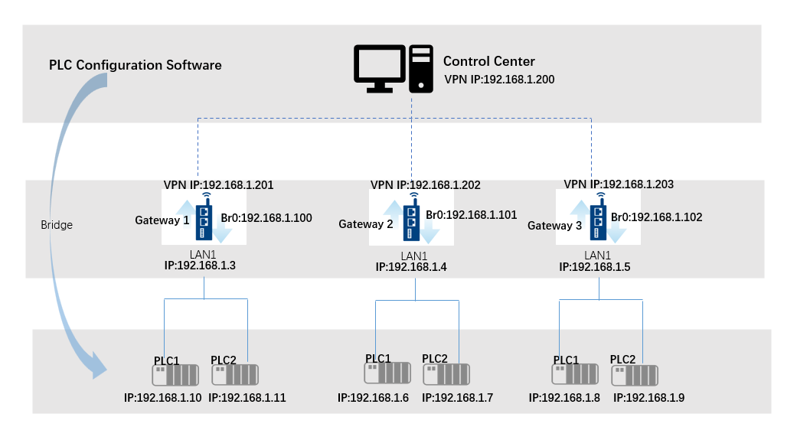
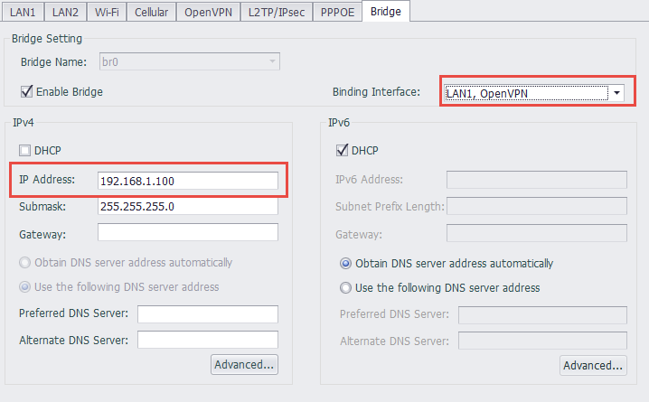
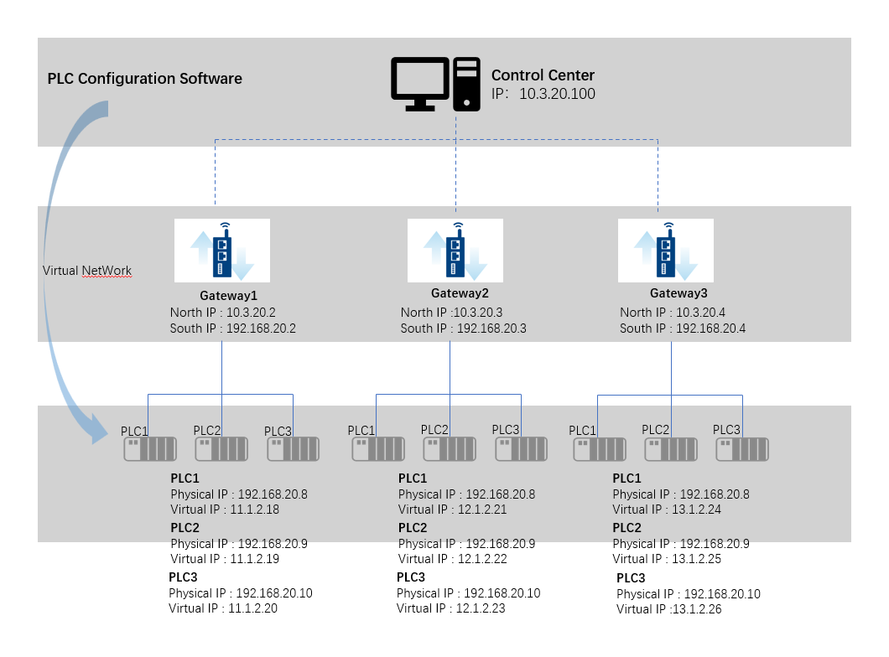
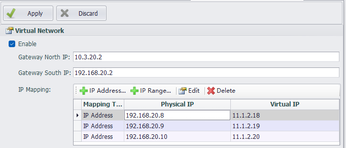
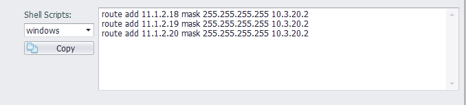

## Ethernet PLC Remote Operation and Maintenance

### Scenario 1

When a single Ethernet port of the gateway is connected to only one PLC, and the PLC configuration software transmits data through a fixed port, remote operation and maintenance can be directly achieved by using port forwarding.

For example, a PC (control center) establishes a network connection with the gateway via VPN. The gateway's LAN1 IP is: 192.168.1.3, and the IP of the PLC connected to LAN1 is: 192.168.1.4. The PLC communication software uses a communication port of: 100.

#### Operational Steps:

1. Configure the port forwarding on the gateway using EdgeLink Studio and download the project.

2. Open the PLC communication software at the control center to configure the PLC.

### Scenario 2

When a single Ethernet port of the gateway connects to multiple PLCs (if there are multiple gateways on site, please note: the IP addresses of the PLCs connected under each gateway must not be duplicated), remote operation and maintenance can be achieved using network bridging.

For example, a PC (control center) establishes a network connection with the gateway via VPN, and the VPN IP is set to be in the same subnet as the PLC. As shown in the figure, the PC (control center) VPN IP is: 192.168.1.200, the gateway VPN IP is: 192.168.1.201, the gateway's LAN1 IP is: 192.168.1.3, and the IP of the PLC connected to LAN1 is: 192.168.1.10.

#### Operational Steps:

1. When deploying VPN, set the IP address to be in the same subnet as the PLC.

2. Use EdgeLink Studio to set up the VPN and LAN1 bridge together, and download it to the gateway. For example, set the br0 IP to: 192.168.1.200.

3. Open the PLC communication software at the control center to configure the PLC.

### Scenario 3

When a single Ethernet port of the gateway is connected to multiple PLCs, and the IP addresses of the PLCs connected under multiple gateways are duplicated, virtual networking functionality is required to achieve remote operation and maintenance. (Scenarios 1 and 2 can also be achieved through virtual networking, but port forwarding and network bridging configurations are simpler and easier to get started with, so the methods for scenarios 1 and 2 are recommended.)

#### Operational Steps:

1. Set up virtual networking through EdgeLink Studio and download it to gateway 1 (other gateways should be configured according to the actual virtual networking).

2. Configure the corresponding route at the control center. EdgeLink Studio provides a reference script, which can be copied and directly executed in the command line at the control center.

3. Open the PLC communication software at the control center to configure the PLC.

For detailed configuration introduction of virtual networking, please refer to the [2.9.1.6 Virtual Network](../systemsetting/VirtualNetwork.html) section.
