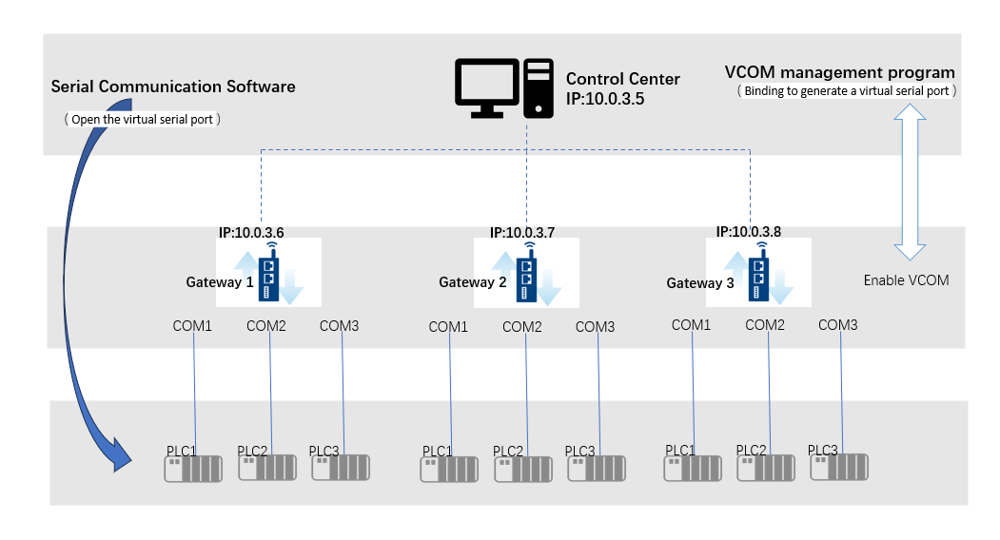

## Serial PLC Remote Operation and Maintenance

The general scenario involves a network connection (such as VPN) between the PC (control center) and the gateway, with serial devices (such as PLCs) connected below the gateway. Customers expect to use the serial communication software that comes with the serial devices to configure the serial devices on the PC (control center).

### Architecture:

#### Operational Steps:

1. Enable the VCOM function on the gateway using EdgeLink Studio and download the configuration file to the gateway.

2. Install the VCOM management program on the PC (control center). The download link for the VCOM management program installation package is: [VCOM Utility](https://www.advantech.tw/support/details/utility?id=1-24KJ5E7){target="_blank"}. You can download the installation package that starts with "SetupEdgeLinkVCOM".

3. Virtualize the gateway's serial port to the PC (control center) using the VCOM management program. For example, if COM1 of Gateway 1 is connected to PLC1 and you want to configure this PLC, bind COM1 of Gateway 1 to the VCOM management program. At this point, you can see the virtualized serial port and its port number in the VCOM management program.

4. Open the virtual serial port through the serial communication software on the PC (control center) to configure the serial device.

**For detailed instructions on configuring the VCOM management program, please refer to the [2.9.8 VCOM](../systemsetting/VCOM.html) section.**

