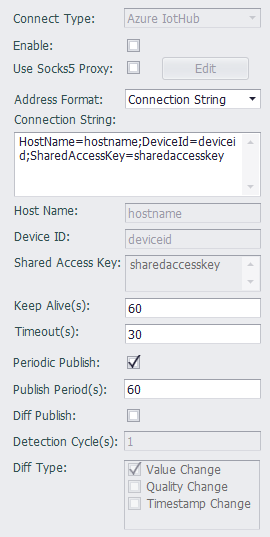

## Azure IoT Hub



When connecting to the Microsoft Azure cloud, the connection type must be Azure IoTHub, and the client needs to configure the connection string provided by the cloud.

Users can directly edit the connection string, or generate a connection string by setting the attributes: Host Name, Device ID, and shared Access Key.

Since v2.8.1, the bottom layer of EdgeLink uses the Microsoft Azure IoT SDK to connect to the Azure IoT Hub, so the communication-related parameters other than the connection string do not need to be set.

If you are using this plugin in the environment of an IoT Edge-launched EdgeLink Container, you do not have to enable resumable uploads, as IoT Edge will cache the transferred data.

This plugin supports the following [Direct Method](https://docs.microsoft.com/en-us/azure/iot-hub/iot-hub-devguide-direct-methods), please note that method names are case sensitive.

### 1. GetVersion - Get EdgeLink version information

**Method Name**: `GetVersion`

**Parameters**: none

**Return Value**: JSON object, where the `Result` parameter indicates whether the call result is successful or not, `Success` indicates success, and `Error` indicates failure. The content of the `Content` parameter in the successful result is the EdgeLink version information, and the content of the `Error` parameter in the failure result indicates the reason for the failure. Please refer to the return value example below.

Example of return value when the call is successful:
````json
{
	"Result": "Success",
	"Content": "ADAM-3600-C2GL1A1E Standard Edition image version 2.8.0 Release Dec 29 2021"
}
````

Example of return value when the call fails:
````json
{
	"Result": "Error",
	"Error": "fail to read version file"
}
````

**Remarks**: None

### 2. PubAllTags - Publish all tag values ​​in the tag list at once

**Method Name**: `PubAllTags`

**Parameters**: none

**Return Value**: None

**Remarks**: After the gateway receives this method call, it will immediately publish a message containing the current values ​​of all tags in the tag list. Please note that the content of the message will not be returned from the direct method, but will be published to the data topic.


### 2. ReadTag - Read tag value

**Method Name**: `ReadTag`

**Parameters**: JSON object, including an array of tag names and related read parameters, where the `tags` parameter is a string array, including all the tag names that need to be read; the `value_as_string` parameter is a boolean value, used for control tags Whether the value is returned as a string, the default value is `false`, i.e. not returned as a string.

Example: The following call parameters will read three tags named tag1, tag2 and tag3 and return the tag value as a string.
````json
{
	"tags": ["tag1","tag2","tag3"],
	"value_as_string": true
}
````

**Return Value**: JSON object, where the `tags` parameter is the object type, including all requested tag values, each object parameter corresponds to a tag, the parameter name is the tag name, and the parameter value is the tag value.

Example:

When there is no `value_as_string` in the calling parameter or its value is false, an example of the return value is as follows:
````json
{
	"tags": {
		"tag1": false,
		"tag2": 3.1415926,
		"tag3": 1.28
	}
}
````

When there is `value_as_string` in the call parameter and its value is true, an example of the return value is as follows:
````json
{
	"tags": {
		"tag1": "0",
		"tag2": "3.1415926",
		"tag3": "1.28"
	}
}
````

**Remarks**: None

### 2. WriteTag - Write tag value

**Method Name**: `WriteTag`

**Parameters**: JSON object, including all the tag values ​​to be modified, each object parameter corresponds to a tag, the parameter name is the tag name, the parameter value is the tag value, the tag value can be a string type or can is a numeric type or a boolean type.

Example:
````json
{
	"tag1": false,
	"tag2": "3.1415926",
	"tag3": 1.28
}
````

**Return Value**: JSON object, where the `Result` parameter indicates whether the call result is successful or not, `Success` indicates success, and `Error` indicates failure. The successful result has no additional parameters, and the `Error` parameter in the failed result indicates the reason for the failure. Please refer to the return value example below.

Example of return value when the call is successful:
````json
{
	"Result": "Success"
}
````

Example of return value when the call fails:
````json
{
	"Result": "Error",
	"Error": "Cannot found tag handle!"
}
````

### Others

[Tag List](./others/TagList_Setting.html)   

[resume](./others/resume.html)

[export/import](./others/excel.html)