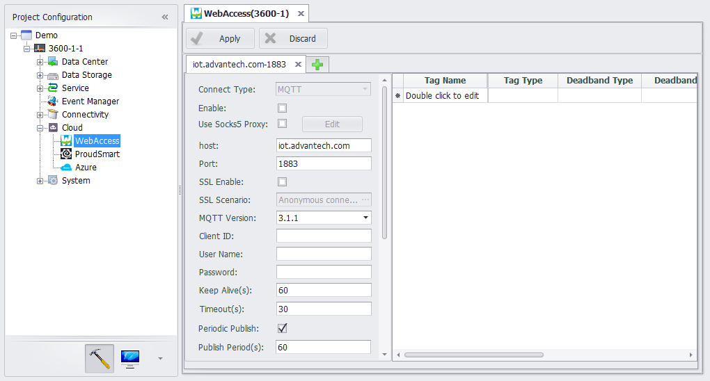
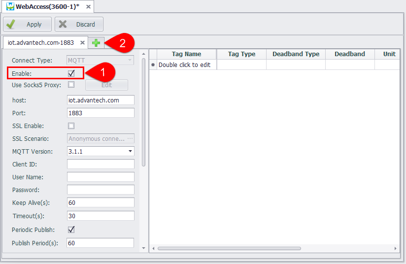
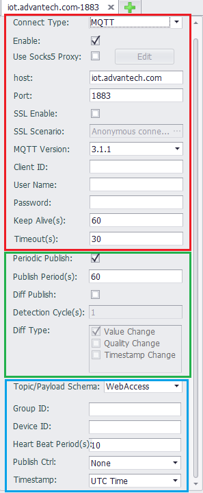
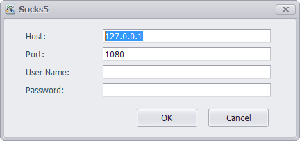
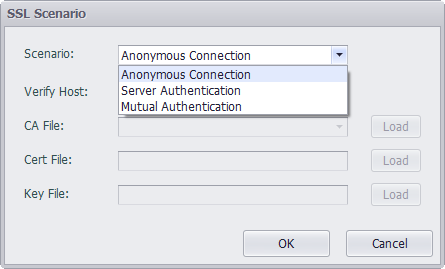
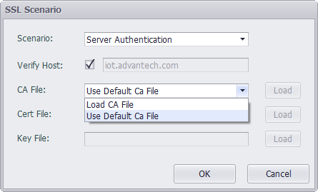
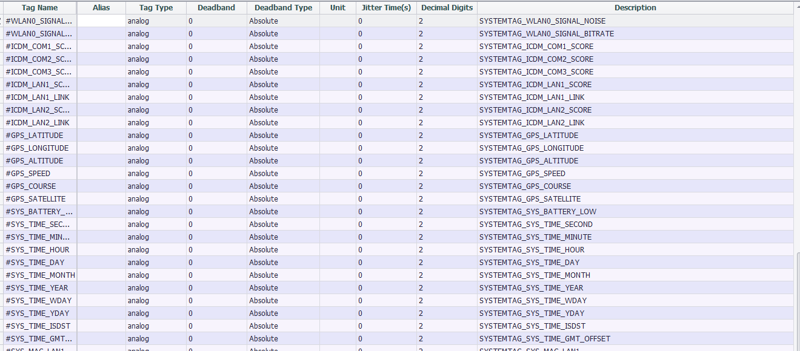

## Cloud Service

EdgeLink can communicate with the IoT center device on the cloud via the MQTT protocol. Currently, EdgeLink supports communication with IoT center of Baidu cloud, Azure and other cloud service providers. 

In EdgeLink Studio, users can configure devices on the cloud service page to upload device tag information to the IoT Center, and support uploading to multiple different types of IoT centers.

Users need to configure IoT center connection properties and upload conditions, receive service attributes, tags to be uploaded and other information.

According to different connection types, EdgeLink supports multiple cloud services, which configure corresponding connection information respectively.

---

### Basic Configuration

1. For the configuration to take effect, users must check "**Enable**". This switch can be used reasonably during the debugging phase to test multiple connections added in the same cloud service type.
2. Click the "+" button on the right of the main page to add multiple connections to the cloud service. Each cloud service type allows up to 4 connections to be added.

---

#### Cloud Connection Properties and Upload Conditions

EdgeLink uses the standard MQTT protocol specification to connect to cloud services, so most cloud service types have the same configuration interface in the MQTT connection settings section. The Azure IoT Hub is an exception. Because Microsoft uses connection string configuration to provide user login credentials, the Azure IoT Hub connection configuration will be different. See the Azure IoT Hub configuration page for details.

As shown in the following figure, the MQTT configuration interface, the red frame is the configuration information connected to the broker, the green frame is the configuration information of the data upload, and the blue frame is the configuration information specific to each cloud service type. This section will be described in detail on the description page for each cloud service type.

##### Connection Configuration Section

- **Use Socks5 Proxy** - If the device is used in a network environment that requires a proxy server to connect to the MQTT Broker, then the SOCKS5 proxy needs to be enabled. Click the Enable check box and then click the "Edit" button to set the SOCKS server information in the pop-up box. As shown below, you can set the IP address, port number, user name and password of the SOCKS5 proxy server.

	

- **Host** - The IP or domain name of entering the MQTT Broker.

- **Port** - Enter the listener port number of the MQTT Broker. By default, the unencrypted TCP port is 1883 and the encrypted TLS port is 8883. EdgeLink does not currently support WebSocket connections.

- **SSL Enable** - If the Broker requires an SSL/TLS connection, then SSL needs to be enabled and selected from three authentication methods depending on the configuration provided by the Broker:

	1. Anonymous connection: Only encrypted connections are provided, and the communicating parties do not verify the identity.

	2. Server authentication: The device side verifies the authenticity of the cloud server, and the cloud server is required to provide the CA file. EdgeLink comes with some public server certificate files. If you are connected to a public cloud, you can try to use the default CA file. If you use a self-signed certificate for your own server, you will not be able to authenticate with a third-party certificate authority. In this case, in addition to loading the CA file to the device, you need to cancel the verification host name, otherwise the connection will not succeed. set up.

	3. Mutual authentication: The difference from the server-side authentication is that in this case, the cloud server needs to verify the identity of the device. In this case, in addition to processing the CA file of the server, the certificate file and the key file of the device need to be loaded. When the cloud server is connected, the device side will authenticate with the cloud server side.

		

		

- **MQTT Version** - Specify the version of the MQTT specification that the communication parties follow. Generally, the default version 3.1.1 can be used. If the Broker has special requirements, it can be configured according to its requirements.

- **Client ID** - Client ID is used by the Broker to distinguish multiple clients connected to it. Please enter a unique client ID here. If the Broker supports it, you can leave it blank for automatic distribution by the Broker.

- **User Name** - The username used to connect to the Broker, please follow the instructions of the Broker. If you are configuring a connection to WISE-PaaS, you can leave it blank here. The WISE-PaaS protocol plugin will get the corresponding username and password through the DCCS API.

- **Password** - The password used to connect to the Broker.

- **Keep Alive** - The unit is seconds. According to the MQTT protocol, when there is no communication between the device and the Broker within a certain period of time, the MQTT PING message must be sent to the Broker to maintain the connection. The setting of this parameter should be determined according to the actual project needs and combined with the configuration of the Broker.

- **Timeout**. The unit is in seconds. Define the maximum time interval for the client to send information to the cloud.

##### Data Upload Configuration Section

There are two modes of data uploading. One is regular upload, that is, to report all the tag instant data in the tag list on the right side at a fixed time interval; the other is change upload. In this mode, the program checks the change of the tag with the configured detection period and detection condition, and uploads the real-time data of the changed tag when the tag change is detected.

Both the regular upload and change upload modes can be enabled at the same time, or only one of them can be enabled. The recommended configuration method is to enable regular upload and change upload at the same time. The detection period of the change upload is set to a shorter time, and the period of the periodic upload is set longer, so that the data can be considered in real time and effective, and reduce bandwidth usage.

- **Periodic Upload**: The enable switch of periodic upload.

- **Publish Period**: Select the upload cycle for data during periodic uploads.

- **Diff Upload**: The enable switch of change upload.

- **Detection Cycle**: Specify the detection period for detecting tag changes.

- **Diff Type**: Select to detect parameter changes for tags. Optional parameters include tag value, quality, and timestamp. The detection of the change of the tag value is affected by the three parameters of the threshold type, the Deadband and the jitter time configured in the tag table. For details, see the tag table configuration description below.

---
### Tag Table Configuration

The tag table is used to add the data center tags to the MQTT connection. Each connection can have its own tag table configuration to meet the needs of different cloud servers.

- **Tag Name**: Double-click this field to add or select a tag in the device.

- **Alias**: Set the name when uploading data. Use the tag name as the data name when the alias is empty.

- **Tag Type**: Displays the data type of the tag. This item is a read-only item and cannot be modified in this tag table. If you need to modify it, please modify the original tag attribute in the data center.

- **Deadband Type**: Used to configure the change detection method of tag values. There are two ways: absolute value and percentage. When the type is configured as an absolute value, the difference between the current tag value of the tag and the last uploaded tag value is taken as an absolute value and compared with the *Deadband*, and if it is exceeded, the tag is considered to have changed; When the type is configured as a percentage, the difference between the current tag value of the tag and the last uploaded tag value is taken as an absolute value and compared with the last uploaded tag value. If the change exceeds the *Deadband*, the tag is considered to have changed.

- **Deadband**: Used to specify the Deadband value of the tag detection. The value change of the tag does not trigger the tag value change within the threshold.

- **Unit**: Read-only item, when the Deadband type is percentage, a percent sign is displayed to distinguish it from the absolute value.

- **Jitter time**: The unit is second. When the detected tag value exceeds *Deadband*, verification of *jitter time* will start. When the tag value is detected as exceeding the *Deadband* within the specified *jitter time*, it will be finally judged as a little value change, and the changed value will be uploaded at this time, otherwise it will be judged as tag value jitter. Not uploaded.

- **Decimal Digits**: The number of digits after the decimal tag for specifying the analog tag value. The default is 2. When the actual tag value has only one integer value, you can set this field to 0 to save data traffic.

- **Description**: The description of the tag. This item is a read-only item and cannot be modified in this tag table. If you need to modify it, please modify the original tag attribute in the data center.
