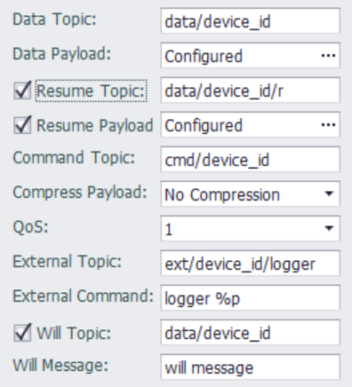

## Custom MQTT

Custom MQTT provides a customized topic / payload scheme in which topic / payload can be defined by the user to test and verify MQTT data communications or to be applied to cloud services that require customized development.
In addition to tag data upload and modification, Custom MQTT also supports the ability of the server to deliver messages of a specific topic to perform the specified commands for special application extensions.

---
### Parameter settings



- **Data Topic**: Required fields that specify topics for publishing real-time data. To facilitate parsing of data packets from different devices on the cloud server, it is recommended to add the device unique identifier to the topic when setting this topic.
- **Data Payload**: Required fields that specify payload for publishing real-time data.

    [Payload Configuration instructions](../resume/Libextext.html)

- **Resume Topic**: Optional, specifies the topic for publishing resuming data. If this field is not set, then the topic specified in `Data Topic` will be used.

- **Resume payload**: Optional, specifies the payload for publishing resuming data. If this field is not set, then the load specified in `Data Payload` will be used.

    [Payload Configuration instructions](../resume/Libextext.html)

- **Command Topic**: Optional, specifies the subject to receive the command. Publishing data from the cloud server to the topic can modify the tag value on the device. The format of the data is as follows. Tags and Tags value are defined by the user. There can be no timestamp data in the write packet (that is, ts). If this field is not filled in, the device will not accept the command to modify the value of the cloud service.

   The example of modifying the value of a packet is as follows: The following packet will write the value of AO\_1 as 12.88 and the value of AO\_2 as 18.76.

   ```json
   {
       "w":[
           {
               "tag":"AO_1",
               "value":12.88
           },
           {
               "tag":"AO_2",
               "value":18.76
           }
       ],
       "ts":"2017-12-28T12:22:21+0000"
   }
   ```
  
- **Compress Payload**: This option controls whether to use GZIP to compress the message payload. By default, the payload is not compressed. If this option is set to GZIP compression, you must make sure that the cloud platform also uses the same GZIP method for decompression. At the same time, the `cmd` payload must also be GZIP compressed message content.

- **QoS**: This option is used to control the quality of service used when publishing messages. The default value is QoS 1.

   * `QoS 0`: Distributed at most once, the distribution of messages depends on the capabilities of the underlying network. The recipient will not send a response and the sender will not retry. The message may or may not be delivered at all.
   * `QoS 1`: Distribute at least once, the quality of service ensures that the message is delivered at least once.
   * `QoS 2`: Distribute only once, which is the highest level of quality of service, and message loss and duplication are unacceptable. There is an additional overhead in using this quality of service level.

- **External Topic**: This option is used to set the topic for external command. If set, the device will subscribe this topic, and will execute the command specified in "External Command" when the message arrived. 

- **External Command**: This option is used combined with the "External Topic", to specify the command line to be executed when message arrived.
For example: `logger %p`, this command will output the message payload to syslog when it is executed。<br>
The command line can have arguments, the following patterns supported in the command line:

	* %t: Topic, this pattern will be substitute by the topic when executing.
	* %p: Payload, this pattern will be substitute by the payload when executing.
	* %pf: Payload file, this pattern will be substitute by a file contains the payload when executing.

	> Note: Don't use `newline` or one of `|, &, ;, <, >, (, ), {, }` in the command string,
	and because of the MQTT application is running as unprivileged user, please don't specify any command needs to run in privileged mode.

- **Will Topic**: Optional, specifies the topic for publishing will message.

- **Will message**: Optional, specifies the content for publishing will message.

### Others

[Tag List](./others/TagList_Setting.html)   

[resume](./others/resume.html)

[export/import](./others/excel.html)