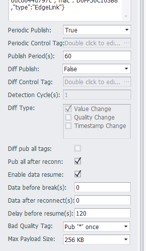
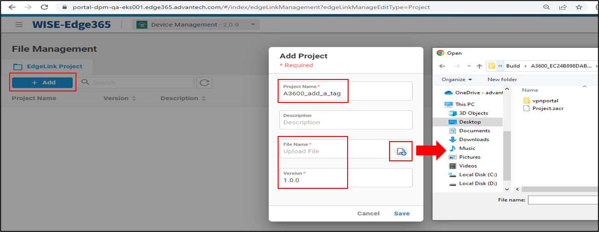
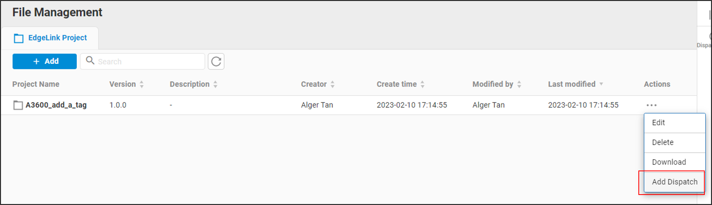
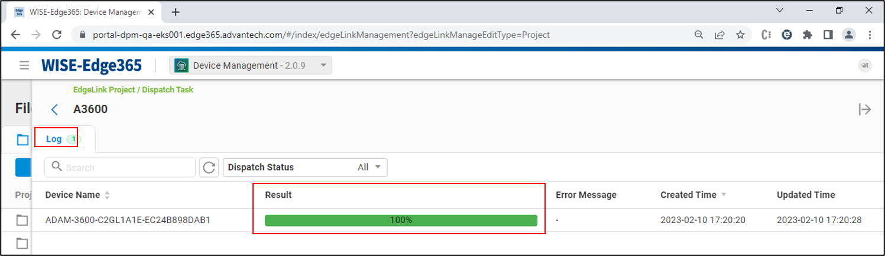
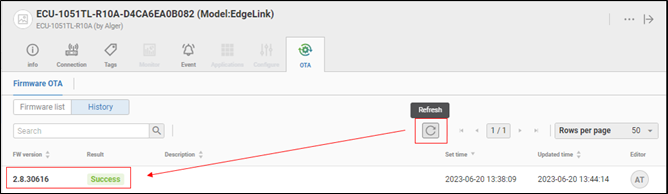

## EdgeSync 360/EdgeHub

### precondition：

$\qquad$ 1.  _The prerequisite for establishing a connection between a gateway and EdgeSync 360/EdgeHub is to create a device in EdgeSync 360/EdgeHub and obtain a connection string_

$\qquad$ 2. _The prerequisite for downloading a project or upgrading an image for a gateway through EdgeSync 360/EdgeHub is that a connection between the gateway and EdgeSync 360/EdgeHub has already been established_

### function list：

 - [Obtaining the connection string in EdgeHub](#the-steps-of-get-connection-string)
 - [Establishing a connection between a gateway and EdgeHub](#establishing-a-connection-between-a-gateway-and-EdgeHub)
 - [Uploading data to EdgeHub](#uploading-data-to-EdgeHub)
 - [Downloading projects to the gateway through EdgeHub](#downloading-edgelink-studio-generated-project-files-to-the-gateway-through-EdgeHub)
 - [Upgrading the image on the gateway through EdgeHub](#upgrading-the-image-on-the-gateway-through-EdgeHub)

#### **the steps of get connection string ：**

1. In EdgeLink Studio, select the online page for the gateway you want to add to EdgeSync 360/EdgeHub, right-click, and choose "Copy device information to clipboard"

2. Open the EdgeSync 360/EdgeHub login page, enter your username and password to log in

3. Device Management

4. Select the option to add an EdgeLink device

5. Paste from Clipboard

6. Click on the newly added device, and the device information will appear on the right side. Copy the "Credential" to the clipboard

#### **Establishing a connection between a gateway and EdgeHub：**

1. Open the EdgeLink Studio project configuration page for EdgeSync 360/EdgeHub by selecting "Project" > "Cloud Service" > "Advantech" > "EdgeSync 360/EdgeHub", and enable the connection

2. Paste the "Credential Key" into the corresponding field

3. Configure connection parameter, [ parameter description](#parameter-description)

4. Configure tag point, [the parameter description of tag](#the-parameter-description-of-tag)

5. Download the project file to the gateway

6. View the device as online in EdgeHub

#### **Uploading data to EdgeHub**

$\qquad$ _The gateway is already online in EdgeSync 360/EdgeHub_

1. Click the online gateway---> Tags

2. For more detailed instructions on additional features, please refer to the relevant documentation of EdgeSync 360/EdgeHub

#### **Downloading Edgelink-Studio generated project files to the gateway through EdgeHub**

1. Uploading project files to EdgeSync 360/EdgeHub

    Method 1：Uploading project files to EdgeSync 360/EdgeHub through EdgeLink Studio

    step 1. Save the project and click "Export for EdgeSync 360"

    

    step 2. After seeing the "Compile success" message, click "Copy Path"

    

    step 3. Navigate to the project loading interface in EdgeSync 360/EdgeHub

    Method 2：Directly add the project file generated by EdgeLink Studio to EdgeSync 360/EdgeHub

    step 1. Click on "File Management" in the EdgeSync 360/EdgeHub interface

    

    step 2. Add the project file

    

2. Find the corresponding project file in EdgeSync 360/EdgeHub and click Add Dispatch

    

3. Add a Dispatch, enter a dispatch name, and select the corresponding device

    

4. Click "Submit" to confirm and submit the dispatch

    

5. View the dispatch results

    

#### **Upgrading the image on the gateway through EdgeHub**

1. Confirm that the device is online and click to enter the functional page.
2. Select the "OTA" feature
3. Click on "Firmware list" under "Firmware OTA" to view all files available for upgrade
4. Click on the "..." behind "2.8.30616" and select "Download And Upgrade"

    

5. You will see the message "Set firmware download success..."

    

6. At this point, the user can click on "History" under "Firmware OTA" to view the current upgrade status

    

7. Click on the "Refresh" button to refresh the current upgrade status until you see "Success", which means the upgrade was successful

    

*************************

###  parameter description

| parameter |  parameter description                                                                                                                                 |
| ------------------ | -------------------------------------------------------------------------------------------------------------------------------|
|`Connection Type`| MQTT type                                                                                                             |
|`Enable`|Check the box to activate the connection for the current page, and the current page configuration will take effect                                                                                          |
| `skip certificate validation` | Check the box to skip the certificate validation                                 |
| `Periodic Publish`  |  Periodic Upload Mode: Enable, Disable, and start by tag                |
|`Periodic Publish`|Periodic Upload Mode: Enable, Disable, and start by tag                                                                                  |
|`Periodic Control Tag`|Select the periodic upload control tag. Upload data when the value of the point is not 0; do not upload data when the value of the point is 0                                                                          |
|`Publish Period`|Periodic Upload Period, units seconds                                                                                                                  |
|`Diff Publish`|Trigger Upload Mode: Enable, Disable, and start by tag Upload                                                                                                |
|`Diff Control Tag`|Select the trigger upload control tag. Upload data when the value of the point is not 0; do not upload data when the value of the point is 0                                                                          |
|`Detection Cycle`|Detection Period for tag Change Detection                                                                                                                        |
|`Diff Type`| the type of Diff Publish |
|`Diff pub all tags`| pub all tags in list when Diff Publish |
|`Pub all after reconn`|When EdgeLink establishes a connection with the cloud, does it upload the current values of all points once to the cloud, with enabling sending and disabling not sending? The default setting is enabling sending                                           |
|`Enable data resume`|Enable switch for resume upload from break                                                                                                                  |
|`Data before break`|Default: 0, resume uploading data from the most recent n seconds before the disconnection                                                                                                                  |
|`Data after reconnect`|Default: 0, resume uploading data until the most recent n seconds after the  reconnection                                                                                                |
|`Delay before resume`|Default: 120, resume uploading data after an interval of n seconds after the reconnection                                                                                                    |
|`Bad Quality Tag`|Upload mode for Tag Quality not equal to 0 (GOOD)：Pub * once; Pub * always; Still pub value; Don't pub                                          |

********************************************************

### the parameter description of tag

- **Tag Name**: Double-click this field to add or select a tag in the device.

- **Alias**: Set the name when uploading data. Use the tag name as the data name when the alias is empty.

- **Tag Type**: Displays the data type of the tag. This item is a read-only item and cannot be modified in this tag table. If you need to modify it, please modify the original tag attribute in the data center.

- **Deadband Type**: Used to configure the change detection method of tag values. There are two ways: absolute value and percentage. When the type is configured as an absolute value, the difference between the current tag value of the tag and the last uploaded tag value is taken as an absolute value and compared with the *Deadband*, and if it is exceeded, the tag is considered to have changed; When the type is configured as a percentage, the difference between the current tag value of the tag and the last uploaded tag value is taken as an absolute value and compared with the last uploaded tag value. If the change exceeds the *Deadband*, the tag is considered to have changed.

- **Deadband**: Used to specify the Deadband value of the tag detection. The value change of the tag does not trigger the tag value change within the threshold.

- **Unit**: Read-only item, when the Deadband type is percentage, a percent sign is displayed to distinguish it from the absolute value.

- **Jitter time**: The unit is second. When the detected tag value exceeds *Deadband*, verification of *jitter time* will start. When the tag value is detected as exceeding the *Deadband* within the specified *jitter time*, it will be finally judged as a little value change, and the changed value will be uploaded at this time, otherwise it will be judged as tag value jitter. Not uploaded.

- **Decimal Digits**: The number of digits after the decimal tag for specifying the analog tag value. The default is 2. When the actual tag value has only one integer value, you can set this field to 0 to save data traffic.

- **Description**: The description of the tag. This item is a read-only item and cannot be modified in this tag table. If you need to modify it, please modify the original tag attribute in the data center.

