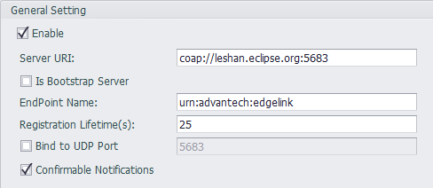
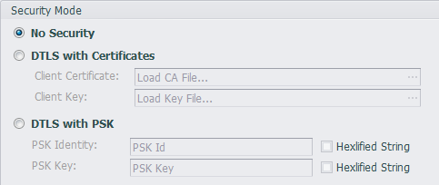
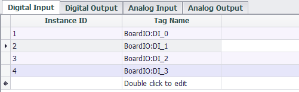

## LwM2M

The LwM2M cloud service plug-in is used to support the OMA Lightweight M2M protocol to implement remote management of devices on the cloud platform. See [Supported Objects and Resources](#supported-objects-and-resources) for the capability of this plug-in.

### Settings

####  General Settings

- **Enable**: Check to enable this plugin
- **Server URI**: Enter the full URI of the server.
- **Is Bootstrap Server**: If the `Server URI` related to a Bootstrap Server, it should be checked here.
- **EndPoint Name**: Enter the end point name of this device. This name should be named according to the management rules of the server.
- **Registration Lifetime(s)**: Specify how often this device is registered with the server, in seconds.
- **Band to UDP Port**: Check this box and fill in the value of 1 ~ 65534 to band the Lightweight M2M device to the specified port.
- **Confirmable Notifications**: Lightweight M2M messages can be sent as a Non-confirmable or as a Confirmable message, you can specify the behavior of the client by this option.

#### Security Mode

- **No Security**：Select this option to use an in-secure connection. In this case, the `Server URI` should be filled with `coap://` instead of the address starting with `coaps://`. Conversely, if you choose the two security options below, then the `Server URI` should be filled with the address starting with `coaps://`.
- **DTLS with Certificates**：Use a secure connection for a given client certificate. Load the client certificate file in the `Client Certificate` and load the client certificate key file in the `Client Key`.
- **DTLS with PSK**：Use the secure connection of the given PSK method. Please fill in the PSK string in `PSK Identity`. If the string is a hexadecimal format string, please check the `Hexlified String` option. Fill the `PSK Key` with the PSK key and check the `Hexlified String` option as appropriate.

#### Tag List Settings

Currently, you can map the tag to the four I/O objects defined by the IPSO (Digital Input, Digital Output, Analog Input, Analog Output). In the four types of tag lists, double-click the tag name field and select the tag to be mapped in the dialog, then the tag will be added to the tag list.

The default `Instance ID` is automatically incremented, you can click the `Instance ID` field to modify it.

### Supported Objects and Resources

<table>
   <tr>
      <td><b>Object<b></td>
      <td><b>Object ID<b></td>
      <td><b>Resource<b></td>
      <td><b>Resource ID<b></td>
   </tr>
   <tr>
      <td rowspan="6">LwM2M Security</td>
      <td rowspan="6">0</td>
      <td>LWM2M Server URI</td>
      <td>0</td>
   </tr>
   <tr>
      <td>Bootstrap-Server</td>
      <td>1</td>
   </tr>
   <tr>
      <td>Security Mode</td>
      <td>2</td>
   </tr>
   <tr>
      <td>Public Key or Identity</td>
      <td>3</td>
   </tr>
   <tr>
      <td>Server Public Key</td>
      <td>4</td>
   </tr>
   <tr>
      <td>Secret Key</td>
      <td>5</td>
   </tr>
   <tr>
      <td rowspan="9">LwM2M Server</td>
      <td rowspan="9">1</td>
      <td>Short Server ID</td>
      <td>0</td>
   </tr>
   <tr>
      <td>Lifetime</td>
      <td>1</td>
   </tr>
   <tr>
      <td>Default Minimum Period</td>
      <td>2</td>
   </tr>
   <tr>
      <td>Default Maximum Period</td>
      <td>3</td>
   </tr>
   <tr>
      <td>Disable</td>
      <td>4</td>
   </tr>
   <tr>
      <td>Disable Timeout</td>
      <td>5</td>
   </tr>
   <tr>
      <td>Notification Storing When Disabled or Offline</td>
      <td>6</td>
   </tr>
   <tr>
      <td>Binding</td>
      <td>7</td>
   </tr>
   <tr>
      <td>Registration Update Trigger</td>
      <td>8</td>
   </tr>
   <tr>
      <td rowspan="11">Device</td>
      <td rowspan="11">3</td>
      <td>Manufacturer</td>
      <td>0</td>
   </tr>
   <tr>
      <td>Model Number</td>
      <td>1</td>
   </tr>
   <tr>
      <td>Serial Number</td>
      <td>2</td>
   </tr>
   <tr>
      <td>Reboot</td>
      <td>4</td>
   </tr>
   <tr>
      <td>Error Code</td>
      <td>11</td>
   </tr>
   <tr>
      <td>Current Time</td>
      <td>13</td>
   </tr>
   <tr>
      <td>UTC Offset</td>
      <td>14</td>
   </tr>
   <tr>
      <td>Timezone</td>
      <td>15</td>
   </tr>
   <tr>
      <td>Supported Binding and Modes</td>
      <td>16</td>
   </tr>
   <tr>
      <td>Device Type</td>
      <td>17</td>
   </tr>
   <tr>
      <td>Software Version</td>
      <td>19</td>
   </tr>
   <tr>
      <td rowspan="2">IPSO Digital Input</td>
      <td rowspan="2">3200</td>
      <td>Digital Input State </td>
      <td>5500</td>
   </tr>
   <tr>
      <td>Application Type</td>
      <td>5750</td>
   </tr>
   <tr>
      <td rowspan="2">IPSO Digital Output </td>
      <td rowspan="2">3201</td>
      <td>Digital Output State</td>
      <td>5550</td>
   </tr>
   <tr>
      <td>Application Type</td>
      <td>5750</td>
   </tr>
   <tr>
      <td rowspan="2">IPSO Analogue Input</td>
      <td rowspan="2">3202</td>
      <td>Analog Input Current Value</td>
      <td>5600</td>
   </tr>
   <tr>
      <td>Application Type</td>
      <td>5750</td>
   </tr>
   <tr>
      <td rowspan="2">IPSO Analogue Output</td>
      <td rowspan="2">3203</td>
      <td>Analog Output Current Value</td>
      <td>5650</td>
   </tr>
   <tr>
      <td>Application Type</td>
      <td>5750</td>
   </tr>
</table>
