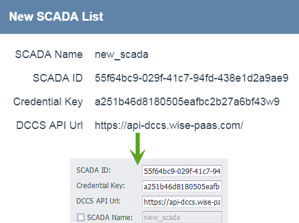
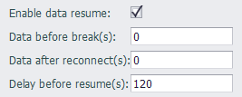

## WISE-PaaS/DataHub

The WISE-PaaS/DataHub plug-in  supports sending tag data to WISE-PaaS/DataHub cloud service. It supports device configuration data upload in Plug&Play, and does not support modifying device configuration from cloud.

Because the WISE-PaaS/DataHub connection depends on the DCCS API to get the connection parameters, the basic connection parameters in the setting configuration will be ignored. Please copy and paste the `DataHub ID`, `Credential Key` and `DCCS API Url` generated on the website to the the corresponding field as following figure shows.

`SCADA Name` is optional. When not specified, the name of the gateway node configured in the project will be used.

WISE-PaaS/DataHub data uses a sub-device model to upload data. The name of the child device is distinguished by the colon (:)  in the tag name or alias. The name before the colon is used as the child device name, and the name after the colon is used as the actual uploaded point name. If there is no colon in the name or alias, `SCADA Name` is used. 

#### Data resume

- **Data before break(s)** :0(default) Cache the data n seconds before disconnection and send it to the server after reconnection
- **Data after reconnect(s)** :0(default)  Cache the data n seconds after reconnection and send it to the server after reconnection
- **Delay before resume(s)** :120(default)  Wait n seconds after reconnecting to the server before starting data transmission

### Others

[Tag List](./others/TagList_Setting.html)   

[resume](./others/resume.html)

[export/import](./others/excel.html)
