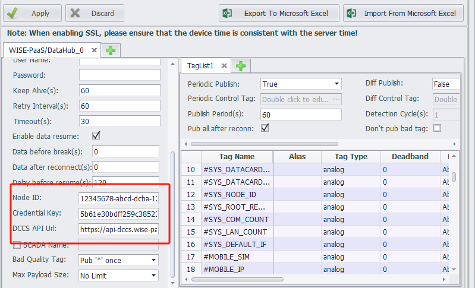
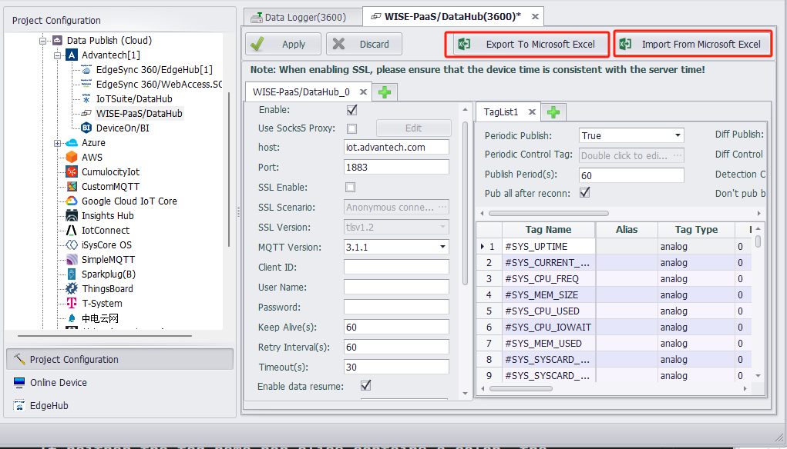

## WISE-PaaS/DataHub

&emsp;&emsp;The WISE-PaaS cloud service plugin in EdgeLink supports connection with WISE-PaaS/DataHub, enabling Plug&Play device configuration data upload. However, it does not support modifying device configurations from DataHub. This feature has been available since EdgeLink_v2.2.0.

### 1. Quick Connection

&emsp;&emsp;This example demonstrates how to establish a periodic upload connection with a 5-second interval between EdgeLink and WISE-PaaS/DataHub. For other settings, refer to [Detailed EdgeLink Project Configuration](#jump1).

(1) Obtain WISE-PaaS/DataHub Connection Information

- Add a Project in WISE-PaaS/DataHub;
- Add a Node to the Project, which will generate `DataHub ID`, `Credential Key`, and `DCCS API Url`;


(2) Configure EdgeLink Project

- Double-click WISE-PaaS/DataHub under Cloud Services in the EdgeLink Studio project configuration panel to configure WISE-PaaS/DataHub_0;
- Enable the connection;
- Set the upload interval to 5 seconds;
- Add the tag list to be uploaded to WISE-PaaS/DataHub;


- Enter the `DataHub ID`, `Credential Key`, and `DCCS API Url` generated in step 1 into the corresponding fields in the EdgeLink Project;



- Keep other connection parameters as default.

(3) Verify Successful Connection

- Download the EdgeLink project;
- After successful restart, real-time data will be visible in the WISE-PaaS/DataHub interface, indicating successful connection and data upload from EdgeLink to WISE-PaaS/DataHub.


### 2. Notes

- Check the EdgeLink hardware device time; it must match the server time.
- Check the EdgeLink hardware device network; it must be able to communicate with the external network.
- Check if the EdgeLink hardware device system certificates exist and are not empty. The certificate system location is `/home/sysuser/project/default-ca-certificates.crt`.
- If the server certificate has expired, it needs to be updated. Contact WISE-PaaS maintenance personnel.

### <span id="jump1">3. Detailed EdgeLink Project Configuration</span>

| Parameter | Description |
| --------- | ---------------------------------------------------------------------------------------------------------------------------- |
| `Connection Type` | MQTT connection (cannot be modified) |
| `Enable This Connection` | Check to activate the current connection; the current page configuration will take effect |
| `Enable SOCKS5 Proxy` | Enable if EdgeLink requires a proxy server to connect to the MQTT Broker. After enabling, configure the SOCKS5 server information. |
| `Host` | Enter the MQTT Broker IP or domain name. This parameter is mutually exclusive with DCCS; DCCS takes priority. |
| `Port` | Enter the MQTT Broker listening port (default: 1883). EdgeLink currently does not support WebSocket connections. |
| `Enable SSL` | Enable SSL |
| `SSL Verification Method` | Select from three verification methods based on the Broker's configuration. |
| `MQTT Version` | Specify the MQTT protocol version (default: 3.1.1). Adjust if the Broker has specific requirements. |
| `Client Identifier` | Used by the Broker to distinguish clients. Leave blank for automatic assignment or manually enter a unique identifier. |
| `Username` | Connection username |
| `Password` | Connection password |
| `Keep Alive` | Time interval (in seconds) for sending MQTT PING packets to maintain the connection. Configure based on project needs and Broker settings. |
| `Reconnect Interval` | Time interval (in seconds) for reconnection attempts if the connection fails or is interrupted. |
| `Timeout` | Maximum response time (in seconds) for client-to-cloud communication. The connection will terminate if no response is received within this time. |
| `Periodic Upload` | Options: Enable, Disable, or Control via Tag. |
| `Periodic Upload Control Tag` | Select the control tag. Data upload occurs when the tag value is non-zero. |
| `Upload Interval` | Periodic upload interval (in seconds). |
| `Change-Based Upload` | Options: Enable, Disable, or Control via Tag. |
| `Change-Based Upload Control Tag` | Select the control tag. Data upload occurs when the tag value is non-zero. |
| `Detection Interval` | Tag change detection interval. |
| `Change Detection` | Select which tag parameters trigger uploads (value, quality, timestamp). Tag value changes are affected by threshold type, width, and jitter time configured in the tag list. See [Tag List Configuration](./others/TagList_Setting.html). |
| `Publish All Tags After Reconnect` | Whether to upload all current tag values to the cloud upon reconnection. Enabled by default. |
| `Enable Resume from Breakpoint` | Enable/disable breakpoint resumption. |
| `Pre-Breakpoint Data` | Default: 0. Resume data from `n` seconds before disconnection. |
| `Post-Reconnect Data` | Default: 0. Resume data until `n` seconds after reconnection. |
| `Resume Delay` | Default: 120. Delay (in seconds) before resuming data upload after reconnection. |
| `Topic/Payload Type` | WISE-PaaS/DataHub. |
| `Node ID` | **Required**. Generated when creating a Node in WISE-PaaS/DataHub. |
| `Credential Key` | **Required**. Generated when creating a Node in WISE-PaaS/DataHub. |
| `DCCS API Url` | **Required**. Generated when creating a Node in WISE-PaaS/DataHub. |
| `SCADA Name` | Optional. Used as the device name in WISE-PaaS/DataHub if no sub-devices are configured. If left blank, the gateway node name from the project will be used. |
| `Bad Quality Tag` | Upload behavior for tags with non-zero (non-GOOD) quality: `Pub * once`, `Pub * always`, `Still pub value`, or `Don't pub`. |

### 4. Advanced Operations

#### 4.1 Resume from Breakpoint

- Prerequisite: Configure tags for breakpoint resumption in DataLogger for local storage. The device must have a storage card. Refer to the data storage documentation for setup.


- Enable breakpoint resumption in WISE-PaaS/DataHub. The configuration below ensures that all current tag values are published immediately upon reconnection, and data upload resumes 120 seconds later, covering only the disconnection period.


- After downloading the project configuration, data resumption will occur if EdgeLink disconnects from WISE-PaaS/DataHub during operation.

#### 4.2 Hidden Parameters

Modify the configuration file at:
`C:\Program Files (x86)\Advantech\EdgeLink Studio\Resources\Cloud\armv7-linux-gcc\common\WISE-PaaS.xml`

| Parameter | Description |
| --------- | ---------------------------------------------------------------------------------------------------------------------------- |
| `Data Worker` | Parameter: `x_data_worker`. Default: `SCADA v1.0.16`. Selects the MQTT version for WISE-PaaS/SCADA. Use `SCADA v1.0.12` only if the deployed SCADA dataworker follows the older v1.0.12 standard. Mismatched versions may prevent cloud-to-gateway writes but won't affect connections or data uploads. |
| `Verify Peer` | Parameter: `x_skip_peer_verification`. Options: `Yes (=0)`, `No (=1)`. Default: `Yes`. Skips server certificate verification in DCCS API requests if the certificate cannot be validated against the gateway's root certificate store. |
| `Verify Hostname` | Parameter: `x_skip_hostname_verification`. Options: `Yes (=0)`, `No (=1)`. Default: `Yes`. Skips hostname verification in DCCS API requests if the server hostname doesn't match the certificate. |
| `Child Device` | Parameter: `x_enable_subdev`. Options: `Enabled (=1)`, `Disabled (=0)`. Default: `Enabled`. Enables sub-device model configuration. |
| `Keep Full Tag Name` | Parameter: `x_keep_whole_name`. Options: `Yes (=1)`, `No (=0)`. Default: `Yes`. Preserves the full tag name in sub-device models. |
| `Heart Beat Period (s)` | Parameter: `x_heart_beat_period`. Range: `0–65535` (seconds). Default: `90`. Sets the heartbeat interval. A heartbeat is sent if no data is published within this interval. Set to `0` to disable. Must not exceed the timeout value. |
| `Heart Beat On Idle` | Parameter: `x_hb_on_idle`. Options: `Yes (=1)`, `No (=0)`. Default: `No`. Sends heartbeats only when no data is being published. |
| `Tags per Message` | Parameter: `x_tags_per_msg`. Range: `0–100000`. Default: `0`. Limits the number of tags per message. Excess tags are split into multiple messages. |
| `Publish Ctrl` | Parameter: `x_pub_limit`. Options: `None (=0)`, `DOn/DOf (=1)`. Default: `None`. Enables DOn/DOf command-based data upload control (for WebAccess only). |
| `Timestamp` | Parameter: `x_local_time`. Options: `UTC Time (=0)`, `Local Time (=1)`. Default: `UTC Time`. Sets the timestamp timezone. |

#### 4.3 Multiple Connections

Up to 4 connections of the same type can be added. Click the "+" button next to the connection tabs to add more. The total number of connections will be displayed in the list after applying.


#### 4.4 Tag List Import/Export

- EdgeLink Studio's cloud service configuration supports tag list import/export.



- Excel format:


#### 4.5 Sub-Device Model

WISE-PaaS/DataHub supports data upload using sub-device models. EdgeLink matches sub-devices as follows:

- Priority: Use the colon (`:`) in the tag alias. The text before the colon is the sub-device name; the text after is the actual tag name.
- Fallback: Use the colon in the tag name if no alias is set.
- If neither the tag name nor alias contains a colon, the `SCADA Name` is used as the sub-device name.
- If `SCADA Name` is unset, the project's gateway node name is used.

Sub-devices will appear in WISE-PaaS/DataHub's Device List, with their respective tag data.

### 5. Debugging Methods

- View system logs using one of these methods:
  1. Check the system log in EdgeLink Studio's online monitoring.
  2. Use the command `tail -F /var/log/messages`.
  3. For detailed cloud service connection logs, manually start the MQTTClient program:
     ```
     killall AdvProgramMgr
     killall MQTTClient
     MQTTClient -log TRACE
     ```
     After debugging, restore normal operation with:
     ```
     AdvProgramMgr -d
     ```

- Use third-party tools like MQTTspy for additional debugging.