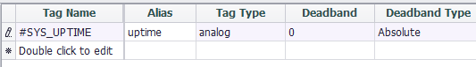

## WLTX

The WLTX cloud service plug-in supports connection with the WLTX platform and reports the tag value to the cloud. Since the setting part of this plug-in is closely related to the configuration of the cloud platform, the user needs to obtain the corresponding configuration information from the cloud platform to fill in, so it will not be described in detail here.

It should be noted that in the data model of the WLTX, each collection tag is determined by Device Address (1 byte) + Channel (channel number of the acquired device, 1 byte) + TAG (1 byte) ), called FULL TAG. In order to include these three fields in the reported data, the Tag name must be separated by an underscore to define these three fields.If the tag name cannot be in this format, then in the WLTX tag list, an alias for this format is required to support FULL TAG.

As shown in the figure below, `CT_0` is defined with an alias `1_2_3`, indicating that the `CT_0` tag corresponds to the collection tag of Device Address = 1, Channel = 2, TAG = 3 defined on the WLTX Platform.

### Others

[Tag List](./others/TagList_Setting.html)   

[resume](./others/resume.html)

[export/import](./others/excel.html)
