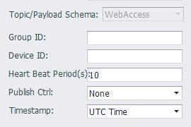

## WebAccess

- **Group ID**: The Group ID is a combination of the project name of the WebAccess Cloud and the SCADA name with an underscore "\_", for example: MyProject\_MySCADA.

- **Device ID**: The device name of the project in the WebAccess Cloud.
 
- **Heart Beat Period**: The period during which the client sends heartbeat information to the server.

- **Publish Ctrl**: Choose whether to upload data by Publish Ctrl.

- **Timestamp**: This option is used to set the timestamp representation format in the published message. UTC Time is expressed in UTC time and Local Time is expressed in the local time of the device. For example, if the time zone of the device is set to East 8 (ie, Beijing time), the message is sent at 11:30:45 on January 1, 2018 Beijing time, then UTC Time will be 2018-01-01T03:30:45+0000, and the Local Time will be 2018-01-01T11:30:45+0800.

### Others

[Tag List](./others/TagList_Setting.html)   

[resume](./others/resume.html)

[export/import](./others/excel.html)

