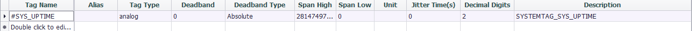

## Tag List Setting

- **Tag Name**: Double-click this field to add or select a tag in the device.

- **Alias**: Set the name when uploading data. Use the tag name as the data name when the alias is empty.

- **Tag Type**: Displays the data type of the tag. This item is a read-only item and cannot be modified in this tag table. If you need to modify it, please modify the original tag attribute in the data center.

- **Deadband Type**: Used to configure the change detection method of tag values. There are two ways: absolute value and percentage. When the type is configured as an absolute value, the difference between the current tag value of the tag and the last uploaded tag value is taken as an absolute value and compared with the *Deadband*, and if it is exceeded, the tag is considered to have changed; When the type is configured as a percentage, the difference between the current tag value of the tag and the last uploaded tag value is taken as an absolute value and compared with the last uploaded tag value. If the change exceeds the *Deadband*, the tag is considered to have changed.

- **Deadband**: Used to specify the Deadband value of the tag detection. The value change of the tag does not trigger the tag value change within the threshold.

- **Unit**: Read-only item, when the Deadband type is percentage, a percent sign is displayed to distinguish it from the absolute value.

- **Jitter time**: The unit is second. When the detected tag value exceeds *Deadband*, verification of *jitter time* will start. When the tag value is detected as exceeding the *Deadband* within the specified *jitter time*, it will be finally judged as a little value change, and the changed value will be uploaded at this time, otherwise it will be judged as tag value jitter. Not uploaded.

- **Decimal Digits**: The number of digits after the decimal tag for specifying the analog tag value. The default is 2. When the actual tag value has only one integer value, you can set this field to 0 to save data traffic.

- **Description**: The description of the tag. This item is a read-only item and cannot be modified in this tag table. If you need to modify it, please modify the original tag attribute in the data center.
