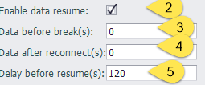

## Data resume

- When an EdgeLink device is connected to an MQTT platform, the resumable upload function completes the data during the disconnection period

- **Prerequisites**: The tags that need to be resumably transferred must be configured to DataLogger for local storage, the device must have a memory card, you can refer to [DataLogger](../../DataLogger/DataLogger.html) description

 &emsp;&emsp;&emsp; 

### Enable resumable transfer

 &emsp;&emsp;&emsp; 

| parameter |  parameter description                                                                                                                                 |
| ------------------ | -------------------------------------------------------------------------------------------------------------------------------|
|`Enable data resume`|Enable switch for resume upload from break                                                                                                                  |
|`Data before break`|Default: 0, resume uploading data from the most recent n seconds before the disconnection                                                                                                                  |
|`Data after reconnect`|Default: 0, resume uploading data until the most recent n seconds after the  reconnection                                                                                                |
|`Delay before resume`|Default: 120, resume uploading data after an interval of n seconds after the reconnection                                                   
