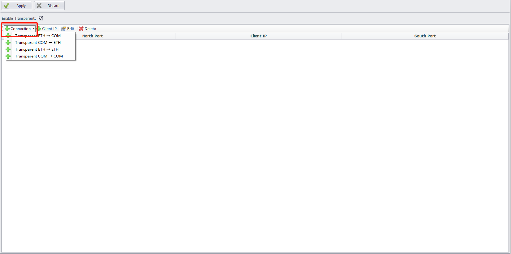
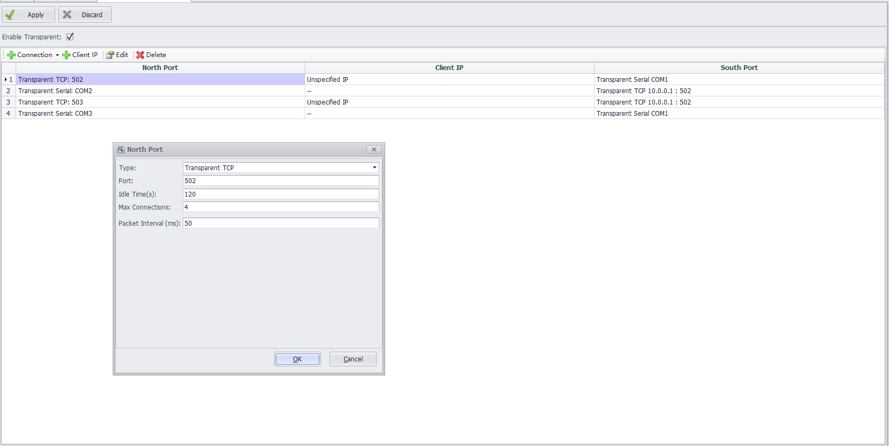
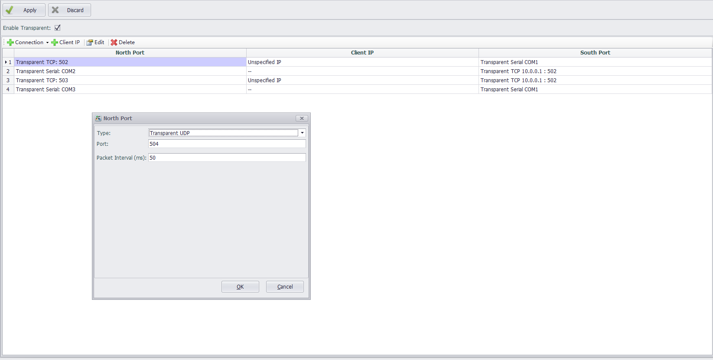
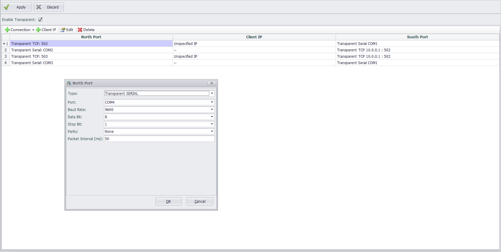
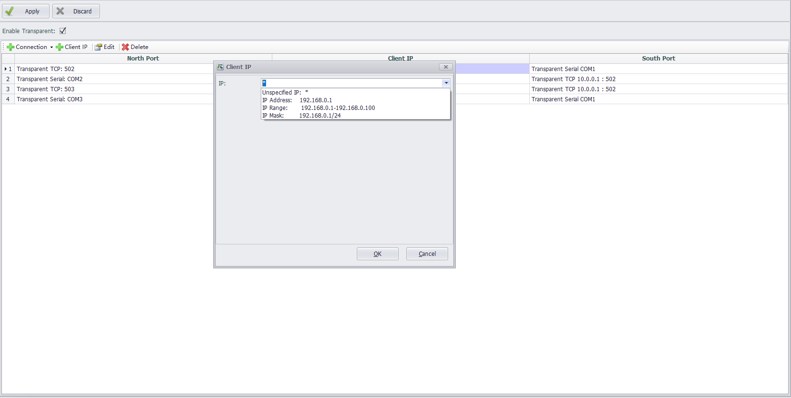
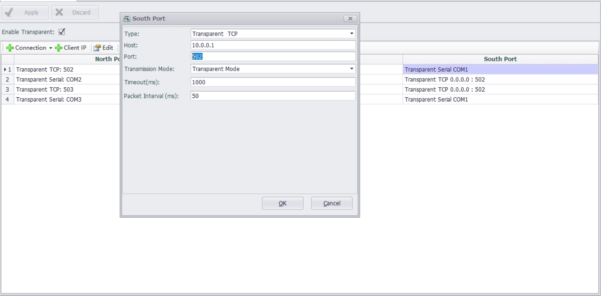
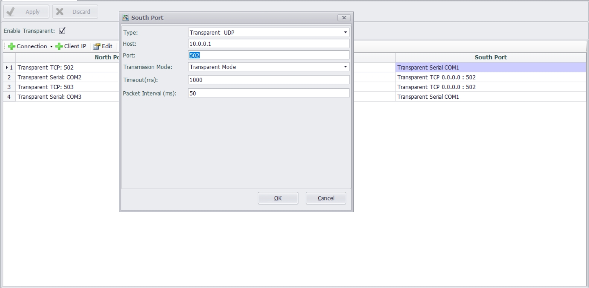
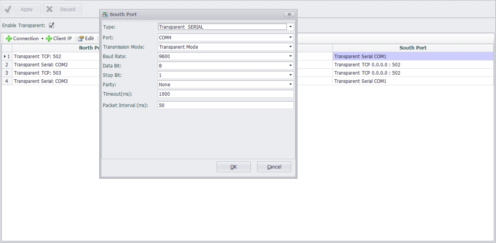

## Transparent Transmission Function

The transparent transmission function enables direct data interaction between southbound devices and northbound devices.

### The transparent transmission function has three modes:

* Transparent Mode: Southbound and northbound devices can communicate freely.

* Response Mode: The northbound device sends a request and waits for a response from the southbound device. Once the southbound device responds, the data is transmitted back to the northbound device.

* Listening Mode: The northbound device cannot and does not initiate any requests, while the southbound device proactively sends data to the northbound device.

### Connection Settings

After enabling the transparent transmission function, select the appropriate connection.

#### North Port Configuration

Configure parameters for the northbound port, such as port number, baud rate, start bit, stop bit, etc.

COM Port: The serial port to which the northbound device connects. The dropdown list displays all available ports on the current device.

Baud Rate: Specifies the serial transmission baud rate. Default: 9600.

Data Bits: Specifies the number of data bits. Default: 8.

Stop Bits: Specifies the number of stop bits. Default: 1.

Parity Check: Specifies the parity check rule. Default: None (no parity check).

Idle Time (Default: 120 seconds): For TCP-type northbound ports, if the device sends no data within 120 seconds, the connection is deemed idle and terminated.

Idle Timeout: Specifies the maximum duration allowed for no read/write operations after a TCP connection is established. Default: 120 seconds. Setting it to 0 disables this check.

Packet Interval: Default: 50 ms. Used to separate frames between packets.

#### Client IP Configuration

Select an IP whitelist option: allow all IPs (\*), a single IP, an IP range, or a subnet mask.

#### Southbound Port Configuration

Configure parameters for the southbound port, such as port number, baud rate, start bit, stop bit.

COM Port: The serial port for the northbound device. If a port is unavailable, it may be occupied by another service and must be manually released in the data center.

Baud Rate: Default: 9600.

Data Bits: Default: 8.

Stop Bits: Default: 1.

Parity Check: Default: None.

Idle Time: Same as northbound configuration.

Packet Interval: Default: 50 ms.

Timeout: Default: 1000 ms. In response mode, if the southbound device does not reply within 1000 ms after a request is forwarded, the system will deem it a timeout.

Transmission Mode:

Default: Transparent Mode.

Transparent Mode Selected: Southbound and northbound devices can communicate freely.

Listening Mode Selected: Data exchange is conducted in a free communication mode.

Response Mode Selected: The southbound device operates in response mode, meaning the northbound device actively sends requests to the southbound device and waits for a response before returning the data to the northbound device.

Note:
When the northbound communication link is via network communication, Transparent Mode can only be enabled if either the maximum number of northbound TCP connections is 1, or the IP whitelist for northbound UDP/TCP is configured with a specific unique IP.
