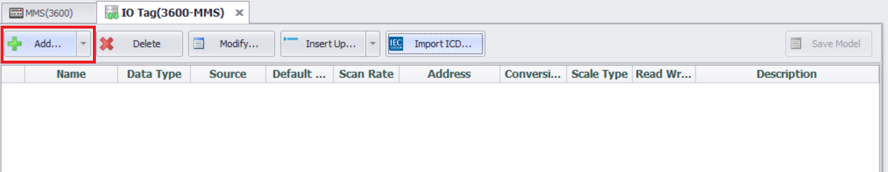
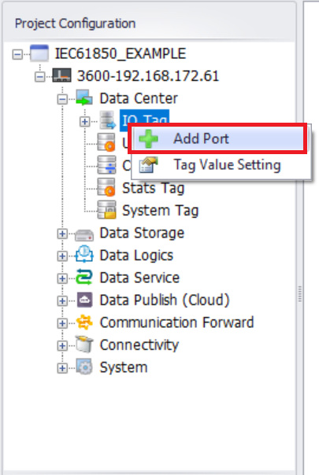

# IEC61850 Client

## MMS   
   
### 1. Add Device   
   
**DataCenter —> IO Tag —> TCP —> Rigth click: Add Device**   
   
   
   
**IEC-61850 MMS Device attribute configuration**   
   
   
   
| **Parameters**        |**Descriptions**                                                          |
|----------------------------|---------------------------------------------------------|
| ​**Device Type**  | `IEC-61850 MMS`                                                     |
| ​**IP/Domain**   | IEC-61850 Server IP Address                                                         |
| ​**Port Number**    | IEC-61850 Server port (default: `102`)                                            |
| ​**Device Address**  | If it is different from the unit number, fill it in, otherwise leave it blank.                                     |
| **Read Tag Value Mode**| Method for obtaining IEC-61850 data attribute values. `0`(Retrieve values of DataAttribute with GetDataValues service; Write values of DataAttribute with SetDataValues service), `1`(Create datasets and obtain DataAttribute values by reading datasets), `2` (The mode `1` should be used first.)|
| ​**Authentication mechanism**  | `0`(None), `1`(Password)                                       |
| ​**Password**      | Required when **Authentication Mechanism** = 1 (e.g. `Password`)                               | 
| **Read q (quality) and t (TimeStamp)**| `0`(Neither of q and t will be read), `1`(Only read q), `2`(Only read t), `3`(Read both q and t)|


### 2. Add tag  
  
  
#### 2.1 **Tag address format**:   
```
[Logical Device]/[Logical Node]$[Functional Constraint]$[Data]$[Attribute]
```  
Enter the **IO Tag** configuration page and click the **"Add..."** button  
   
   
   
**On the Tag configuration page, enter the MMS DA address**     
   
**Example**:   
```
IED1LDevice1/MMXU2$MX$TotW$mag$f
```  

   
   
#### 2.2 **Import ICD File**:   
   
Import the ICD file, and the MMS address for DataAttribute will be automatically added   
   
Enter the **IO Tag** configuration page and click **"Import ICD..."** button  
   
   
   
Select the ICD file to import and click the **"Open"** button  
   
   
   
**Select the DO or DA that needs to be collected**  
   
   
   
Click the **"OK"** button  
   
   
   
**Download the project and view the collected values**  
   
   
   
## GOOSE   
   
### 1. Add Port   
   
#### **1.1 GOOSE Data Acquisition requires adding API (IEC-61850 GOOSE) port**   


  **DataCenter —> IO Tag: Rigth click: Add Port**

   

**Select port Type: API (IEC-61850 GOOSE)**     
   
   
   
### 2. Add Device   
    
#### **2.1 Add Device**   
   
**DataCenter —> IO Tag —> API_(IEC-61850_GOOSE): Rigth click: Add Device**   

   
   
**IEC-61850 GOOSE Device attribute configuration**   
   
   
   
| **Parameters**        |**Descriptions**                                                          |
|---------------|----------------------------------------------------------------------|
| ​**Device Type**  |`IEC61850G`                                                     |
| ​**Adapter**   | Physical network card used for GOOSE communication                                                      |
| ​**SCL file**    | Select the SCL file required for GOOSE communication                                       |
   
   
Configure **Adapter** and select an existing **SCL file**   

   
   
### 3. Add tag  
   
#### 3.1 **Import ICD File GOOSE configuration**:   
   
Enter the **IO Tag** configuration page and click **"Import GOOSE Tags..."** button  
   
   
   
**Enter the DO or DA selection page** 
   
   
   
**Select the DO or DA that needs to be collected**  
   
   
   
Click the **"OK"** button  
   
   
   
**Download the project and view the collected values**  
   
   
   
