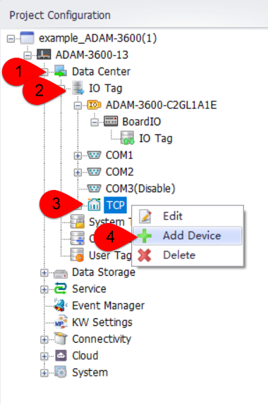
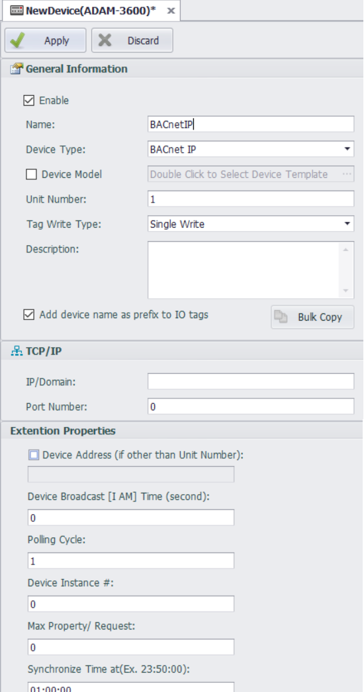
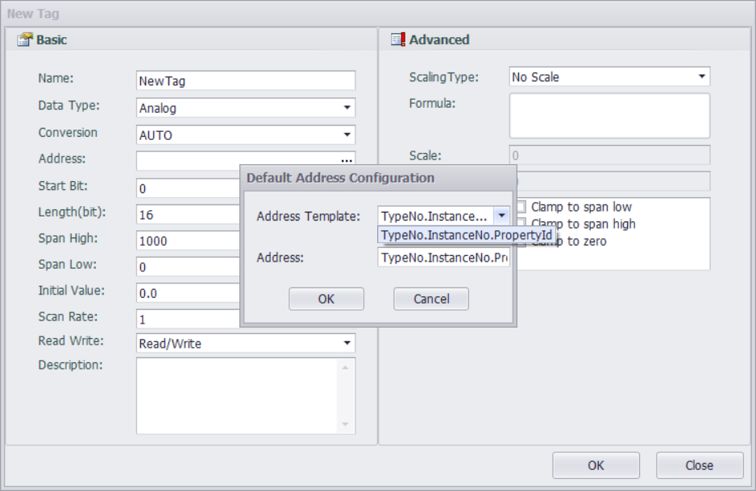

## BACnet IP(TCP/IP)

### 1.Driver support start version number:

### 2.Add Meter

- DataCenter--->I/O点--->TCP--->Right Click：Add Device

- Name: Fill in as you please。
- Device Type: Select BACnet IP。
- IP/Domain Name: The IP address of the BACnet server。
- Port Number: The port number of the BACnet server。
- Device Broadcast[I AM] Time (second)：Frequency of EdgeLink sending "I AM" messages。
- Polling Cycle：Data Collection Period
- Device Instance #：Device Instance ID of the BACnet server。  
- Max Property/Request： 0 means polling 70 points in one round, and other values mean the number of points configured for one round of polling。  
- Synchronize Time at (Ex. 23:50:00) ：Sync time with server at a certain time 。
- After configuring the above parameters, click "Apply" to add it. Click "Cancel" to cancel the operation。

### 3.Add tag

1).Fill in or select the parameters on the above interface according to the requirements, and click "OK" to save the changes。

2).Tag point address format：TypeNo.InstanceNo.PropertyId  

- TypeNo：Representing the type number。The driver protocol supports six types: Analog Input, Analog Output, Analog Value, Binary Input, Binary Output, and Binary Value：

  | Type | TypeNum  |
  | ------------ | ------ |
  | Analog Input | 0     |
  | Analog Output| 1     |
  | Analog Value | 2     |
  | Binary Input | 3     |
  | Binary Output| 4     |
  | Binary Value | 5     |

- InstanceNo：Tag point sequence number in the server。

- PropertyId：Please refer to the Bacnet protocol。

  example：The Property ID for "Present Value" in BACNet is 85 。 The address example for reading "Present Value" is as follows:  

  | Type and index | Address |
  | ------------ | ------ |
  | AI_2       | 0.2.85 |
  | AO_2       | 1.2.85 |
  | AV_2       | 2.2.85 |
  | BI_2       | 3.2.85 |
  | BO_2       | 4.2.85 |
  | BV_2       | 5.2.85 |

### 4.FAQ

#### 4.1.ErrorCode

| ErrorCode        | Description                                                         |
| --------------- | ------------------------------------------------------------ |
| GOOD            | No error                                                     |
| C010            | Device Idle, I-AM timeout                                    |
| C002            | Data type mismatch                                           |
| A00X            | iscrete value over max state                                 |
| QCode bit coded | 0001 in alarm, 0002 Fault, 0004   Overridden, 0008 Out of service |
| b014            | No space to write property                                   |
| b01b            | Read access denied                                           |
| b01f            | Unknown object                                               |
| b020            | Unknown property                                             |
| b025            | Value out of range                                           |
| b028            | Write access denied                                          |
| b02a            | Invalid array index                                          |
| b02f            | Datatype not supported                                       |
| b030            | Duplicate name                                               |
| b031            | Duplicate object id                                          |
| b032            | Property is not an array                                     |
| b033            | Abort buffer overflow                                        |
| b034            | Abort invalid apdu in this   state                           |
| b035            | Abort preempted by higher   priority task                    |
| b036            | Abort segmentation not   supported                           |
| b037            | Abort proprietary                                            |
| b038            | Abort other                                                  |
| b03b            | Reject buffer overflow                                       |
| b03c            | Reject inconsistent parameters                               |
| b03d            | Reject invalid parameter data   type                         |
| b03e            | Reject invalid tag                                           |
| b03f            | Reject missing required   parameter                          |
| b040            | Reject parameter out of range                                |
| b041            | Reject too many arguments                                    |
| b042            | Reject undefined enumeration                                 |
| b043            | Reject unrecognized service                                  |
| b044            | Reject proprietary                                           |
| b045            | Reject other                                                 |
| b050            | Parameter out of range                                       |
| b07b            | Abort apdu too long                                          |
| b07c            | Abort application exceeded   reply time                      |
| b07d            | Abort out of resources                                       |
| b07e            | Abort tsm timeout                                            |
| b07f            | Abort window size out of range                               |
| b0100           | Loss of port connection                                      |
| b0101           | Header timeout error                                         |
| b0102           | Data timeout error                                           |
| b0103           | NPDU Timeout error                                           |
| b0104           | Header CRC error                                             |
| b0105           | Data CRC error                                               |
| b0106           | Non-NPDU message error                                       |
| b0107           | Timeout error                                                |
| b0108           | Serial port error                                            |
| b0109           | Invalid Write Properity Error                                |
| b010a           | Invalid Read Properity Error                                 |
| b010b           | No valid read data                                           |
| b010c           | Unsupported Frame Type                                       |
| b010d           | Error in the MS/TP Network                                   |
| b010e           | Unknown Data Type to write                                   |
| b010f           | Invalid Destination MAC Address                              |
| b0110           | Invalid Source MAC Address                                   |
| b0111           | Invalid Header Information                                   |
| b0112           | Unable to get a valid Invoke ID                              |

