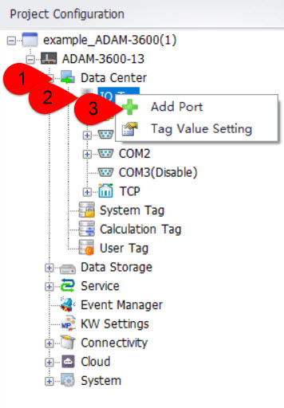
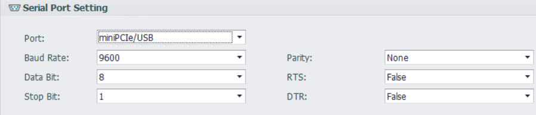
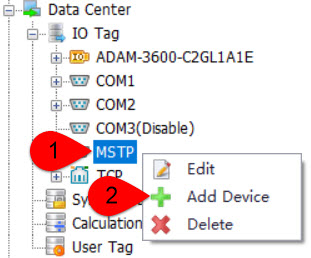
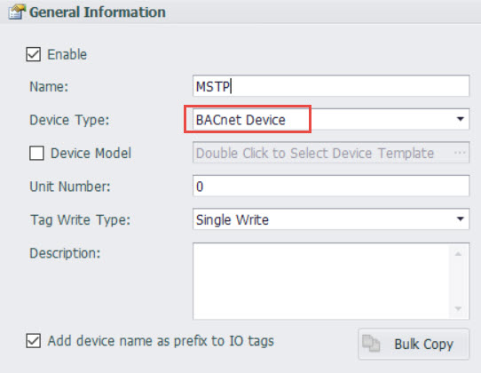
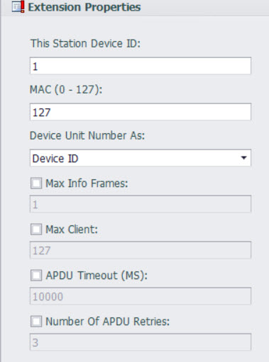
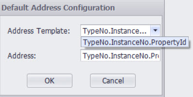

## BACnet MS/TP

一、Driver support start version number：v2.8.0

二、Quic start

  1.Add Port

- DataCenter--->I/O点--->Add Port

- Port Type：Select “Serial(BACnet MS/TP)”--->Name: Fill in as desired (The name used in this document is "MSTP")

2.Configure the port

- Serial Number：Gateway serial port number

- Other parameters：Configure according to device characteristics
- After configuring, click "Apply"

3.Add Device

- DataCenter--->I/O Tag--->MSTP--->Add Device

4.Configure Device

- Device Type：Select “BACnet Device”--->Name: Fill in as desired (The name used in this document is "MSTP")--->click "Apply"

5.Add tag point

6.Download project，You have successfully completed the configuration of BACnet MS/TP.

三、Detailed configuration instructions

1.Detailed explanation of the extended attributes in the port configuration interface

- This Station Device ID：Device ID.

- MAC(0~127)：The MAC address of the device, default is 127.

- Device Unit Number As：The Unit Number value in the device configuration is the device ID, not the MAC address of the device.

- Max Info Frames：The maximum number of information frames that a designated node can send before the token must be transfer.

- Max Master：The highest address allowed by the master node in the network, default is 127.

- APDU Timeout(MS)：The amount of time (milliseconds) between unconfirmed attempts to resend an APDU when confirmation is required. For devices that allow modification of this parameter, the recommended value for this property is 10000 milliseconds. Otherwise, the default value should be 60000 milliseconds.

- Number of APDU Retries：The maximum number of times an APDU should be retransmitted. The recommended value for this property is: if this device does not perform retries, this property should be set to zero. If the value of this property is greater than zero, a non-zero value should be placed in the APDU_Timeout property of the device object.

2.Detailed explanation of the extended attributes in the device configuration interface

- Max Property/ Request：The maximum number of tags included in each request packet.

3.Detailed description of tag point address

Tag point address format：TypeNo.InstanceNo.PropertyId

The specific address instructions can be found in the BACnet IP documentation.
