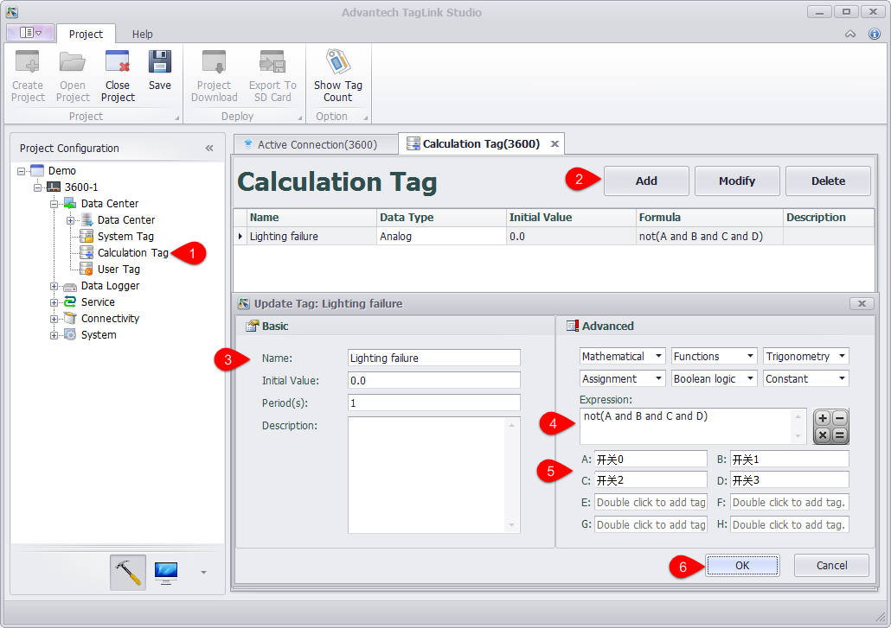
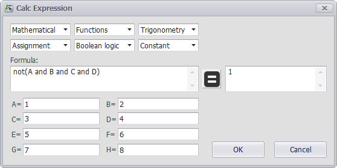
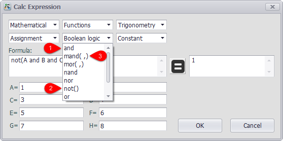

## Configure Calculation Tag　　

Calculation tag is a kind of special tags, the value of which indicates the calculation result of an formula. The parameter of this formula can be a tag or a constant. Also, the expression can utilize some common calculation methods, including arithmetic & logic operation and trigonometric function, etc..

Calculation tag can perform some relatively complex operations, such as converting the acquired sensor value to the real physical quantity (liquid level, wind speed, etc.), so as to make the computation less intensive for the upper computer as well as the device more intelligent.

Each calculation tag corresponds to one expression which may support at most 8 tags as its input variables. For users' convenience, 8 tags are represented by A, B, C, D, E, F, G and H (case insensitive) in the expression.

### Add Calculation Tag

Please follow the procedures to add a calculation tag:

1. Double-click on "Calculation Tag" in the left tree menu.

2. Click "Add" button to add a new calculation tag.

3. Fill in the basic information. "Periods (s)" specifies how often the tags are calculated, and its unit is second.

4. Enter an expression. Uses can select default function or operator from the pull-down lists or type them manually. The example figure shows the calculation expression of "Lighting Failure", the expression logic of which is that the lighting is failed when the value of any tag in four switches is 0.

5. Double-click the variable box to add a tag.

6. Click "OK" button to save the changes.

### Expression Check

On the right of "Expression" box there is a calculator button. Click it to open "Calc Expression" window shown as below. This interface is roughly the same as "Advanced" setting interface in the above, but with a "=" button and a box displaying the operation result. Besides, the variable boxes here require users to input the variable values rather than tag names.

To verify the expression is correct or not, users can click this buttonto get the result, then review it to see its correctness. After the expression has been verified, click "OK" button to update the value; if users do not want to update it, click "Cancel" button.　

### Function and Operator Description

Through the drop-down boxes, users can set the functions and operators calculation tag supports, which is divided into five categories: "Mathematical", "Functions", "Trigonometry", "Assignment" and "Boolean logic". Moreover, "Constant" box is also provided, allowing users to select from three constants: pi (the ratio of the circumference to the diameter of a circle), epsilon (the smallest positive double value that is greater than zero) and inf (infinity).

As shown in the figure below, the functions or operators listed in the box can be classified into three types: 1. With no brackets, this indicates binary operations (labeled with 1); 2. With brackets but no comma, this means this function only has one parameter (labeled with 2); 3. With brackets and comma, this means the function supports more than one parameter (labeled with 3).

All functions and operators are described as follows:

(0) Arithmetic & Assignment Operators

| OPERATOR | DEFINITION                                              |
| ------ | --------------------------------------------- |
|  +       | Addition between x and y.  (eg: x + y)                  |
|  -       | Subtraction between x and y.  (eg: x - y)               |
|  *       | Multiplication between x and y.  (eg: x * y)            |
|  /       | Division between x and y.  (eg: x / y)                  |
|  %       | Modulus of x with respect to y.  (eg: x % y)            |
|  ^       | x to the power of y.  (eg: x ^ y)                       |
|  :=      | Assign the value of x to y. Where y is either a variable  or vector type.  (eg: y := x)|
|  +=      | Increment x by the value of the expression on the right  hand side. Where x is either a variable or vector type. (eg: x += abs(y - z))                                   |
|  -=      | Decrement x by the value of the expression on the right  hand side. Where x is either a variable or vector type.  (eg: x[i] -= abs(y + z))                                |
|  *=      | Assign the multiplication of x by the value of the  expression on the righthand side to x. Where x is either  a variable or vector type.  (eg: x *= abs(y / z))                                   |
|  /=      | Assign the division of x by the value of the expression  on the right-hand side to x. Where x is either a  variable or vector type.  (eg: x[i + j] /= abs(y * z))  |
|  %=      | Assign x modulo the value of the expression on the right  hand side to x. Where x is either a variable or vector  type.  (eg: x[2] %= y ^ 2)                              |

(1) Equalities & Inequalities

| OPERATOR | DEFINITION                                              |
| ------ | --------------------------------------------- |
| == or =  | True only if x is strictly equal to y. (eg: x == y)     |
| <> or != | True only if x does not equal y. (eg: x <> y or x != y) |
|  <       | True only if x is less than y. (eg: x < y)              |
|  <=      | True only if x is less than or equal to y. (eg: x <= y) |
|  >       | True only if x is greater than y. (eg: x > y)           |
|  >=      | True only if x greater than or equal to y. (eg: x >= y) |

(2) Boolean Operations

| OPERATOR | DEFINITION                                              |
| ------ | --------------------------------------------- |
| true     | True state or any value other than zero (typically 1).  |
| false    | False state, value of exactly zero.                     |
| and      | Logical AND, True only if x and y are both true.  (eg: x and y)                                           |
| mand     | Multi-input logical AND, True only if all inputs are  true. Left to right short-circuiting of expressions.  (eg: mand(x > y, z < w, u or v, w and x))               |
| mor      | Multi-input logical OR, True if at least one of the | inputs are true. Left to right short-circuiting of  expressions.  (eg: mor(x > y, z < w, u or v, w and x))  |
| nand     | Logical NAND, True only if either x or y is false.  (eg: x nand y)                                          |
| nor      | Logical NOR, True only if the result of x or y is false  (eg: x nor y)                                           |
| not      | Logical NOT, Negate the logical sense of the input.  (eg: not(x and y) == x nand y)                          |
| or       | Logical OR, True if either x or y is true. (eg: x or y) |
| xor      | Logical XOR, True only if the logical states of x and y  differ.  (eg: x xor y)                                  |
| xnor     | Logical XNOR, True iff the biconditional of x and y is  satisfied.  (eg: x xnor y)                              |
| &        | Similar to AND but with left to right expression short  circuiting optimisation.  (eg: (x & y) == (y and x))    |
| |        | Similar to OR but with left to right expression short  circuiting optimisation.  (eg: (x | y) == (y or x))     |

(3) General Purpose Functions

| FUNCTION | DEFINITION                                              |
| ------ | --------------------------------------------- |
| abs      | Absolute value of x.  (eg: abs(x))                      |
| avg      | Average of all the inputs.  (eg: avg(x,y,z,w,u,v) == (x + y + z + w + u + v) / 6)   |
| ceil     | Smallest integer that is greater than or equal to x.    |
| clamp    | Clamp x in range between r0 and r1, where r0 < r1.  (eg: clamp(r0,x,r1))                                    |
| equal    | Equality test between x and y using normalised epsilon  |
| erf      | Error function of x.  (eg: erf(x))                      |
| erfc     | Complimentary error function of x.  (eg: erfc(x))       |
| exp      | e to the power of x.  (eg: exp(x))                      |
| expm1    | e to the power of x minus 1, where x is very small.  (eg: expm1(x))                                          |
| floor    | Largest integer that is less than or equal to x.  (eg: floor(x))                                          |
| frac     | Fractional portion of x.  (eg: frac(x))                 |
| hypot    | Hypotenuse of x and y (eg: hypot(x,y) = sqrt(x*x + y*y))|
| iclamp   | Inverse-clamp x outside of the range r0 and r1. Where  r0 < r1. If x is within the range it will snap to the  closest bound. (eg: iclamp(r0,x,r1)                     |
| inrange  | In-range returns 'true' when x is within the range r0  and r1. Where r0 < r1.  (eg: inrange(r0,x,r1)           |
| log      | Natural logarithm of x.  (eg: log(x))                   |
| log10    | Base 10 logarithm of x.  (eg: log10(x))                 |
| log1p    | Natural logarithm of 1 + x, where x is very small.  (eg: log1p(x))                                          |
| log2     | Base 2 logarithm of x.  (eg: log2(x))                   |
| logn     | Base N logarithm of x. where n is a positive integer.  (eg: logn(x,8))                                         |
| max      | Largest value of all the inputs. (eg: max(x,y,z,w,u,v)) |
| min      | Smallest value of all the inputs. (eg: min(x,y,z,w,u))  |
| mul      | Product of all the inputs.  (eg: mul(x,y,z,w,u,v,t) == (x * y * z * w * u * v * t)) |
| ncdf     | Normal cumulative distribution function.  (eg: ncdf(x)) |
| nequal   | Not-equal test between x and y using normalised epsilon |
| pow      | x to the power of y.  (eg: pow(x,y) == x ^ y)           |
| root     | Nth-Root of x. where n is a positive integer.  (eg: root(x,3) == x^(1/3))                              |
| round    | Round x to the nearest integer.  (eg: round(x))         |
| roundn   | Round x to n decimal places  (eg: roundn(x,3))  where n > 0 and is an integer.  (eg: roundn(1.2345678,4) == 1.2346)                     |
| sgn      | Sign of x, -1 where x < 0, +1 where x > 0, else zero.  (eg: sgn(x))                                            |
| sqrt     | Square root of x, where x >= 0.  (eg: sqrt(x))          |
| sum      | Sum of all the inputs.  (eg: sum(x,y,z,w,u,v,t) == (x + y + z + w + u + v + t)) |
| swap     | Swap the values of the variables x and y and return the |
| <=>      | current value of y.  (eg: swap(x,y) or x <=> y)         |
| trunc    | Integer portion of x.  (eg: trunc(x))                   |

(4) Trigonometry Functions

| FUNCTION | DEFINITION                                              |
| ------ | --------------------------------------------- |
| acos     | Arc cosine of x expressed in radians. Interval [-1,+1]  (eg: acos(x))                                           |
| acosh    | Inverse hyperbolic cosine of x expressed in radians.  (eg: acosh(x))                                          |
| asin     | Arc sine of x expressed in radians. Interval [-1,+1]  (eg: asin(x))                                           |
| asinh    | Inverse hyperbolic sine of x expressed in radians.  (eg: asinh(x))                                          |
| atan     | Arc tangent of x expressed in radians. Interval [-1,+1]  (eg: atan(x))                                           |
| atan2    | Arc tangent of (x / y) expressed in radians. [-pi,+pi]  eg: atan2(x,y)                                          |
| atanh    | Inverse hyperbolic tangent of x expressed in radians.  (eg: atanh(x))                                          |
| cos      | Cosine of x.  (eg: cos(x))                              |
| cosh     | Hyperbolic cosine of x.  (eg: cosh(x))                  |
| cot      | Cotangent of x.  (eg: cot(x))                           |
| csc      | Cosecant of x.  (eg: csc(x))                            |
| sec      | Secant of x.  (eg: sec(x))                              |
| sin      | Sine of x.  (eg: sin(x))                                |
| sinc     | Sine cardinal of x.  (eg: sinc(x))                      |
| sinh     | Hyperbolic sine of x.  (eg: sinh(x))                    |
| tan      | Tangent of x.  (eg: tan(x))                             |
| tanh     | Hyperbolic tangent of x.  (eg: tanh(x))                 |
| deg2rad  | Convert x from degrees to radians.  (eg: deg2rad(x))    |
| deg2grad | Convert x from degrees to gradians.  (eg: deg2grad(x))  |
| rad2deg  | Convert x from radians to degrees.  (eg: rad2deg(x))    |
| grad2deg | Convert x from gradians to degrees.  (eg: grad2deg(x))  |

(5) String Processing

| FUNCTION | DEFINITION                                              |
| ------ | --------------------------------------------- |
|  = , ==  | All common equality/inequality operators are applicable |
|  !=, <>  | to strings and are applied in a case sensitive manner.  |
|  <=, >=  | In the following example x, y and z are of type string. |
|  < , >   | (eg: not((x <= 'AbC') and ('1x2y3z' <> y)) or (z == x)  |
| in       | True only if x is a substring of y.  (eg: x in y or 'abc' in 'abcdefgh')                     |
| like     | True only if the string x matches the pattern y.  Available wildcard characters are '*' and '?' denoting  zero or more and zero or one matches respectively.  (eg: x like y or 'abcdefgh' like 'a?d*h')               |
| ilike    | True only if the string x matches the pattern y in a  case insensitive manner. Available wildcard characters  are '*' and '?' denoting zero or more and zero or one  matches respectively.  (eg: x ilike y or 'a1B2c3D4e5F6g7H' ilike 'a?d*h')      |
| [r0:r1]  | The closed interval [r0,r1] of the specified string.  eg: Given a string x with a value of 'abcdefgh' then:  1. x[1:4] == 'bcde'  2. x[ :5] == x[:10 / 2] == 'abcdef'  3. x[2 + 1: ] == x[3:] =='defgh'  4. x[ : ] == x[:] == 'abcdefgh'  5. x[4/2:3+2] == x[2:5] == 'cdef'   Note: Both r0 and r1 are assumed to be integers, where  r0 <= r1. They may also be the result of an expression,  in the event they have fractional components truncation  will be performed. (eg: 1.67 --> 1)                     |
|  :=      | Assign the value of x to y. Where y is a mutable string  or string range and x is either a string or a string  range. eg:  1. y := x  2. y := 'abc'  3. y := x[:i + j]  4. y := '0123456789'[2:7]  5. y := '0123456789'[2i + 1:7]  6. y := (x := '0123456789'[2:7])  7. y[i:j] := x  8. y[i:j] := (x + 'abcdefg'[8 / 4:5])[m:n]   Note: For options 7 and 8 the shorter of the two ranges  will denote the number characters that are to be copied.|
|  +       | Concatenation of x and y. Where x and y are strings or  string ranges. eg  1. x + y  2. x + 'abc'  3. x + y[:i + j]  4. x[i:j] + y[2:3] + '0123456789'[2:7]  5. 'abc' + x + y  6. 'abc' + '1234567'  7. (x + 'a1B2c3D4' + y)[i:2j]                           |
|  +=      | Append to x the value of y. Where x is a mutable string  and y is either a string or a string range. eg:  1. x += y  2. x += 'abc'  3. x += y[:i + j] + 'abc'  4. x += '0123456789'[2:7]                               |
| <=>      | Swap the values of x and y. Where x and y are mutable  strings.  (eg: x <=> y)                                 |
| []       | The string size operator returns the size of the string  being actioned.  eg:  1. 'abc'[] == 3  2. var max_str_length := max(s0[],s1[],s2[],s3[])  3. ('abc' + 'xyz')[] == 6  4. (('abc' + 'xyz')[1:4])[] == 4                        |

(6) Control Structures

|STRUCTURE | DEFINITION                                              |
| ------ | --------------------------------------------- |
| if       | If x is true then return y else return z.  eg:  1. if (x, y, z)  2. if ((x + 1) > 2y, z + 1, w / v)  3. if (x > y) z;  4. if (x <= 2*y) { z + w };                             |
| if-else  | The if-else/else-if statement. Subject to the condition  branch the statement will return either the value of the  consequent or the alternative branch.  eg:  1. if (x > y) z; else w;  2. if (x > y) z; else if (w != u) v;  3. if (x < y) { z; w + 1; } else u;  4. if ((x != y) and (z > w))  &nbsp;&nbsp;&nbsp;{  &nbsp;&nbsp;&nbsp;&nbsp;&nbsp;y := sin(x) / u;  &nbsp;&nbsp;&nbsp;&nbsp;&nbsp;z := w + 1;  &nbsp;&nbsp;&nbsp;}  &nbsp;&nbsp;&nbsp;else if (x > (z + 1))  &nbsp;&nbsp;&nbsp;{  &nbsp;&nbsp;&nbsp;&nbsp;&nbsp;w := abs (x - y) + z;  &nbsp;&nbsp;&nbsp;&nbsp;&nbsp;u := (x + 1) > 2y ? 2u : 3u;  &nbsp;&nbsp;&nbsp;}                                                    |
| switch   | The first true case condition that is encountered will  determine the result of the switch. If none of the case  conditions hold true, the default action is assumed as  the final return value. This is sometimes also known as  a multi-way branch mechanism.  eg:  switch  {  &nbsp;&nbsp;case x > (y + z) : 2 * x / abs(y - z);  &nbsp;&nbsp;case x < 3       : sin(x + y);  &nbsp;&nbsp;default          : 1 + x;  }                                                       |
| while    | The structure will repeatedly evaluate the internal  statement(s) 'while' the condition is true. The final  statement in the final iteration will be used as the  return value of the loop.  eg:  while ((x -= 1) > 0)  {  &nbsp;&nbsp;y := x + z;  &nbsp;&nbsp;w := u + y;  }                                                       |
| repeat/  | The structure will repeatedly evaluate the internal     |
| until    | statement(s) 'until' the condition is true. The final  statement in the final iteration will be used as the  return value of the loop.  eg:  repeat  &nbsp;&nbsp;y := x + z;  &nbsp;&nbsp;w := u + y;  until ((x += 1) > 100)                                  |
| for      | The structure will repeatedly evaluate the internal  statement(s) while the condition is true. On each loop  iteration, an 'incrementing' expression is evaluated.  The conditional is mandatory whereas the initialiser  and incrementing expressions are optional.  eg:  for (var x := 0; (x < n) and (x != y); x += 1)  {  &nbsp;&nbsp;y := y + x / 2 - z;  &nbsp;&nbsp;w := u + y;  }                                                       |
| break    | Break terminates the execution of the nearest enclosed  |
| break[]  | loop, allowing for the execution to continue on external  to the loop. The default break statement will set the  return value of the loop to NaN, where as the return  based form will set the value to that of the break  expression.  eg:  while ((i += 1) < 10)  {  &nbsp;&nbsp;if (i < 5)  &nbsp;&nbsp;&nbsp;&nbsp;j -= i + 2;  &nbsp;&nbsp;else if (i % 2 == 0)  &nbsp;&nbsp;&nbsp;&nbsp;break;  &nbsp;&nbsp;else  &nbsp;&nbsp;&nbsp;&nbsp;break[2i + 3];  }                                                       |
| continue | Continue results in the remaining portion of the nearest  enclosing loop body to be skipped.  eg:  for (var i := 0; i < 10; i += 1)  {  &nbsp;&nbsp;if (i < 5)  &nbsp;&nbsp;&nbsp;&nbsp;continue;  &nbsp;&nbsp;j -= i + 2;  }                                                       |
| return   | Return immediately from within the current expression.  With the option of passing back a variable number of  values (scalar, vector or string). eg:  1. return [1];  2. return [x, 'abx'];  3. return [x, x + y,'abx'];  4. return [];  5. if (x < y)  &nbsp;&nbsp;&nbsp;&nbsp;return [x, x - y, 'result-set1', 123.456];  &nbsp;&nbsp;&nbsp;else  &nbsp;&nbsp;&nbsp;&nbsp;return [y, x + y, 'result-set2'];                   |
| ?:       | Ternary conditional statement, similar to that of the  above denoted if-statement.  eg:  1. x ? y : z  2. x + 1 > 2y ? z + 1 : (w / v)  3. min(x,y) > z ? (x < y + 1) ? x : y : (w * v)         |
| ~        | Evaluate each sub-expression, then return as the result  the value of the last sub-expression. This is sometimes  known as multiple sequence point evaluation.  eg:  ~(i := x + 1, j := y / z, k := sin(w/u)) == (sin(w/u)))  ~{i := x + 1; j := y / z; k := sin(w/u)} == (sin(w/u))) |
| [*]      | Evaluate any consequent for which its case statement is  true. The return value will be either zero or the result  of the last consequent to have been evaluated.  eg:  [*]  {  &nbsp;&nbsp;case (x + 1) > (y - 2)    : x := z / 2 + sin(y / pi);  &nbsp;&nbsp;case (x + 2) < abs(y + 3) : w / 4 + min(5y,9);  &nbsp;&nbsp;case (x + 3) == (y * 4)   : y := abs(z / 6) + 7y;  }                                                       |
| []       | The vector size operator returns the size of the vector  being actioned.  eg:  1. v[]  2. max_size := max(v0[],v1[],v2[],v3[])                 |
