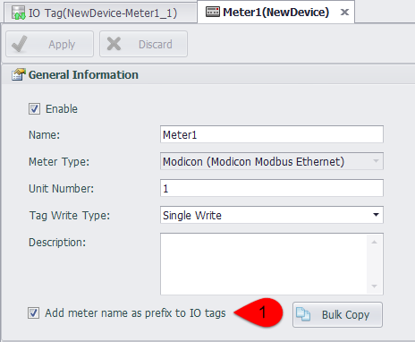
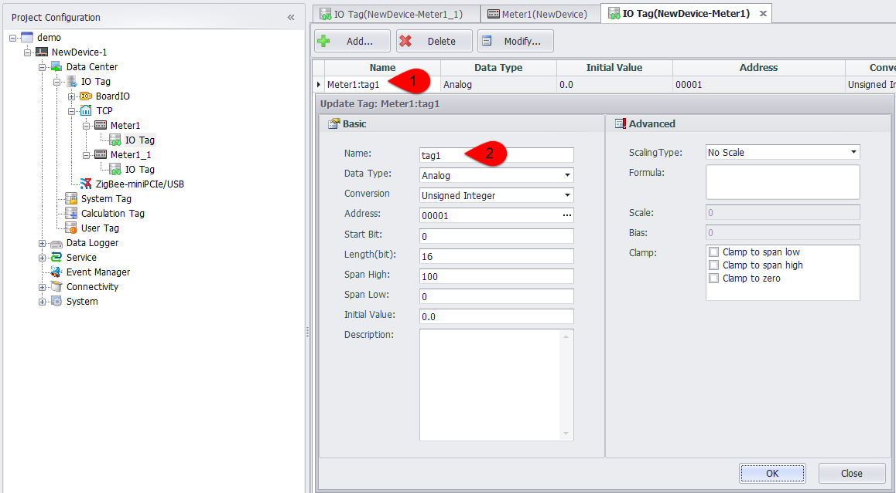
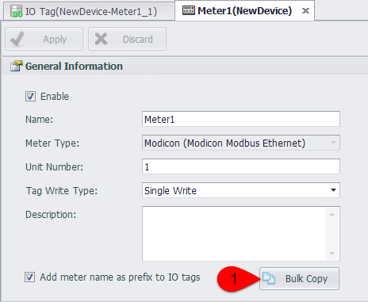
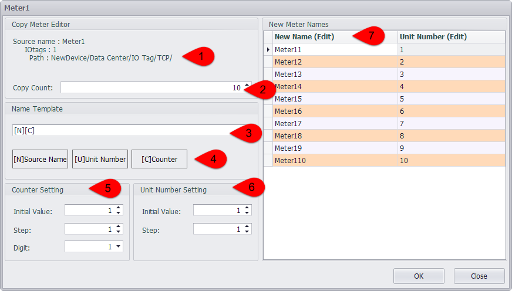
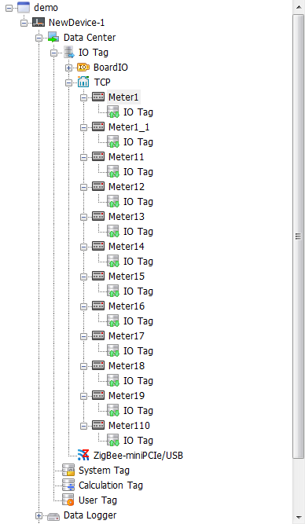

## Add A Device Name Prefix for the IO tag

Click the option of "add device name as prefix to IO tags",and it will add a prefix for the IO tag,format such as'meter name: IO tag name'.

The device name prefix will be removed after cancling point .If the the IO tag name is not unique after the prefix is canceled, the user will be prompted to allow the system to automatically rename the duplicate IO tag.

The device name prefix is displayed in the I/O tag editing interface, but cannot be edited.

## Bulk Copy

After selecting add the device name prefix, you can try to copy the current device with bulk copy function.

Click the  bulk copy button to pop up the page of editing the device name, in which users can edit the number of meters to be copied, the name of the device, and the number of units.

1. Display the basic information of the original instrument.
2. Select the number of meters to copy up to 100 once.
3. The name of the device will be generated according to the name template.
4. You can use the name of the original device and unit number and counter with the change of the number.
5. The initial value and the step size of the unit number can be set.
6. The counter can set the initial value, the step size and the number of the display.
7. The name of the generated device is showed in the right list, and the value in the device can be modified, but it will be reset after the modification to the left property.。

Click OK and users can see the generating bulk copied device under the port.