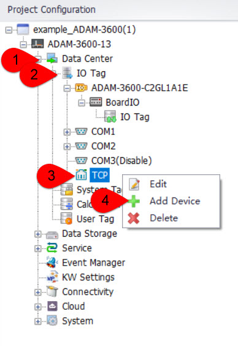
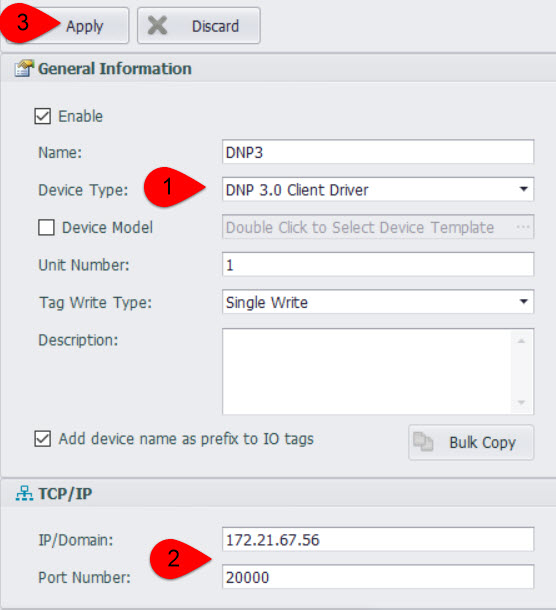
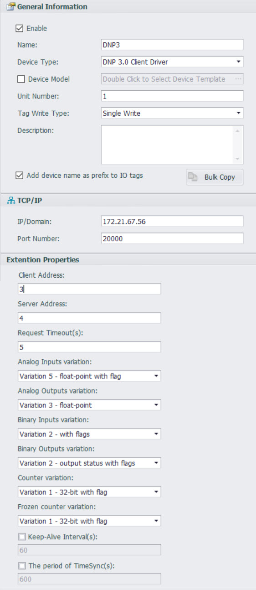
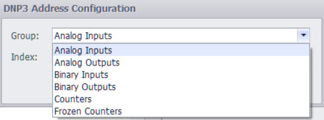

## DNP3(TCP)

一、Driver support start version number：

二、Quick Connection

1.Add Device

- DataCenter--->I/O Tag--->TCP--->Rigth click：Add Device

2.Configure the device

- Select Device Type：DNP3.0 Master Driver--->Fill in the DNP3 server IP and port number: such as 172.21.67.56 and 20000--->click "Apply"

3.Add tags

4.Download project，completed the quick configuration of DNP3.

三、Detailed configuration instructions

1.Detailed configuration interface instructions

- Name: Fill in as desired.

- Device Type：Select DNP3.0 Master Driver.

- IP/Domain Name: The IP address of the DNP3 server.

- Port Number: The port number of the DNP3 server.

- Master Address： Session Master address.

- Slave Address：Session Slave Address.

- Request Timeout(s)： Response timeout time for data request commands.

- Keep-Alive Interval(s)： Heartbeat period: When this option is not selected, it means that the Master endpoint does not send heartbeat packets.

- The period  of TimeSync(s)：Time synchronization period: When this option is not selected, it means that time synchronization operations are not performed.

- xx variation：It is possible to configure the default variation (i.e., data format) for each different data type. Please refer to the specification document for details. If there are no special requirements, it is sufficient to keep the defaults.

2.Detailed description of tag point address

- Group：There are six types in total. Please select the appropriate type from the dropdown list based on the actual situation.

- Index：Index on slave，Under the same data type, there may be multiple tag points. The index number is the sequential number of the tag point.

- Note: Due to the inability of the Master in Linux to issue the Frozen command, the Frozen counter point is only used for data collection.

