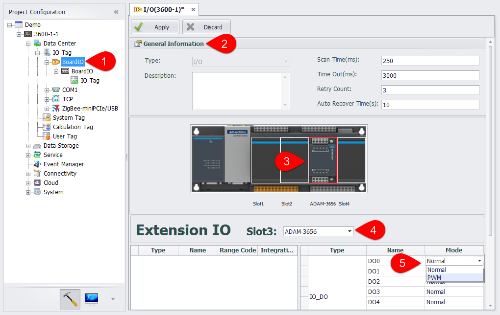

## Add Extension Module

EdgeLink supports various extension modules, including DO, DI, AI and AO, etc. Please follow the below procedures to add an extension module.

1. Double click to open the BoardIO node.

2. Modify the basic properties of the BoardIO port.

3. Users can select a Board or Slot picture on the EdgeLink schematic, and edit the IO tag property and the slot type.

4. After clicking on the Slot picture, users can select the module type of the ExtensionIO.

5. AI tag supports four range options for +/-10V, +/-2.5V, 0-20mA, and 4-20mA. DI tag supports Normal, Counter two working modes. DO tag supports Normal, PWM two working modes.
