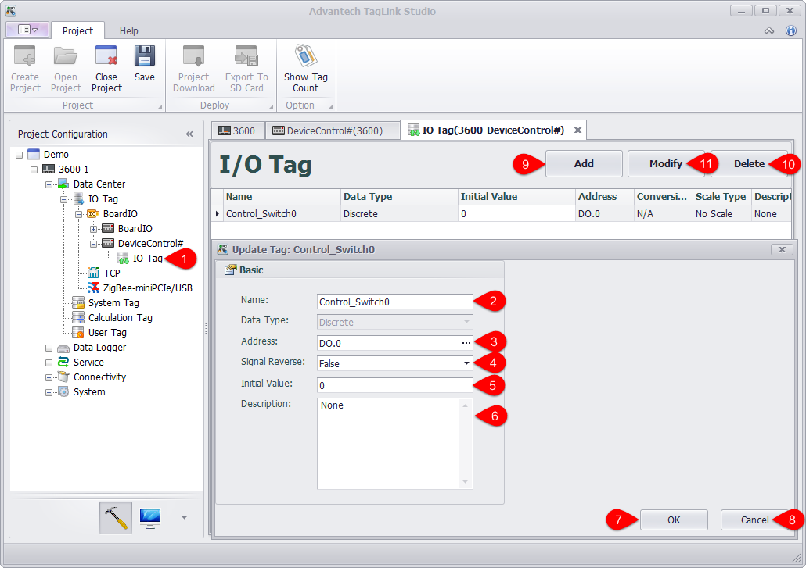

## Configure Extended IO

Please follow the below procedures to configure IO tag of the extension module.

1. Double-click "IO Tag" in the left tree menu or right-click on it and select "Edit".

2. Fill in a tag name.

3. Select a tag address.

4. Select whether to reverse the signal, which is only available for DO module.

5. Set its initial value.

6. Give a description of the IO tag, which is optional.

7. Click "OK" button to successfully add the tag. Then this new tag will appear in I/O Tag list.

8. Click this button to cancel the changes.

9. Add another new tag.

10. Choose one or several tags to delete.

11.Choose one or several tags to modify.

