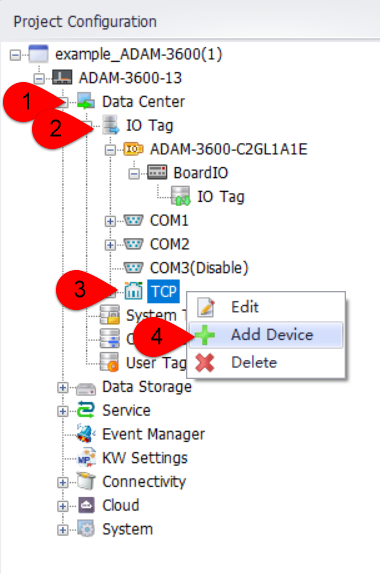
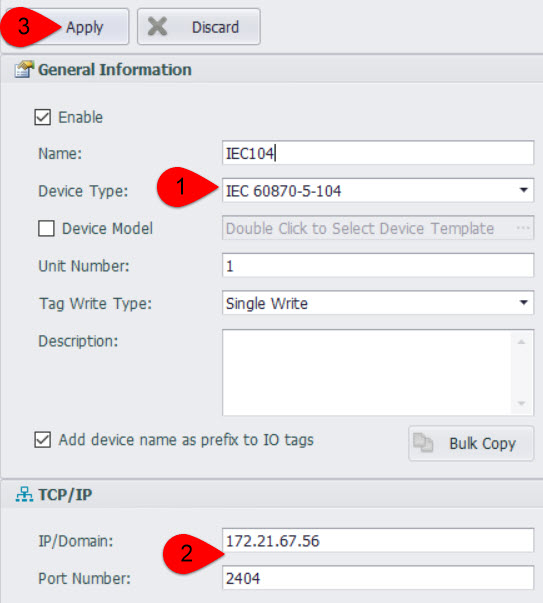
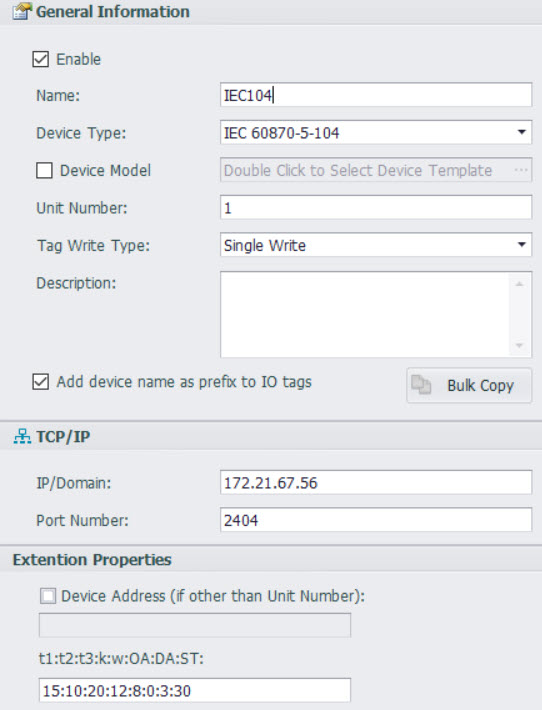

## IEC104

一、Driver support start version number：

二、Quick Connection

1.Add Device

- DataCenter--->I/O Tag--->TCP--->Right Click：Add Device

2.Configure the device

- Select Device Type：IEC 60870-5-104--->Fill in the IEC104 server IP and port number: such as 172.21.67.56 and 2404--->click "Apply"

3.Add tag(s)

4.Download project，completed the quick configuration of IEC104.

三、Detailed configuration instructions

1.Detailed configuration interface instructions

- Name: Fill in as desired.
- Device Type: Select IEC 60870-5-104.

- IP/Domain Name: The IP address of the IEC104 server.

- Port Number: The port number of the IEC104 server.

- t1:t2:t3:k:w:OA:DA:ST：
  - [ ] t1：1~255 seconds, Refer to the IEC104 protocol for specific requirements.
  - [ ] t2：1~600 seconds, Refer to the IEC104 protocol for specific requirements.
  - [ ] t3：1~600 seconds, Refer to the IEC104 protocol for specific requirements.
  - [ ] k： 1~32767, Refer to the IEC104 protocol for specific requirements.
  - [ ] w： 1~32767, Refer to the IEC104 protocol for specific requirements.
  - [ ] OA：Master Address，Refer to the IEC104 protocol for specific requirements.
  - [ ] DA：Slave public address.
  - [ ] ST：Scan time. 	1 ~3000 seconds.

2. Detailed description of tag point configuration

    There are three types of Tag.

      A.	Read Only Tag
              Format: R:Read Address / Read Data Type / Read Command  
              Example: R:402 / M_BO_NA_1 / n

      B.	Write Only Tag
              Format: W:Write Address / Write Command  
              Example: W:2300 / C_RC_NA_1
              Note: Always show value 0 for this kind of tag

      C.	Read And Write Tag
              Format: R:Read Address / Read Data Type / Read Command / W:Write Address / Write Command 
              Example: R:400 / M_BO_NA_1 / n / W:2400 / n

**Note**: Add /SE after Write Command to change “Direct Execute” to “Select and Execute”
- Read And Write Tag
Format: R:Read Address / Read Data Type / Read Command / W:Write Address / Write Command / SE
Example: R:100 / M_SP_NA_1 / n / W:2100 / n / SE
- Write Only Tag
Format: W:Write Address / Write Command / SE
Example: W:2100 / C_SC_NA_1 / SE

