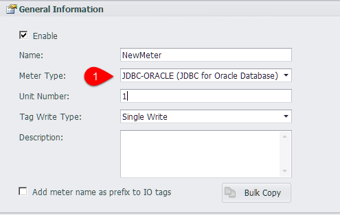
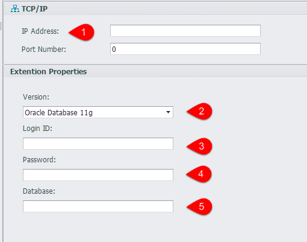
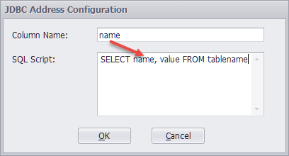

## JDBC Device

1. Select the device type JDBC-ORACLE in the device interface, and can be configured to collect data via an online JDBC server

	

2. In the device interface, enter the JDBC service configuration.

	

	1. Server IP address.
	2. Oracle version, you can choose Oracle Database 10g、Oracle Database 11g、Oracle Database 12c and so on.
	3. The user name required for logging in Oracle.
	4. The password required for logging in Oracle.
	5. The name of the database that you need to log in.

3. Data acquisition script

	

	Click on the address bar of the Tag edit interface to edit the SQL scripts for data collection,
	
	which "SQL Script" enter the SQL query script, "Column Name" enter the column name of the query result..