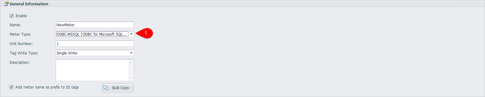
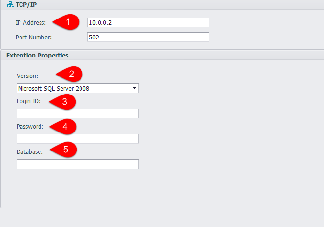
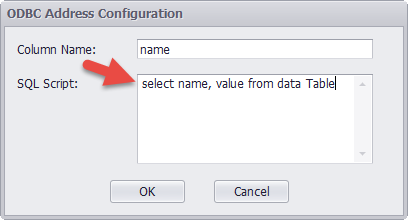

## ODBC Device

1. Select the device type ODBC-MSSQL in the device interface, and can be configured to collect data via an online ODBC server

	

2. In the device interface, enter the ODBC service configuration.

	

	1. Server IP address.
	2. SQL Server version, you can choose SQL Server2008, SQL Server2005, SQL Server2000 and so on.
	3. The user name required for logging in SQL Server.
	4. The password required for logging in SQL Server.
	5. The name of the database that you need to log in.

3. Data acquisition script

	

	Click on the address bar of the Tag edit interface to edit the SQL scripts for data collection,
	
	which "SQL Script" enter the SQL query script, "Column Name" enter the column name of the query result..