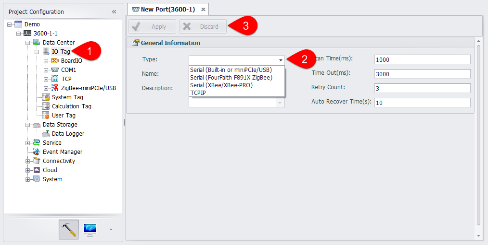
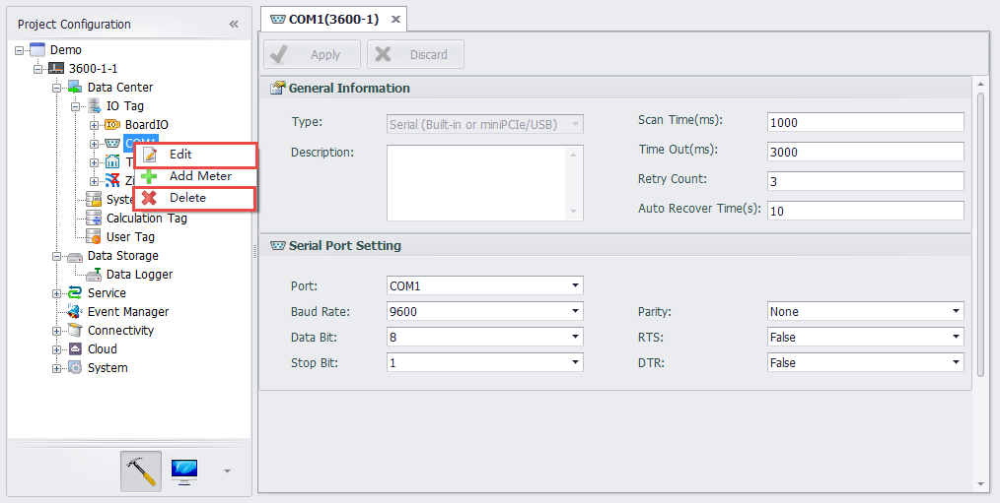
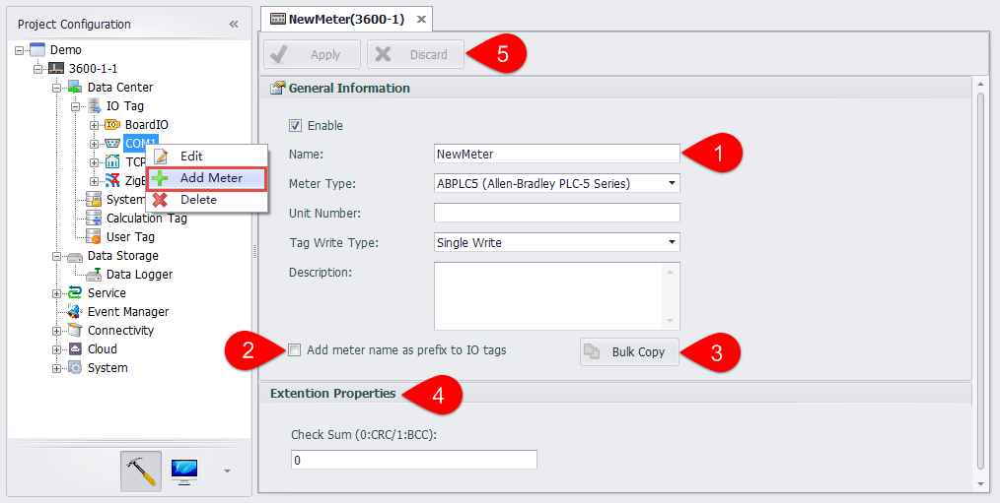
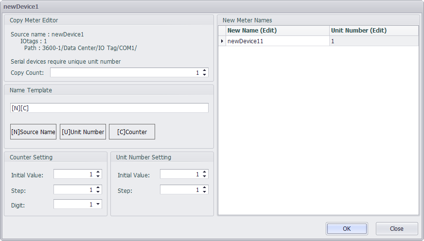
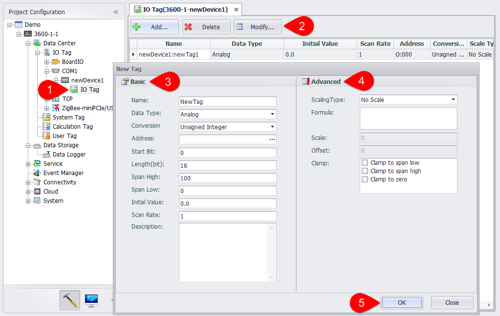

## Configure IO of Serial Devices

 When creating the device, all serial ports on devices will be created at the same time. Users need to add new ports into EdgeLink Studio following the below procedures.

1. Right-click on "IO Tag" and choose "Add Port".

2. Select the port type from the drop-down list. Then "Serial Port Setting" will appear and allow users to set the related parameters according to their requirements.

3. After the setup, click "Apply" button to save the changes.If users do not want to save the changes, click "Discard" button.　

After the port has been added successfully, users can edit/delete it and add device.

A. Right-click on the port name and select "Edit" to change the serial port settings which are shown in below.

B. Right-click on the port name and select "Delete" to remove this port.

C. Right-click on the port name and select "Add Device" to configure the serial device, whose detailed settings are shown in the below figure.

1.Fill in the device name information, select the device type, set the device unit number, IO tag write mode, fill in the description information (optional).

2.Select whether to add a name prefix to the IO tag. If you select "Yes", the Tag name is composed of "Device name: Tag name" when you add a Tag under this device.

3.Whether to batch copy the Tags under this device. The button is only available if you have chosen to add a name prefix to the IO tag.

4.In "Extension Properties", users can know the different protocols and their corresponding configurations.

5.Then, click "Apply" button save the settings.If users do not want to save the changes, click "Discard" button.

D.After a new device has been successfully added, users need to configure IO tag, the procedures of which are similar as for "Configure Onboard IO" (see below).。　

E.If users want to delete the newly added device, right-click on the device name and select "Delete" to remove it.
