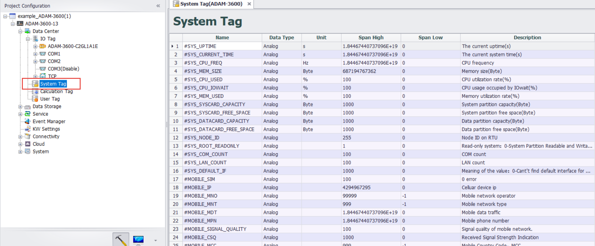

## System Tag　  

There are two types of system tags：[**General system tag**](#general-system-tag-descriptionread-only)和[**Special system tag**](#special-system-tag-description)

**General system tag**：It is generally read-only. System-related information, module (4G, Wifi, GPS) information, serial port, network port information, etc

**Special system tag**：Some can be read and written

1. When a meter is added to DataCenter, three system tags are generated, representing information about the meter.
2. DatLogger Status

### General system tag description(Read Only)

|Name                        |	Description                                             |
|------------------------------|-----------------------------------------------------------------------------------|
|#SYS_UPTIME|	The current uptime(s)|
|#SYS_CURRENT_TIME|	The current system time(s)|
|#SYS_CPU_FREQ|	CPU frequency|
|#SYS_MEM_SIZE	|Memory size(Byte)|
|#SYS_CPU_USED	|CPU utilization rate(%)|
|#SYS_CPU_IOWAIT	|CPU usage occupied by IOwait(%)|
|#SYS_MEM_USED	|Memory utilization rate(%)|
|#SYS_SYSCARD_CAPACITY	|System partition capacity(Byte)|
|#SYS_SYSCARD_FREE_SPACE	|System partition free space(Byte)|
|#SYS_DATACARD_CAPACITY	|Data partition capacity(Byte)|
|#SYS_DATACARD_FREE_SPACE	|Data partition free space(Byte)|
|#SYS_NODE_ID	|Node ID on RTU|
|#SYS_ROOT_READONLY	|Read-only system：0-System Partition Readable and Writable, 1-System Partition Read-Only|
|#SYS_COM_COUNT	|COM count|
|#SYS_LAN_COUNT	|LAN count|
|#SYS_DEFAULT_IF	|Meaning of the value：0-Cant't find default interface for route, 1-LAN1, 2-LAN2, 3-LAN3, 4-LAN4, 101-WiFi, 201-Cellular|
|#MOBILE_SIM	|0 error  1 READY: MT is not pending for any password  2 SIM PIN: MT is waiting SIM PIN to be given  3 SIM PUK: MT is waiting SIM PUK to be given  4 SIM PIN2: MT is waiting SIM PIN2 to be given  5 SIM PUK2: MT is waiting SIM PUK2 to be given  6 PH-NET PIN: MT is waiting network personalization password to be given  7 PH-NETSUB PIN: MT is waiting network subset personalization password to be given  8 PH-SP PIN: MT is waiting service provider personalization password to be given  9 PH-CORP PIN: MT is waiting corporate personalization password to be given  10 PH-SIM PIN: MT is waiting phone to SIM/UICC card password to be given 99 not known|
|#MOBILE_IP	|Celluar device ip|
|#MOBILE_MNO	|Mobile network operator|
|#MOBILE_MNT	|Mobile network type|
|#MOBILE_MDT	|Mobile data traffic|
|#MOBILE_MPN	|Mobile phone number|
|#MOBILE_SIGNAL_QUALITY	|Signal quality of mobile network|
|#MOBILE_CSQ	|Received Signal Strength Indication|
|#MOBILE_MCC	|Mobile Country Code，MCC|
|#MOBILE_MNC	|Mobile Network Code，MNC|
|#MOBILE_LAC	|Location Area Code, LAC|
|#MOBILE_CID	|Cell Tower ID, Cid|
|#MOBILE_IMSI	|IMSI, International Mobile Subscriber Identity|
|#MOBILE_IMEI	|IMEI, International Mobile Equipment Identity|
|#MOBILE_IMEI_RAW	|IMEI raw data|
|#MOBILE_USBID	|mobile modem, usb vendor id, product id|
|#MOBILE_DATA_DAY	|Cellular data, current day used traffic|
|#MOBILE_DATA_MONTH	|Cellular data, current month used traffic|
|#MOBILE_DATA_YEAR	|Cellular data, current year used traffic|
|#WLAN0_SIGNAL_QUALITY	|Signal quality of wlan0|
|#WLAN0_SIGNAL_LEVEL	|Signal level of wlan0|
|#WLAN0_SIGNAL_NOISE	|Signal noise of WLAN0|
|#WLAN0_SIGNAL_BITRATE	|Bit rate of WLAN0|
|#WLAN0_AP_MAC	|MAC or BSSID in Wifi AP mode|
|#ICDM_COM1_SCORE	|COM 1 score|
|#ICDM_COM2_SCORE	|COM 2 score|
|#ICDM_COM3_SCORE	|COM 3 score|
|#ICDM_LAN1_SCORE	|LAN 1 score|
|#ICDM_LAN1_LINK	|LAN 1 link state|
|#ICDM_LAN2_SCORE	|LAN 2 score|
|#ICDM_LAN2_LINK	|LAN 2 link state|
|#GPS_LATITUDE	|Latitude for the GPS module|
|#GPS_LONGITUDE	|Longitude for the GPS module|
|#GPS_ALTITUDE	|Altitude for the GPS module|
|#GPS_SPEED	|Speed for the GPS module|
|#GPS_COURSE	|Course for the GPS module|
|#GPS_SATELLITE	|Status of the GPS module: 0-error state, 1-use GPS module working, 2-use a preset location information|
|#SYS_BATTERY_LOW	|Battery power: 1 indicates that the battery is low, 0 indicates that the battery is normal|
|#SYS_TIME_SECOND	|(0~59, when leap seconds: 60)|
|#SYS_TIME_MINUTE	|Minutes（0~59）|
|#SYS_TIME_HOUR	|Hours (0~23)|
|#SYS_TIME_DAY	|Day (1~31)|
|#SYS_TIME_MONTH	|Month (1~12)|
|#SYS_TIME_YEAR	|Year (for example,2016)|
|#SYS_TIME_WDAY	|Week (0~6, Sunday: 0, Monday to Saturday: 1~6)|
|#SYS_TIME_YDAY	|Number of days from the beginning of the annual January 1st (0~365,January 1st: 0, January 2nd: 1, and so on)|
|#SYS_TIME_ISDST	|Daylight saving time identifier, implementing daylight saving time, the value is positive. Do not implement the time in the summer, the value is 0. Cannot be determined when the value is negative|
|#SYS_TIME_GMT_OFFSET	|The deviation of GMT seconds and local time, the eastern time zone is positive and negative for West Zone, such as China, should be 28800|
|#DATALOG_ENABLE	|Enable Datalogger storage when the value is 1, and stop storage when the value is 0|
|#DATALOG_ERROR	|When the value of DATALOG_ERROR is 0, it means that there is no error in the program. Check the manual for other error code information|
|#SYS_MAC_LAN1	|MAC address of lan1|
|#SYS_MAC_LAN2	|MAC address of lan2|
|#SYS_TFCARD_CAPACITY	|TF card capacity(Byte)|
|#SYS_TFCARD_FREE_SPACE	|TF card root partition free space(Byte)|
|#SYS_SDCARD_CAPACITY	|SD card capacity(Byte),the value is 0 if there is no SD card|
|#SYS_SDCARD_FREE_SPACE	|SD card free space(Byte),the value is 0 if there is no SD card|
|#SYS_DNP3_AI_POLLED_COUNTER	|The number of times AI data was polled in DNP3 Outstation|
|#MQTTStatus_WISE-Edge365_0	|0- Not connected; 1- Connecting; 2- Connected, subscribing to topics; 3- Connected，the topics is subscribed|

### Special system tag description

- **#DATALOG_ENABLE** ：  Read-write, enabling DataLogger storage when the value is 1 and stopping the DataLogger storage when the value is 0  
- **#DATALOG_ERROR** ：   Read-only, 0--The program runs normally, other error codes need to be found in the DataLogger manual section 
- **#DISABLE_DEVICE_MeterName** ： Read-write, each meter in the DataCenter has its own tag, distinguished by the name of the meter. 0--meter available, 1--meter not available. For example, if the meter name is Test Device 1, there will be a corresponding system tag #DISABLE_DEVICE_ Test Device 1, through which the meter can be disabled or started 
- **#BATCH_WRITE_MeterName** ：  Read-write, each meter in the DataCenter has its own tag, distinguished by the name of the meter. 0--meter single point write, 1--meter batch write. For example, if the name of the meter is testdevice1, there will be a corresponding system point #BATCH_WRITE_ testdevice1, through which the writing method of the meter can be set
- **#DEVICE_ERROR_MeterName** ：   Read-only, each meter in the DataCenter has its own tag, distinguished by the name of the meter. The error code when the current meter is collecting errors. For example, if the instrument name is TestDevice1, there will be a corresponding system tag #DEVICE_ERROR_TestDevice1, through which the current meter collection status can be viewed
- **#DISABLE_PORT_PortName** ： Read-write, each port has its own tag, 0--port available, 1-disable port. For example, the COM1 port will have a corresponding system tag #DISABLE_PORT_COM1, through which the port can be turned on or disabled 

 

