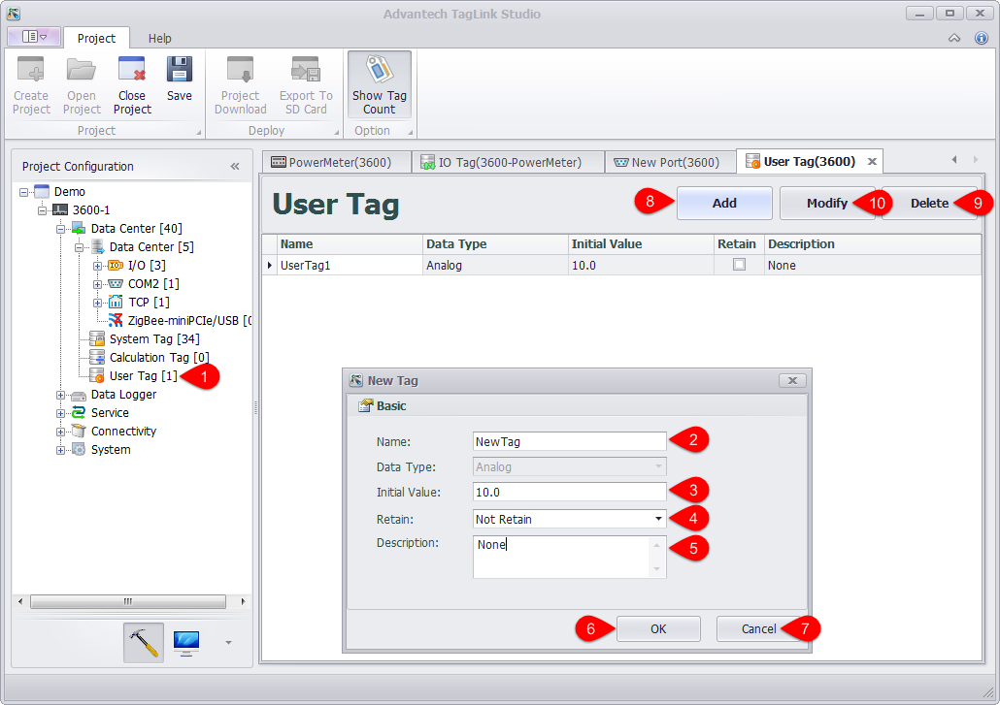

## Configure User Tag

IO tags described in the previous sections are all real ones, while some unreal IO tags are also need in the process of project deployment. This kind of tags is optional and called User Tag which can be used for C and KW language programming, as a control signal or a manifestation of an operation result.

User tag configuration is supported by EdgeLink Studio. Users can configure them one by one based on real needs for future programming. Please follow the below procedures to configure a user tag:

1. Double-click or right-click "User Tag" in the left menu tree to select "Edit".

2. Fill in the tag name.

3. Select the data type.

4. Set the initial value.

5. Give a description of the user tag, which is optional.

6. Click "OK" button to save the changes.

7. If users do not want to save the changes, click "Cancel Change" button.

8. Add another new tag.

9. Users can select one or more tags and click "Delete" button.

10. Users can select one or more tags and click "Modify" button.

