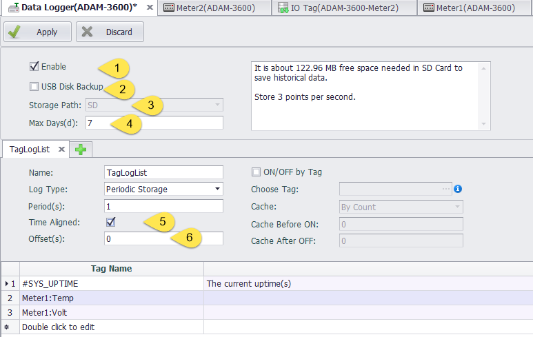
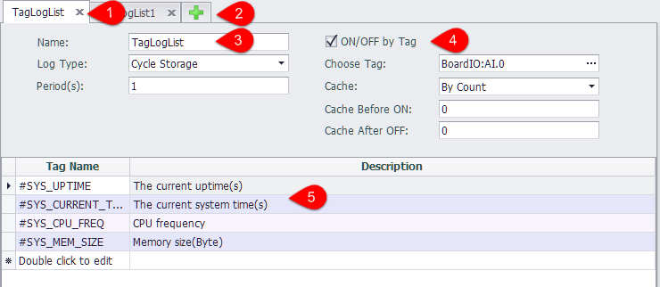
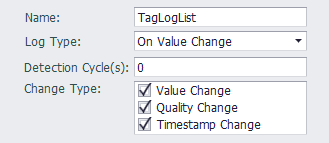
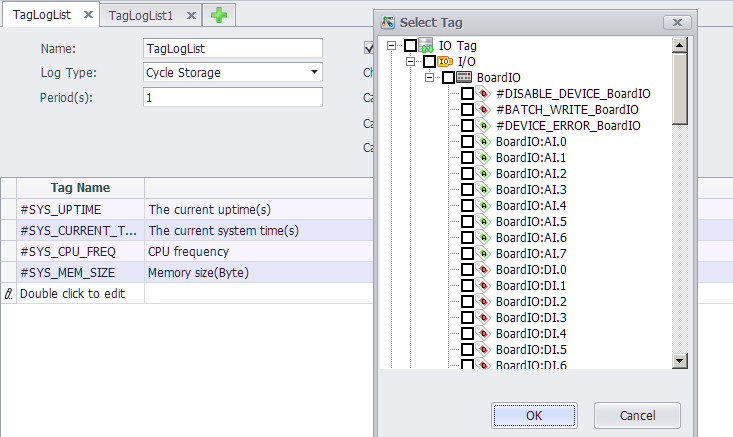

## DataLogger configuration

DataLogger is the software module that implements historical data storage on EdgeLink. 

The DataLogger module uses SQLite as the base storage medium, saves the data in the "Tag historical data table", and saves the data in minutes, hours and days three historical data tables.

### DataLogger Parameter Configuration：

1. Enable: select this item to enable data storage;
2. USB Disk backup: select this item, the existed historical data will be copied into the USB disk from SD card only when the system detects an insertion event. The newly added historical data is still stored in the SD card.
3. Storage address enabled: the location of the data store is stored on the SD card by default. **The SD card must be installed before using DataLogger function**;
4. Save the number of days (days): the maximum number of days of historical data is 7 days by default. If the number of days saved is exceeded, the system will automatically delete the earliest stored data.

Example:
- If the periodic storage period is 10S, the stored program starts to run at 13:15:17, then the time is 13:15:20 for the first stored data and 13:15:30 for the next data

### Storage group parameter configuration：

Tag values can be stored in a data table in a variety of ways depending on the configuration of the storage group

1. The storage group configures the Tab page, and the user can click "x" to close the current configuration page.
2. Users can click "+" to add storage groups
3. The basic parameters of a storage group:
	- Name: the name of the storage group, which is used only to distinguish storage groups
	- Storage mode: you can select cycle storage and change storage.
	- Period needs to be configured when selecting cycle storage.
4. The user can select a tag to control the current storage group ON and OFF. When the Tag value is 0, the storage group is not enabled, and the storage group is enabled when the rest of the values are present.
	- Select the control tag: select a tag in the Data Center as the control tag.
	- Cache mode: when the control tag ON and OFF, it will cache a certain amount of data. In the cache mode, you can choose to cache log information by count or time.
	- Cache before ON: some Tag data is cached before the storage group starts its storage
	- Cache after OFF： after the storage group stops storage, some Tag data is stored.
5. Edit the tags to be stored in the list，and the total number of tags stored in all storage groups is limited to 200.

When the storage mode is selected as the change storage, it is necessary to configure " Detection Cycle " and " Change Type ". The time of each " Change Type " after the storage group is enabled is to detect whether the tags in the storage group and the attributes selected in the " Detection Cycle " are consistent with the values saved after the last detection cycle. If there is a change, it will be stored in the data table.

When the value of " Change Type " is 0, it will be immediately stored in the data table when the change of the tag attribute is detected.

### Edit the storage tag

Double-click on the last line in the tag name column to add the storage tag, and double-click the added Tag to modify. To delete the Tag, right-click on the Tag line that you want to delete, and click the delete button on the pop-up toolbar to remove the current Tag.

>**Note!** Tags are added to a storage thread and cannot be added to other storage threads

### Error code information of #DATALOG_ERROR

When the value of #DATALOG_ERROR is 0, it means that there is no error in the program. 

Error 1 ~ 9 are critical errors

	1: DataLogger is not enabled.
	2: Storage path is invalid.
	3: DataLogger SDK initialize Storage path failed.
	4: DataLogger SDK initialize failed.
	5: Failed to allocate memory at DataLogger startup.
	6: Failed to initialize the logging thread at DataLogger startup.
	7: Open Control Tag failed.
	8: Read Control Tag value failed. 
	9: Add Tag to data center failed.
	
	257: Insufficient storage space. The safety space is 50Mb.
	512 ~ 767: Insert value to DataLogger SDK value cache failed.
	768 ~ 1023: DataLogger SDK write values to storage failed.
	1024 ~1279: DataLogger SDK reposition the write file failed while writing values to storage.
