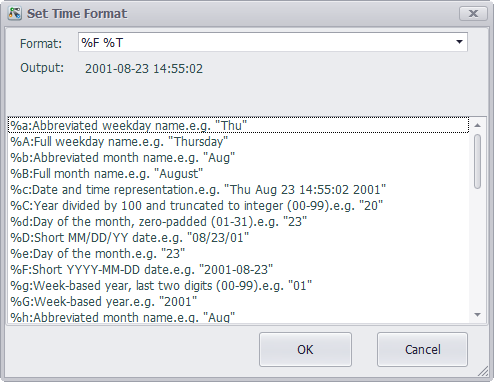
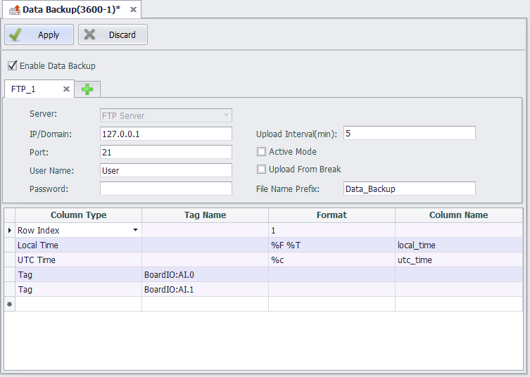

## Data Backup ##

In EdgeLink Studio, users can set the historical data for the specified tag to be stored. According to the set storage method, historical data will occupy some of the SD card or U disk space.With the increase of running time, the historical data will be more and more.To improve the backup performance and security of historical data, users can backup huge amounts of data to other servers remotely.

1.Open the "Data backup" page.

2.Select Enable Data Backup.

3.Fill in data backup settings.

4.Select the tags to be backed up and other necessary information.

5.Click the "+" button to add a backup setting.

6.Click the "×" button to delete a backup setting.

7.Click Apply to complete the configuration.

Currently, data backup is divided into SQL Server and FTP Server according to the type of server used:

After the content to be backed up (such as a tag) has been added to the backup list under the connection, the server type cannot be modified; after all the contents in the backup list have been deleted, the server type can be modified.

###SQL Server Method###

In the data backup settings area, select Server Type as SQL Server to back up the selected tag data in ODBC mode. The information you need to fill out includes:

IP/Domain: The IP address or domain name of the backup server.

Port: The port number of the database.

DataBase Name: The name of the database that already exists on the connected server side.

Index Table: Custom table name. The table will be automatically generated in the SQL server, and the last time of each upload tag will be recorded in the table for the data store and forward.

User Name: The username to log in to the remote server.

Password: The password to log in to the remote server.

Table Name Prefix: Used to automatically create a database table by table name in the connected database.

Batch Upload Count: The default limit for allowing the client to upload data each time is 500. That is, the system queries the cached 500 data and uploads them to the server in batches.

In the tag list, double-click on the blank row of the tag name column, and you can add the tags included in this backup.

A tag is saved as a database table during backup. By default, the "table name prefix _tag name" is used as the table name stored in the tag. To distinguish the storage table of the same name tag, you can specify different contents for the "table name prefix" in different connections, or modify the table name column by yourself. If the table name prefix and the tag are the same, the system will automatically rename the table name.

The default maximum upload period of the tag is 2 minutes. It is compatible with the “batch upload count”. New data is not queried beyond the maximum upload period, and if the single maximum upload limit is not reached, the data cached at this time will be uploaded to the server.

The tag storage value type is the format of the stored data. The default value type is float, and can be saved as float, int, big int, navarchar, bit type.

Users can modify the "table name", "maximum upload period", and "value type" in the tag list as needed.

If the "TagLogger" function is unavailable or the stored Tag is not specified in "TagLogger", a dialog box will pop up  and indicate that the user should set the "TagLogger" function before setting the backup tag when adding the tag to data backup. ***

###MySQL Server Method###

In the data backup settings area, select Server Type as MySQL Server to back up the selected tag data in MySQL mode. The information you need to fill out is same as SQL Server.

###ORACLE Method###

In the data backup setting area, select Server Type as ORACLE Server to back up the selected tag data by ORACLE. The information you need to fill out includes:

1.	IP/Domain：The IP address of the database, where the domain mode is not tested.
1.	Port：The port that the database listens to. When the database is installed, the default is 1521. If there is no modification when configuring the database, the default is 1521.
1.	DataBaseName：The instance name of the Oracle database . The name of this instance is orcl by default during installation. If there are changes during the installation process, please use the custom instance name.
1.	TableName: The table in Oracle that stores data. This version of the data upload mechanism is that all data that needs to be backed up on the device side is stored in this table on the database side. The database does not need to be created manually. When the device uploads data, the table will be created automatically if it does not exist, and must start with a letter. Table 2 is the table structure.
 
    

    - RECDATETIME field：Tag timestamp，stored in Date format.
    - METERCODE field：Corresponds to the MeterCode in table 1, same as in Tagname.
    - ATTRCODE field: Corresponds to the Alias content in Table 1.
    - VALUE field：Tag value.

    The rules for defining transmission fields are as follows:

    - Tag name format：devicename:tagname . Tagname automatically corresponds to the field Alias，and devicename corresponds to the field metercode.
    - When the tag name format is tagname, Tagname automatically corresponds to the field Alias, the field metercode can be empty, and the field Alias cannot be empty

1.	UserName and Password are the credentials for remote login to oracle.
1.	Timestamp: The type of time stored in the RECDATETIME field in the database table. Local time and UTC time can be selected.
The table storing the timestamp of the tag value cannot be customized. When the device connects to the database, the FORRECORDTIME table will be created by default to store the last uploaded timestamp of the tag, which is used for the device's data resume function.

###FTP Server Method###

In the data backup setting area, select Server Type as FTP Server to back up the selected tag data by FTP. The information you need to fill out includes:

IP/Domain: The IP address or domain name of the backup server.

Port: The port number of the database.

User Name: The username to log in to the remote server.

Password: The password to log in to the remote server.

Upload Interval: The interval at which the device uploads files to the server. The default is 5 minutes.

Whether to enable active mode: whether the mode of connecting to the server is active. FTP supports two modes, one is Standard (PORT), and the other is Passive (PASV). In active mode, the FTP client sends a PORT command to the FTP server. In passive mode, the FTP client sends a PASV command to the FTP server. Active mode is not enabled by default, ie passive connections are used.

Whether to enable upload from break: For files that are incompletely transmitted due to network reasons during transmission, continue to transmit or delete incomplete files and retransmit after network recovery. Consider that some servers do not support this feature and are not enabled by default.

File name prefix: Multiple users or multiple devices transmitting to the same server at the same time will result in consistent file name conflicts, prefixing the file names for differentiation.

Column type: Click on the blank line in the "column type" in the list, you can choose to add a column of data to the backup FTP file. The optional types include "tag" and the corresponding "row index", "local time", and "UTC time" when the tag is stored.

Format: Only for the format of "serial number", "local time", "UTC time".

Column Name: Users can rename the name of the data column that needs to be stored.

Tag: When the selected column type is "tag", the user can select the tag to be backed up in the pop-up dialog box and modify the "column name" in the list. The contents of the data will be displayed in the FTP file according to the "column name" set by the user.

Row Index: When the selected column type is "serial number", the user can modify the "format" and "column name" in the list. The "format" should be filled with an integer greater than 0, indicating the index value of the first row of the backup data.

Local Time or UTC Time: When the selected column type is "local time" or "UTC time", the default saved data format is "% F% T". Users can set the time format of the backup in the pop-up dialog box. The code in different time formats is given in the date list at the bottom of the window, and an example of the time format is shown in "Save as". Users can use the various formats in the date list. Specify the time format and click the OK button, and the "time format" code will appear in the list, where the user can modify the "column name" that is saved by the time column.

The file uploaded by FTP Server is a csv file. The system records the value of the same timestamp of all tags selected for backup as one piece of data in the table.