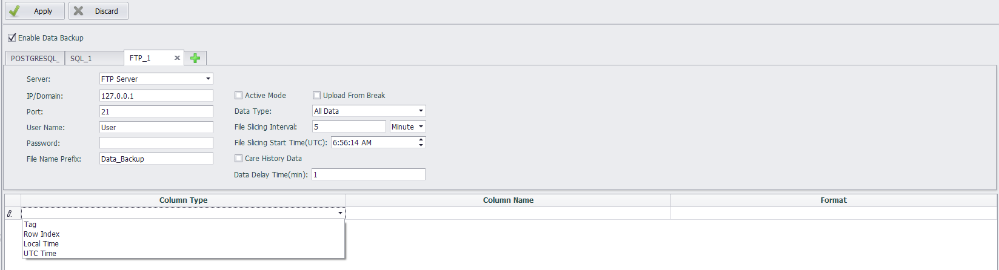

## Data Backup ##

In EdgeLink Studio, users can set the historical data for the specified tag to be stored. According to the set storage method, historical data will occupy some of the SD card or U disk space.With the increase of running time, the historical data will be more and more.To improve the backup performance and security of historical data, users can backup huge amounts of data to other servers remotely.

1.Open the "Data backup" page.

2.Select Enable Data Backup.

3.Fill in data backup settings.

4.Select the tags to be backed up and other necessary information.

5.Click the "+" button to add a backup setting.

6.Click the "×" button to delete a backup setting.

7.Click Apply to complete the configuration.

Currently, data backup is divided into SQL Server and FTP Server according to the type of server used:

After the content to be backed up (such as a tag) has been added to the backup list under the connection, the server type cannot be modified; after all the contents in the backup list have been deleted, the server type can be modified.

### SQL Server Method ###

In the data backup settings area, select Server Type as SQL Server to back up the selected tag data in ODBC mode. The information you need to fill out includes:

IP/Domain: The IP address or domain name of the backup server.

Port: The port number of the database.

DataBase Name: The name of the database that already exists on the connected server side.

Index Table: Custom table name. The table will be automatically generated in the SQL server, and the last time of each upload tag will be recorded in the table for the data store and forward.

User Name: The username to log in to the remote server.

Password: The password to log in to the remote server.

Table Name Prefix: Used to automatically create a database table by table name in the connected database.

Batch Upload Count: The default limit for allowing the client to upload data each time is 500. That is, the system queries the cached 500 data and uploads them to the server in batches.

In the tag list, double-click on the blank row of the tag name column, and you can add the tags included in this backup.

A tag is saved as a database table during backup. By default, the "table name prefix _tag name" is used as the table name stored in the tag. To distinguish the storage table of the same name tag, you can specify different contents for the "table name prefix" in different connections, or modify the table name column by yourself. If the table name prefix and the tag are the same, the system will automatically rename the table name.

The default maximum upload period of the tag is 2 minutes. It is compatible with the “batch upload count”. New data is not queried beyond the maximum upload period, and if the single maximum upload limit is not reached, the data cached at this time will be uploaded to the server.

The tag storage value type is the format of the stored data. The default value type is float, and can be saved as float, int, big int, navarchar, bit type.

Users can modify the "table name", "maximum upload period", and "value type" in the tag list as needed.

If the "TagLogger" function is unavailable or the stored Tag is not specified in "TagLogger", a dialog box will pop up  and indicate that the user should set the "TagLogger" function before setting the backup tag when adding the tag to data backup. ***

### MySQL Server Method ###

In the data backup settings area, select Server Type as MySQL Server to back up the selected tag data in MySQL mode. The information you need to fill out is same as SQL Server.

### PostgreSQL Server Method ###

In the data backup settings area, select Server Type as PostgreSQL to back up the selected tag data in PostgreSQL mode. The information you need to fill out is same as SQL Server.

### ORACLE Method ###

In the data backup setting area, select Server Type as ORACLE Server to back up the selected tag data by ORACLE. The information you need to fill out includes:

1.	IP/Domain：The IP address of the database, where the domain mode is not tested.
1.	Port：The port that the database listens to. When the database is installed, the default is 1521. If there is no modification when configuring the database, the default is 1521.
1.	DataBaseName：The instance name of the Oracle database . The name of this instance is orcl by default during installation. If there are changes during the installation process, please use the custom instance name.
1.	TableName: The table in Oracle that stores data. This version of the data upload mechanism is that all data that needs to be backed up on the device side is stored in this table on the database side. The database does not need to be created manually. When the device uploads data, the table will be created automatically if it does not exist, and must start with a letter. Table 2 is the table structure.
 
    

    - RECDATETIME field：Tag timestamp，stored in Date format.
    - METERCODE field：Corresponds to the MeterCode in table 1, same as in Tagname.
    - ATTRCODE field: Corresponds to the Alias content in Table 1.
    - VALUE field：Tag value.

    The rules for defining transmission fields are as follows:

    - Tag name format：devicename:tagname . Tagname automatically corresponds to the field Alias，and devicename corresponds to the field metercode.
    - When the tag name format is tagname, Tagname automatically corresponds to the field Alias, the field metercode can be empty, and the field Alias cannot be empty

1.	UserName and Password are the credentials for remote login to oracle.
1.	Timestamp: The type of time stored in the RECDATETIME field in the database table. Local time and UTC time can be selected.
The table storing the timestamp of the tag value cannot be customized. When the device connects to the database, the FORRECORDTIME table will be created by default to store the last uploaded timestamp of the tag, which is used for the device's data resume function.

### FTP Server Method ###
In the data backup settings area, select "Server Type" as "FTP Server" to back up the selected point data via FTP.

#### Parameter Description

| Parameter | Description |
|---------------------------|-----------------------------------------------------|
| IP/Domain Name | The IP address or domain name of the backup server |
| Port Number | The port number required to connect to the database |
| Username | The username for remote login to the server |
| Password | The password for remote login to the server |
| File Name Prefix | To avoid file name conflicts when multiple users or devices transmit data to the same server simultaneously, a prefix can be added to the file name for differentiation |
| Active Mode | Whether the connection mode to the server is active. FTP supports two modes: Standard (PORT, i.e., active mode) and Passive (PASV, i.e., passive mode). In active mode, the FTP client sends a PORT command to the FTP server, while in passive mode, the FTP client sends a PASV command to the FTP server. By default, active mode is not enabled, meaning passive connection is used |
| Upload from break | For files that are not completely transferred due to network issues during transmission, the incomplete part can be resumed or the incomplete file can be deleted and retransmitted when the connection is restored. Since some servers do not support this feature, it is disabled by default |
| Data Type | Default is all data, which refers to all data in the point list stored in DataLogger. In addition to this, it also supports forwarding of statistical data, including minute, hour, and daily statistics |
| File Slicing Interval | The duration of stored data to be saved in one file. For example, if this parameter is set to 5 minutes, the data stored every 5 minutes for the tags in the point list will be generated into one file |
| File Slicing Start Time | The time offset at which the backup file begins to record data. For example, if the file split interval is 5 minutes and the file split start time is 2025/3/19 9:03:19 (UTC), with a storage cycle of 1 second for the tag in DataLogger, and the backup program is launched at 2025/3/19 9:05:29 (UTC) after downloading the project, the first file will back up data from 2025/3/19 9:05:29 to 2025/3/19 9:08:28, and the second file will back up data from 2025/3/19 9:08:29 to 2025/3/19 9:13:28, and so on |
| Care History Data | By default, this option is not checked. If checked, the backup program will record the time when the backup stops. When the backup program is restarted, it will back up the data stored in DataLogger between the two program launches |
| Data Delay Time | The delay time for data backup |

#### Point Table Parameter Description

| Parameter | Description |
|---------------------------|-----------------------------------------------------|
| Column Type | Click on the blank row in the "Column Type" column in the list to add a column of data to the backup FTP file. The available types include "Point" and the corresponding "Serial Number," "Local Time," and "UTC Time" when storing points |
| Point | When the column type is selected as "Point," users can batch-select the points to be backed up in the pop-up dialog box and modify the "Column Name" in the list. The data content will be displayed in the FTP file according to the "Column Name" set by the user |
| Serial Number | When the column type is selected as "Serial Number," users can modify the "Data Format" and "Column Name" in the list. The "Data Format" should be an integer greater than 0, representing the index value of the first row of data to be backed up |
| Local Time or UTC Time | When the column type is selected as "Local Time" or "UTC Time," the default data format is "%F %T." Users can set the required time format for backup in the pop-up dialog box. The date list at the bottom of the window provides codes for different time formats and displays examples of time formats in the "Save As" section. Users can combine various formats from the date list. After specifying the time format and clicking the OK button, the "Time Format" code will be displayed in the list, and users can modify the "Column Name" for the time column |
| Column Name | The column name of the data to be stored can be renamed |
| Data Format | Applies only to the formats of "Serial Number," "Local Time," and "UTC Time" |
| Value Type | Applies only to statistical types such as minute statistics, hour statistics, and day statistics. Options include average value, maximum value, minimum value, and last value |

The file uploaded by FTP Server is a csv file. The system records the value of the same timestamp of all tags selected for backup as one piece of data in the table.

### SFTP Server Configuration Instructions

In the data backup settings area, select "Server Type" as "SFTP Server" to back up the selected point data via the SFTP Server method. The information required to be filled in is the same as that for the "FTP Server."