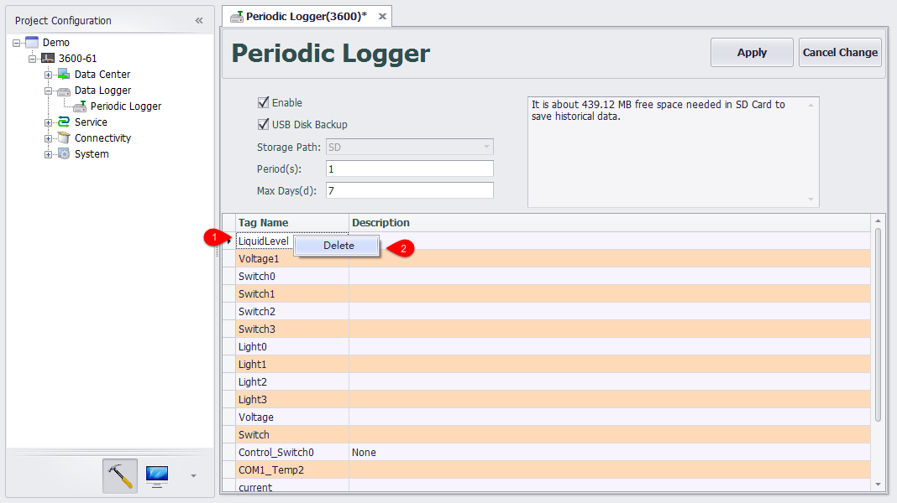
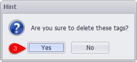
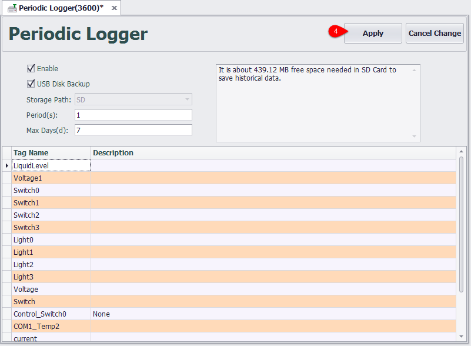

## Delete Tag

In project configuration, users can delete the unneeded tags as required.

Please follow the below procedures to delete a tag:

1. Right-click on the unneeded tags.;

2. Select "Delete".

3. In the pop-up dialog box, click "Yes" button.

4. Then click "Apply" button.

