## Device Template ##

In EdgeLink Studio, a set of templates is created for each model of the device according to different device drivers and models. The template includes the basic information of the device and the tag information under the device, which is the “device template”. When adding devices in EdgeLink Studio, you can use the device template to add the tags included in the device template to the device according to certain rules, instead of adding tags one by one.
The device template is a sqlite database file, which is divided into the default template and the user template. The default template is saved in the EdgeLink Studio installation directory to store the factory device templates included in the factory. The user template is saved in the template path where the project file is located.
The device template can be set to an open password. The user can use the EdgeLinkStudio device template tool to open the template with the password to maintain the template. The ordinary user can only open the user template for maintenance, and the developer can open the default template for maintenance.

###Device Template Tool###

Click the Device Template button in the EdgeLink Studio toolbar to open the device template tool.

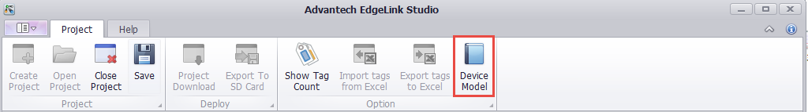

Device template tool interface：

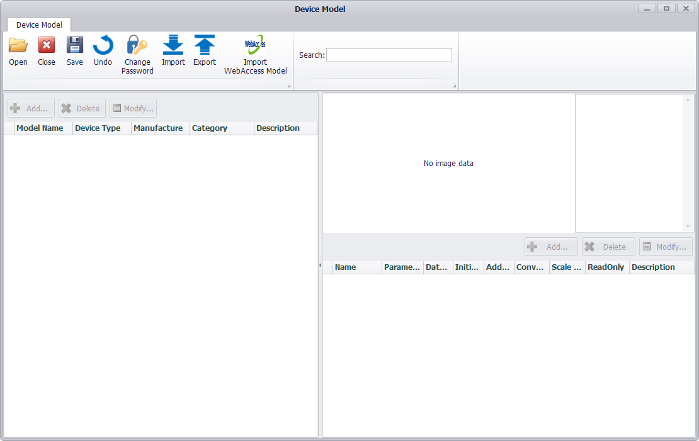

In the device template tool, the functions of opening, closing, saving, revoking, modifying password, importing and exporting, and importing Webaccess templates are supported.

1.Open the device template

When you open the device template tool in the EdgeLink Studio page, you will open the user template by default.When you open the device template tool in the EdgeLink Studio page, the User Template will be opened by default, and users can view template information, template images, and tag information in the interface.

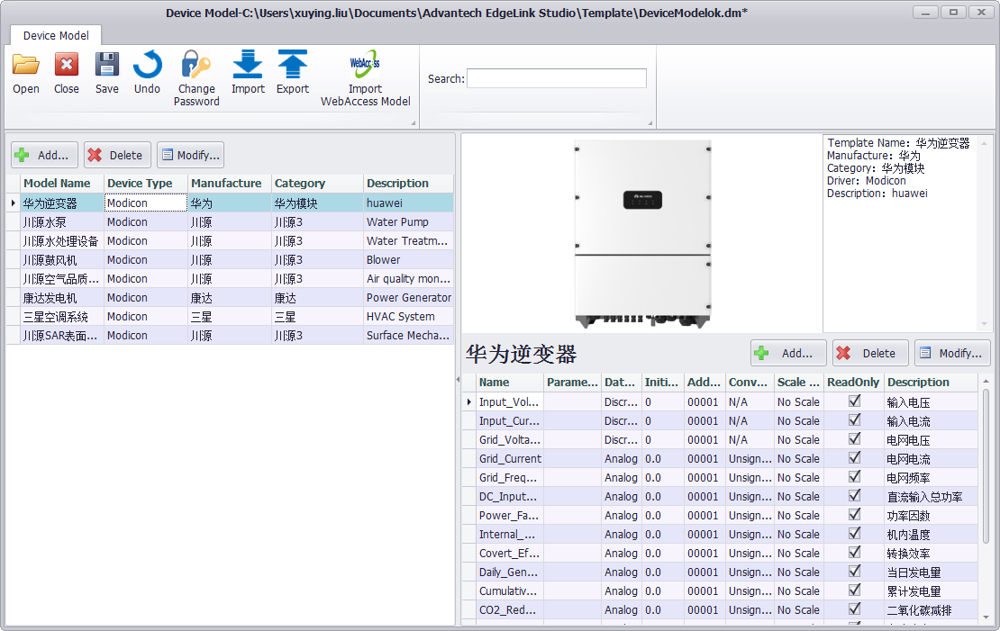

If a user template does not exist locally, a prompt box will pop up and the user can create an empty user template according to the prompt.

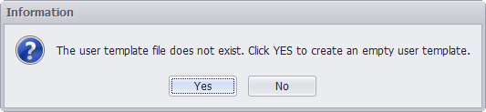

Users can click on the Open button to open any device template file.

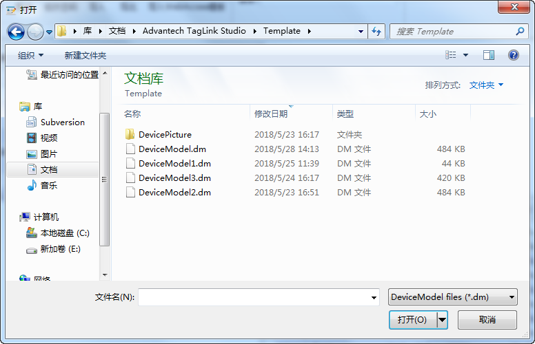

If the open device template needs to be opened with a password, you need to enter the template password. A prompt will be given when the password is wrong.

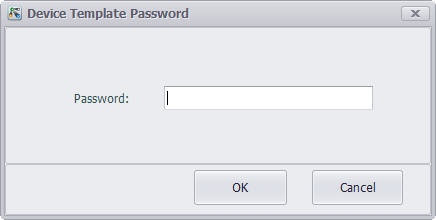

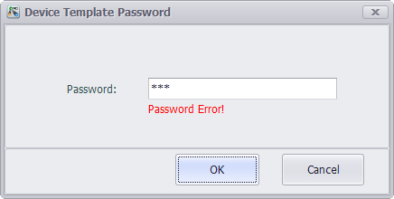

2.Close the device template

The user can click the Close button to close the current device template file. If there are unsaved changes to the template, a prompt box will pop up.

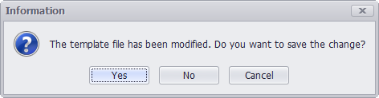

3.Modify the device template

In the device template tool, users can view, sort，search, filter, add, modify, and delete templates, and add, modify, sort，and delete tags included in the template.

Click the device template list header to sort the template. Click the tag list header to sort the tags.

Fill in the keyword in the search box of the toolbar, and click the Enter button to search for the template information in the current template file.

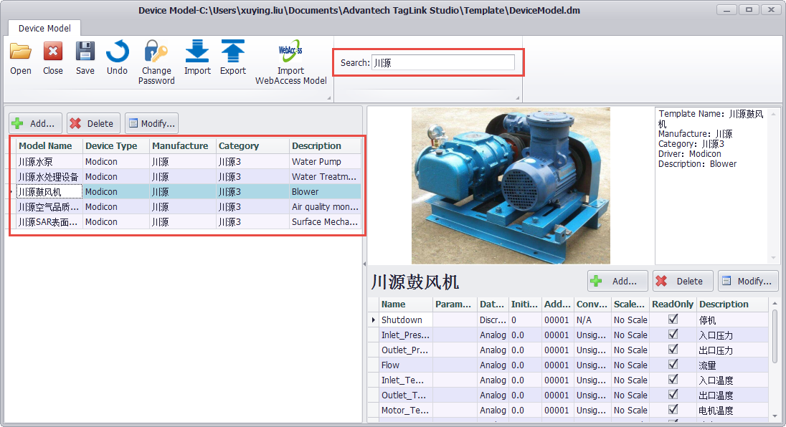

The template can be filtered by column in the header section of the template list.

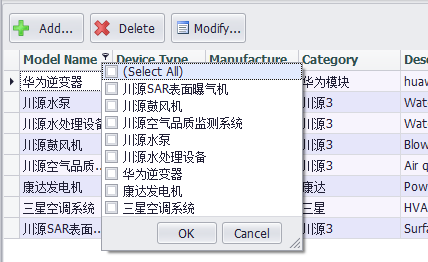

Click the Add button above the template list to add a new device template. The information includes the template name, driver type, manufacturer, device category, device image, and description. The template name cannot be duplicated with other templates in the template file. The manufacturer and device categories can be added by clicking the Add button on the right side of the input box. You can also select an existing manufacturer by pull-down. Device images can upload image files of up to 200K in .PNG, .JPG, .JPGE, .BMP, and .GIF formats.

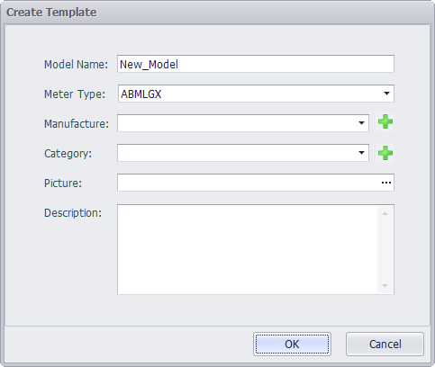

Double-click on an existing template in the list, or select a template in the list and click the Modify button above the list to modify the template.

Select a template in the list and click the Delete button above the list to delete the template.

Click the Add button above the list of tags to add a new tag to the currently selected template.The tag information is similar to the IO Tag information in EdgeLink Studio. The added tag name cannot be the same as the other tags under the same template.

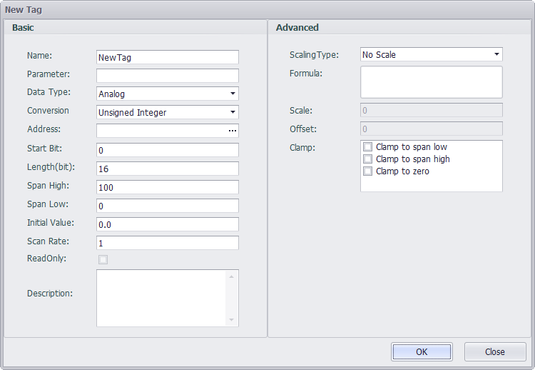

Double-click an existing tag in the list, or select a tag in the list, and click the "modify" button above the list to modify the tag.

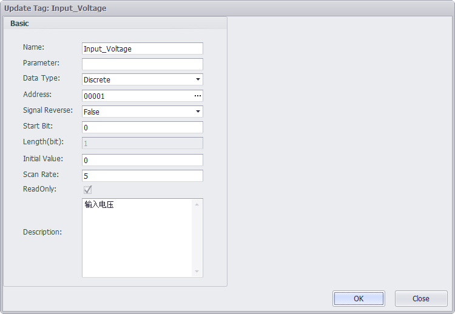

Select a tag in the list and click the Delete button above the list to delete the tag.

4.Save the device template modification

Adding, modifying, deleting, importing, etc. to the template file requires clicking the Save button in the page toolbar to save to the template file. After saving successfully, a prompt box will pop up.

5.Undo the device template modification

Click the Undo button to undo unsaved changes, and the template will be returned to the previous save.

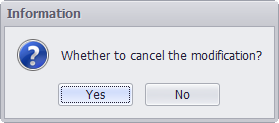

6.Modify the device template password

Click the Change Password button, and the template password can be modified in the pop-up dialog box.

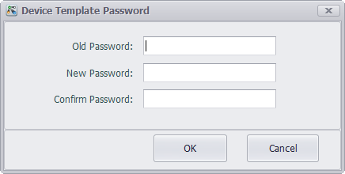

7.Import the device template

Click the Import button to import templates from other device templates files into the currently open template. To import a template that requires a password to open, a password dialog box pops up to prompt the user for a password.

Select to open the template file to be imported, and users can view the template information in the preview panel. Check the template information to be imported. Click the Append button to import the selected template into the current template file, click the Overwrite button to clear the current template and then import the selected template to the current template.

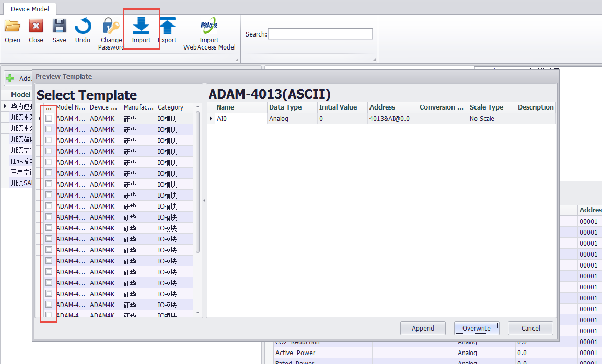

Whether it is append or overwrite, it will judge whether there is a template duplicate name and a tag duplicate name. If there is a duplicate name, it will be highlighted in the preview panel, and you can choose to rename the duplicate template or tag.

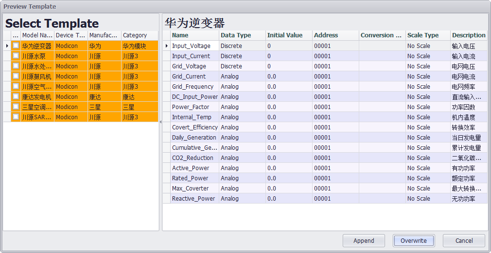

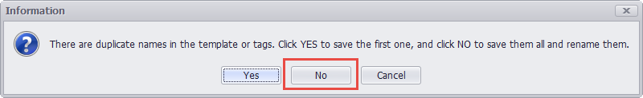

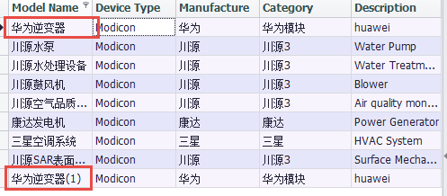

8.Export the device template

Click the Export button to export the currently opened template to a new template file. When exporting, you still need to check the template to be exported in the preview panel, and click the OK button to save the template file.

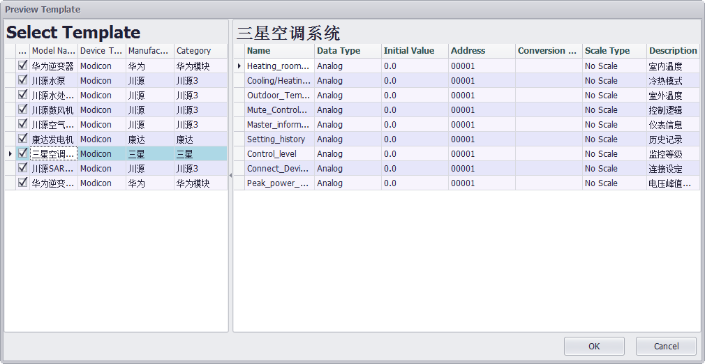

After saving successfully, the preview panel automatically closes.

9.Import Webaccess template

Webaccess template is an access database file in .mdb format. Click the Import Webaccess Template button, select the file to be imported, select the template information to be imported in the preview panel, click the Add button to import the selected template into the current template file, click the Overwrite button will clear the current template. Then import the selected template to the current template.

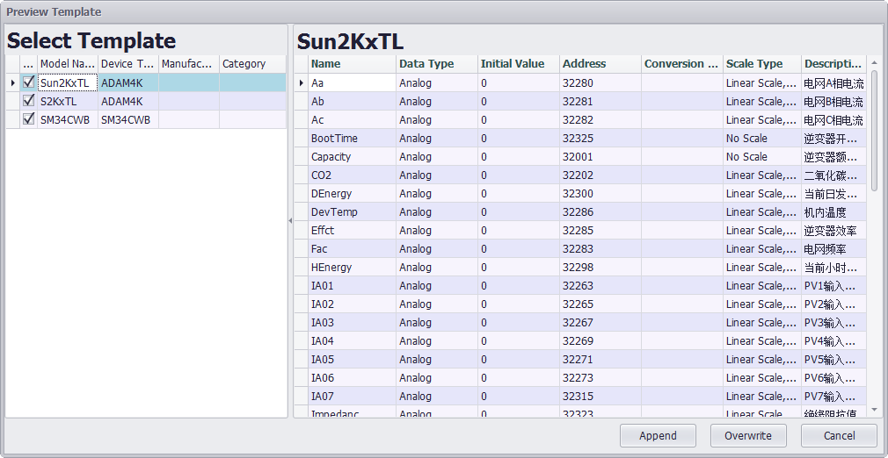

Similar to the import device template file, when importing the Webaccess template, it will also determine whether there is a template duplicate name and a tag duplicate name. If there is a duplicate name, it will be highlighted in the preview panel, and you can choose to rename the duplicate template or Tag.

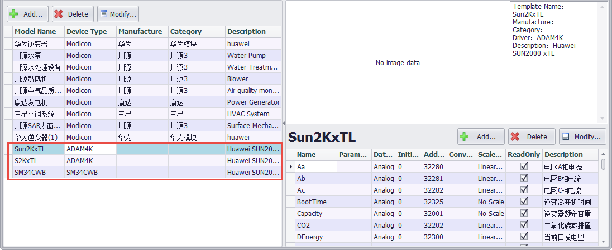

###Use Device Template###

1、Check the Use Device Template when adding and modifying devices.

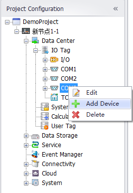

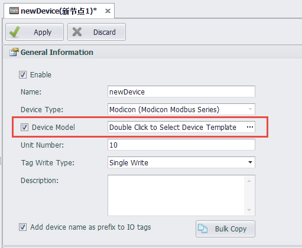

Double-click the device template selection box to bring up the panel to view and select all the device templates in the Default Template and User Template supported by the device driver. The tags under the template can be selected all or part of them.

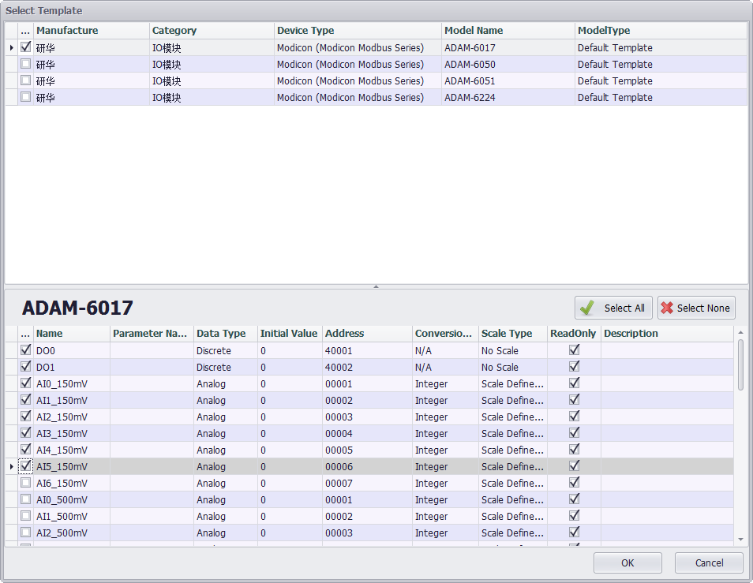

After clicking the OK button, the use template is set for the device. Click the Apply button on the device information page to add or update the device information. At the same time, the selected tag under the selected device template will be automatically added to the IO Tag list under the device.

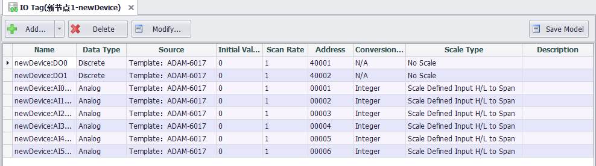

Click the Add button in the list of IO Tags to add tags customarily, and you can choose to add tags in bulk from the template by clicking the Add from Template button in the Add button drop-down menu.

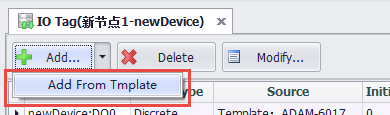

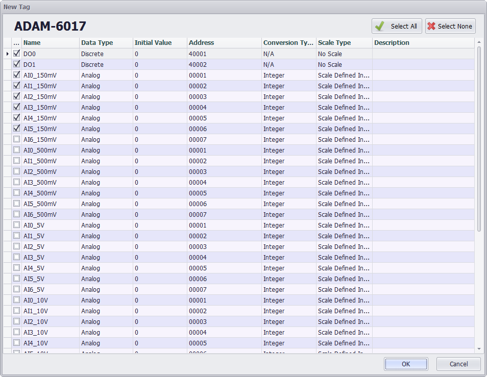

The tag information under the device can be saved as a template on the IO tag list page. Click the Save Template button to pop up the input template information panel. If the user template has an open password set, you will need to enter the open password to save the template.

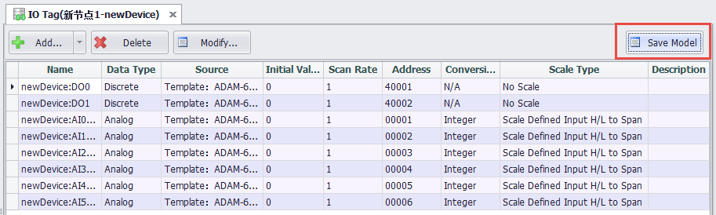

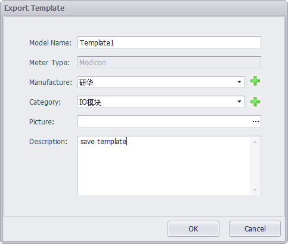

After saving successfully , the newly saved device template information can be viewed in the user template .

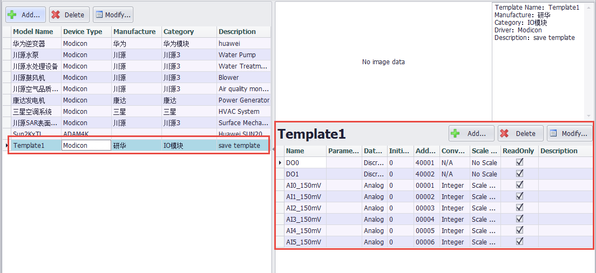

