## EdgeLink Purchase Methods

We provide two ways to purchase EdgeLink components, which may include: EdgeLink Basic Functions or IEC-61850 add-ons based on the Basic Functions.

### 1. Method 1: Purchase via Marketplace  
[Marketplace Link](https://wise-iot.advantech.com/en-us/marketplace){target="_blank"}

#### Purchase Steps:  
1. **Log in to Marketplace**  

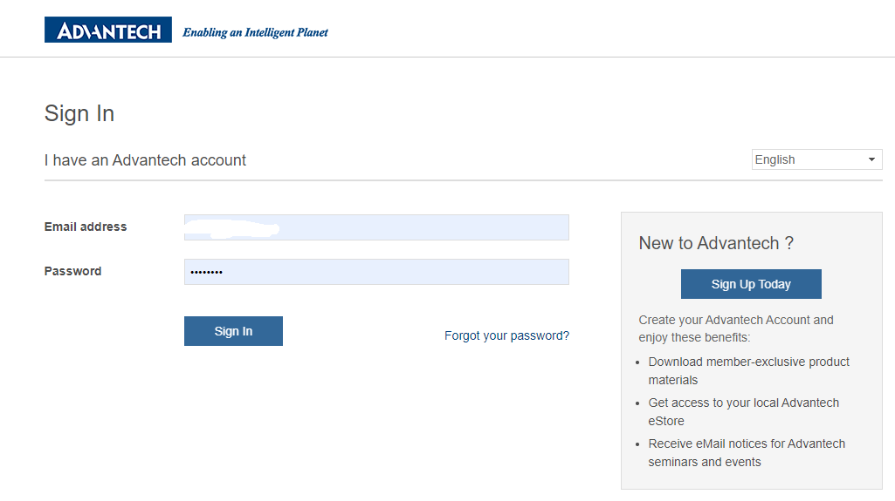

2. **Search for EdgeLink**, select the pricing plan, and place your order based on requirements  

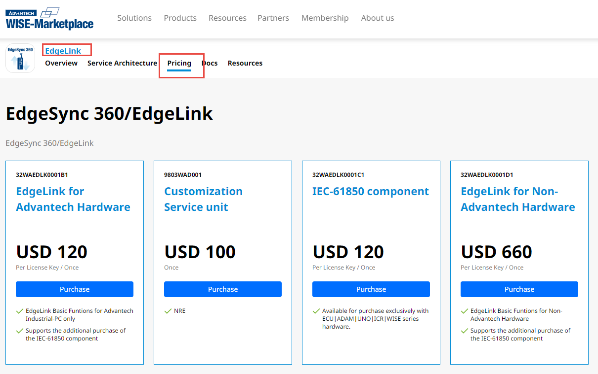

| Part Number     | Description                              | Notes                                                                 |  
|-----------------|------------------------------------------|-----------------------------------------------------------------------|  
| 32WAEDLK0001B1 | EdgeLink for Advantech Hardware          | Purchase this part number when the customer has already bought Advantech hardware and needs to deploy EdgeLink (IEC-61850 can be added later or purchased subsequently) |  
| 32WAEDLK0001C1 | IEC-61850 component                      | For Advantech factory-installed EdgeLink devices (e.g., ECU, ADAM, WISE, UNO, ICR) with only Basic Functions by default. Requires separate purchase of IEC-61850 service. |  
| 32WAEDLK0001D1 | EdgeLink for Non-Advantech Hardware      | Purchase this part number when deploying EdgeLink on non-Advantech hardware (IEC-61850 can be added later or purchased subsequently) |  
| 9803WAD001     | NRE Fee                                  | For custom requirements. NRE fees will be assessed by the product team before purchase. |  

3. **After Purchase**, check pending activation orders in the "My Software Licenses" section of your account (multiple EdgeLink licenses can be purchased but must be activated individually).  

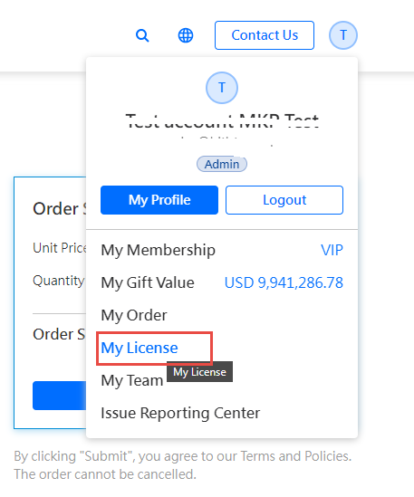

### 2. Method 2: Purchase via Advantech Sales  
Contact Advantech sales representatives for purchasing.  

## Activation

### When Activation Is Required

1. **EdgeLink is not pre-installed on the purchased hardware**, and the customer needs to install it manually (Basic Functions only by default).  
2. **The hardware already has activated EdgeLink Basic Functions**, but additional paid components (e.g., IEC-61850) require separate purchase and activation. For details, refer to [Component Description](#component-description).

**Notes:**  
1. Hardware purchased from Advantech with pre-installed EdgeLink Basic Functions (activated during production) does not require reactivation. Check the [Activation Status Codes](#activation-status-code-description) online.  
2. This section covers license activation only. For EdgeLink Container deployment, refer to the [EdgeLink Deployment Guide](https://www.advantech.com.cn/zh-cn/support/details/manual?id=1-2BBA3OC){target="_blank"}.

### Activation Steps

#### Install EdgeLink Studio

If purchased via Marketplace, download the "Activation Tool" (EdgeLink Studio) from the "My Software Licenses" page. Alternatively, download it from the [EdgeLink Studio Official Link](https://www.advantech.com.cn/zh-cn/support/details/utility?id=1-28QPAEB){target="_blank"}. Skip this step if already installed.  

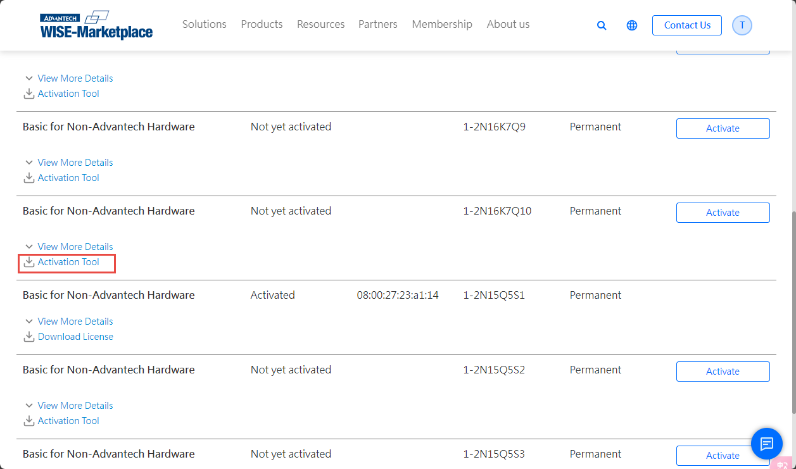

#### Obtain the Device's `reg.elic` File and Save Locally

Open EdgeLink Studio on a PC connected to the same network as the target device. Locate the device in Studio's online device list, log in, and navigate to the Activation page.  

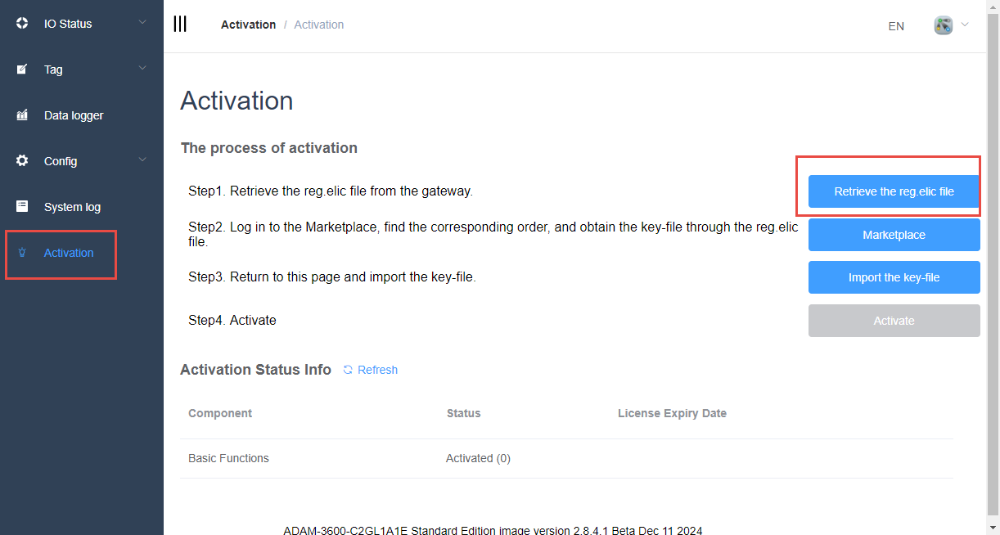

#### Obtain the License File (Methods Vary by Purchase Channel)

##### For Marketplace Purchases:
Go to the "My Software Licenses" page on Marketplace.  

1. Click the **Activate** button  
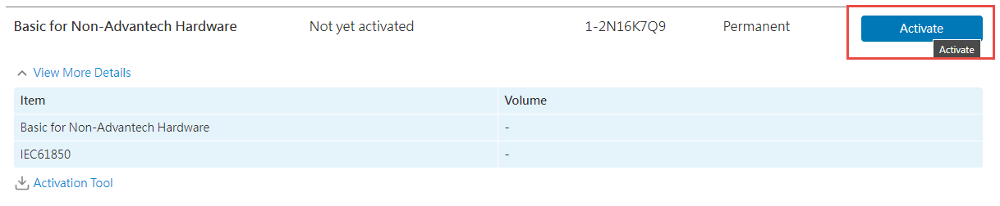

2. Click **Browse** to import the `reg.elic` file  
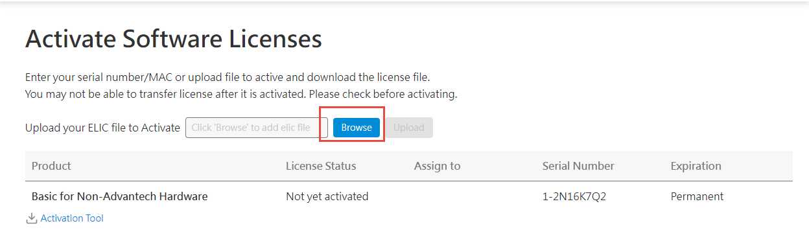

3. Click **Upload** to complete authorization  
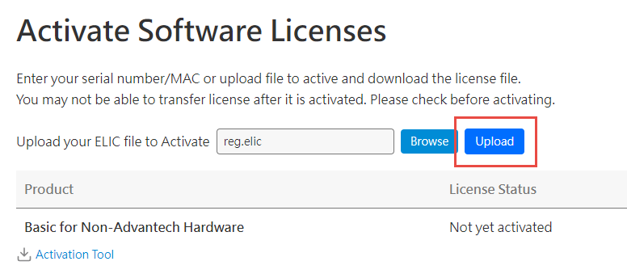

4. Download the license key after successful authorization  
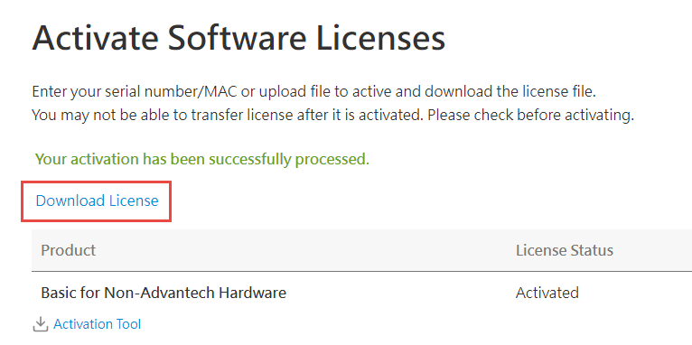

5. Unzip the downloaded file to extract `edgelink.lic`  
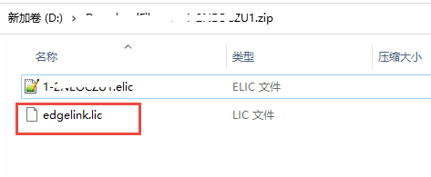  

##### For Sales Channel Purchases:
Send the `reg.elic` file (obtained as above) to the sales representative, who will coordinate with the product team to provide the license file.  

#### Import `edgelink.lic` (or `.elic`) in EdgeLink Studio's Activation Page

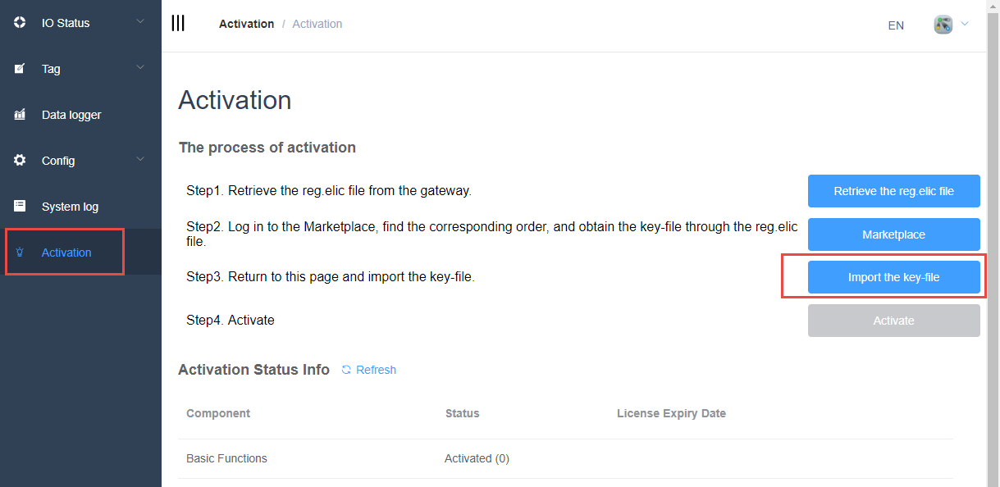

#### Activate

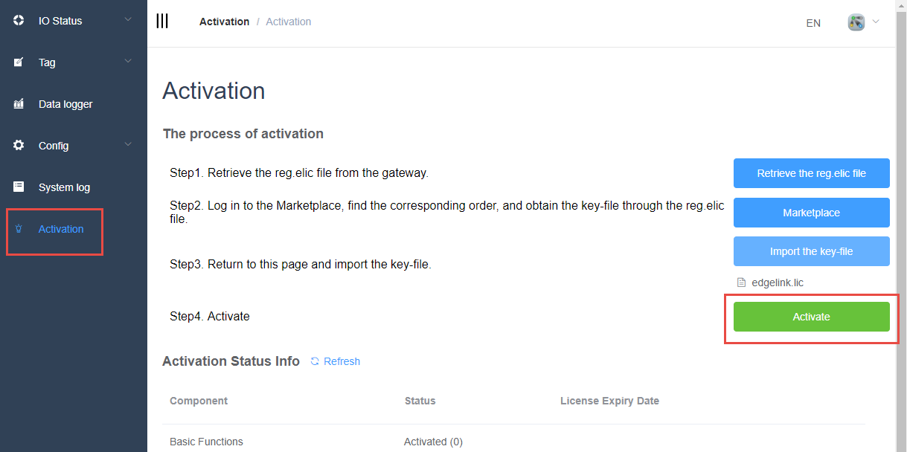

#### Click **Refresh** to Check Activation Status

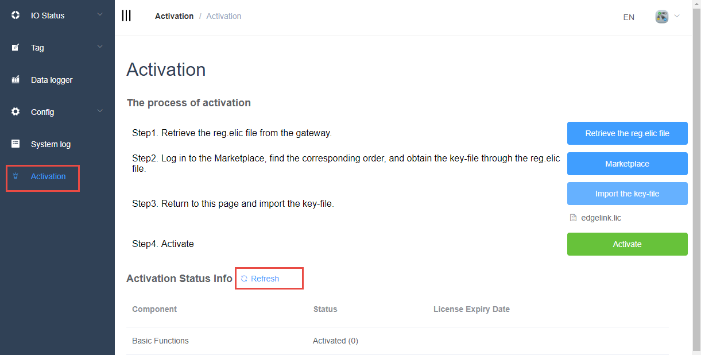

### Activation Status Code Description

| Status Code | Description               |  
|-------------|---------------------------|  
| 0           | Activated                 |  
| 1           | Trial                     |  
| 2           | Trial Expired             |  
| -1          | Not Activated             |  
| -2          | ElicMgr Connection Failed |  
| -3          | Component Not Available   |  

### Component Description

| Component       | Description                          |  
|-----------------|--------------------------------------|  
| Basic Functions | EdgeLink Core System                |  
| IEC61850        | IEC61850 Component (driver & server)|  
| Mitsubishi CNC  | Mitsubishi CNC Component            |  
| FANUC CNC       | FANUC CNC Component                 |  
| Haas CNC        | Haas CNC Component                  |  
| Brother CNC     | Brother CNC Component               |  
| KND CNC         | KND CNC Component                   |  

### Notes:  
1. Basic Functions include all features not listed as paid components above. For details, refer to the [EdgeLink Function Support List](https://www.advantech.com.cn/zh-cn/support/details/manual?id=1-2BLS919){target="_blank"}.  
2. CNC components are not yet available on Marketplace. Contact sales representatives for more information.  
