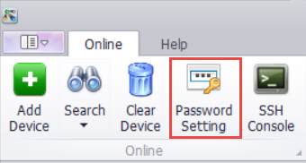
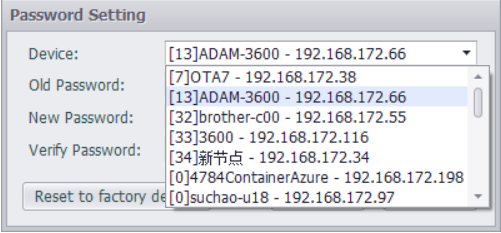
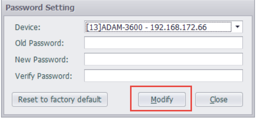
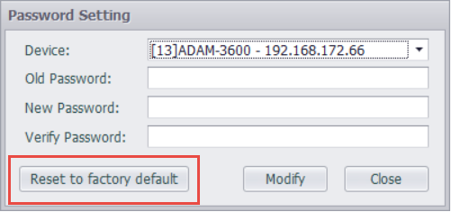

## Password Setting

You can set a password for the device, and note that this password is also the download password (default password 00000000).　

The first case: any one of the multiple devices is selected to change the password

1. Click Password setting　

2. Select the device you want to set up　

    

    

The second case: Right-click on a specific online device and select Change Password to modify the password of the current device

1. Select the device, right-click　

2. Select Modify password　
    
    

After the above two situations

1. Fill in the old password, new password, and thenconfirm password　

2. Click Modify to set a password　

    

### Reset to factory default

Click "Reset to factory default" on this interface, after which you need to restart the device within 10 seconds. After restarting, the device's passcode is restored to its factory state.

