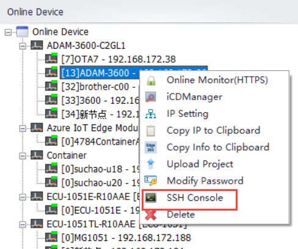
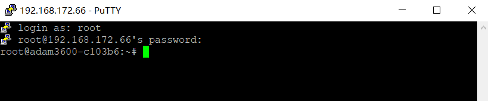
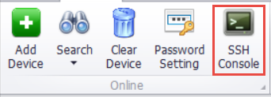
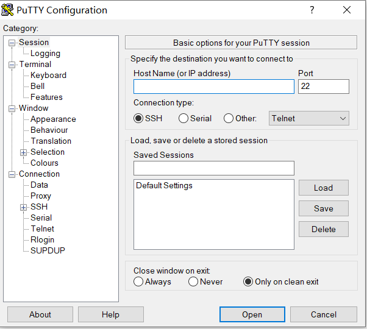

## SSH Console

Users can log in directly to the online device via SSH Console in the Online interface.

### Sign in to your online device

Right-click on the device in the online device to bring up the toolbar and click the SSH Console button in the toolbar.

After entering a user name and password, the user can remotely log in to the device's system.

>**！Note**：EdgeLink Studio uses Putty to connect devices remotely

### Log in to the device manually

If you need to set the connection parameters before logging in to the device, you can click the SSH Console button in the upper toolbar.

EdgeLink Studio will open Putty's configuration page for users to edit, and click Open to log in to the device after editing.