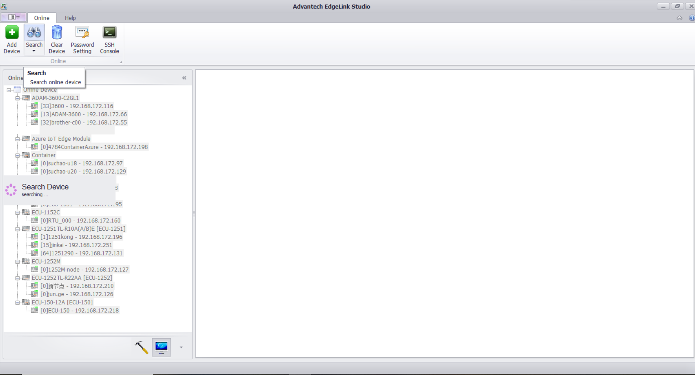
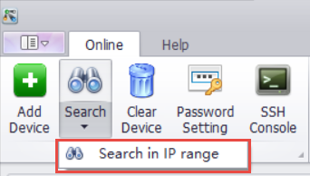
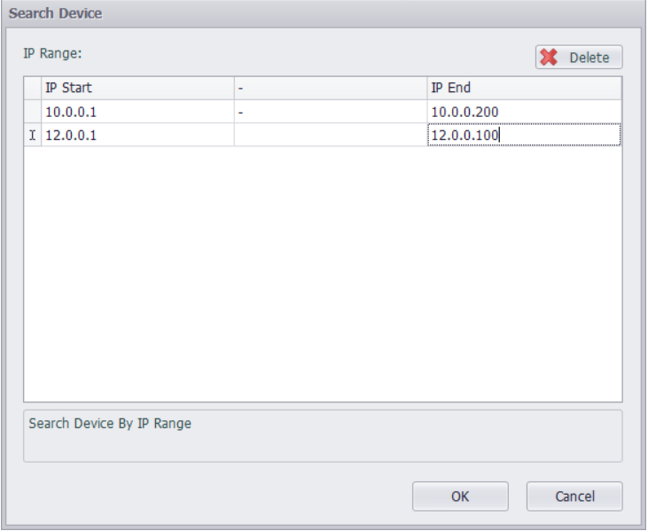

## Search Device　

1. Search for all devices in the network and list them in the online list.　

    

2. Users can also choose to search within an IP range when searching.

    

3. Multiple network segments can be added to search at the same time, and the program will send search commands to each IP in the IP range in turn, which can search for devices across the router.

    