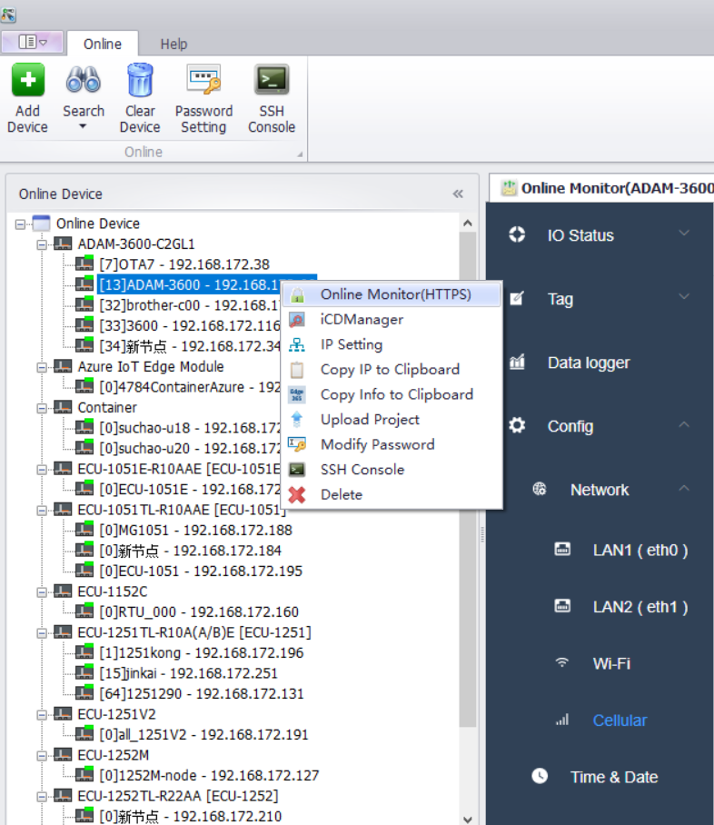

## Online Functions　

Advantech EdgeLink Studio supports online device operations and has the following main functions:　

1. Add Device、Search、Clear Device　

2. This password is used for Project download and online login (default password 00000000).

3. Online Monitor:IO Status、Tags、DataLogger、Config、System Log

4. Set device IP address online (reboot expired)

5. Copy current device IP address to clipboard

6. Copy the current device information to the clipboard (used when creating the device in Edge365)

7. Upload the current device project to the local computer

8. SSH access

9. iCDManger　

　
