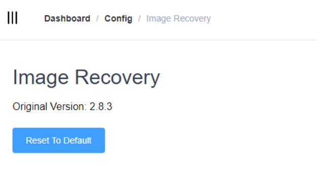

## Image Recovery

IThe Image recovery function can help users restore the system version to the initial state of the currently used version

This function clears the configuration that the user has already made, so the permissions are high and a second confirmation is required.

