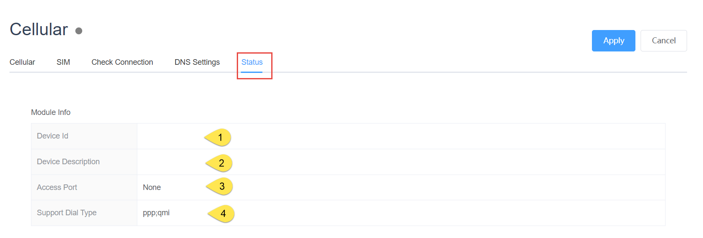

## Celluar Configuration

### General

1. Led Status

|  Status  |  Description                                                         |
|  ----  | ---------------------------------------------------------------------  |
| grey | The module is unplugged                                                  |
|green| The module has been detected and a network connection has been established  |
|red| Module detected but no network connection is established                     |

2. Select Module Auto or None

3. Whether cellular networks are enabled

4. Dialing type: PPP or QMI (depending on module)

5. Effective after apply

### SIM

The default is Auto mode, which can be configured separately if needed

Effective after apply

### DNS

The default is to obtain DNS automatically, or you can configure it manually

Effective after apply

### Check Connection

The connection mechanism is checked in order to make the network recoverable through some attempts in case the network is not available, including rebooting the network card and rebooting the device (customer choice)

1. Swtich to Check Connection

2. Select the connection judgment mechanism, which currently supports Ping IP/URL and Monitor data traffic

#### Ping IP/URL Mode

    3. Ping host(1\2\3) Please fill in the IP or URL that can be accessed under normal network conditions

    4. Retry interval: The interval between ping commands

    5. Check whether to restart the device

    6. How long to restart the device when checking that the network cannot be connected and the network card cannot be restored by turning it back on

    7. Effective after apply

#### Monitor data traffic Mode

    1. Choose Monitor data traffic Mode

    2. The maximum silence time is the time that no traffic increases in the network environment

    3. Check whether to restart the device

    4. How long to restart the device when checking that the network cannot be connected and the network card cannot be restored by turning it back on

    5. Effective after apply

### Status

View module status online, divided into two parts, one is module status and the other is Celluar information, including dial-up and network status

#### Module Status

1. Device Id

2. Module Description

3. Access Port

4. Dial Type

#### Celluar Status

Cellular-related system tag, in order to avoid traffic waste, please click the "Refresh" button to update the current status every time you view it

