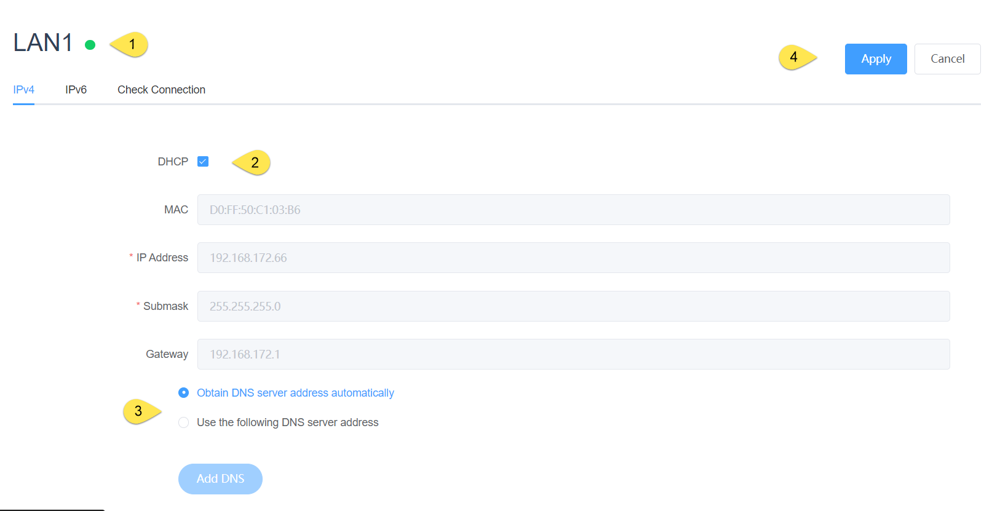
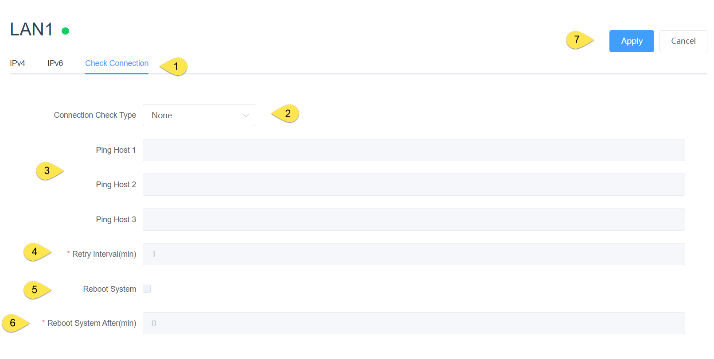

## LAN

### General 

1. led status

|  status   |  description  |
|  ------  | ---------------------  |
| green | The network is connected |
|yellow| A network cable was detected, but not connected to the network |
|red| The network cable is unplugged |

2. When checked, it is DHCP mode, and when it is unchecked, it is static IP mode, and you can set the IP address, subnet mask, and gateway

3. DNS servers can be obtained automatically or added manually

4. Effective after apply

### Check Connection

The connection mechanism is checked in order to make the network recoverable through some attempts in case the network is not available, including rebooting the network card and rebooting the device (customer choice)

1. Swtich to Check Connection

2. Select the connection judgment mechanism, which currently supports Ping IP/URL

3. Ping host(1\2\3) Please fill in the IP or URL that can be accessed under normal network conditions

4. Retry interval: The interval between ping commands

5. Check whether to restart the device

6. How long to restart the device when checking that the network cannot be connected and the network card cannot be restored by turning it back on

7. Effective after apply

