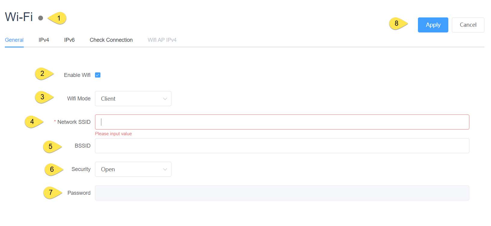
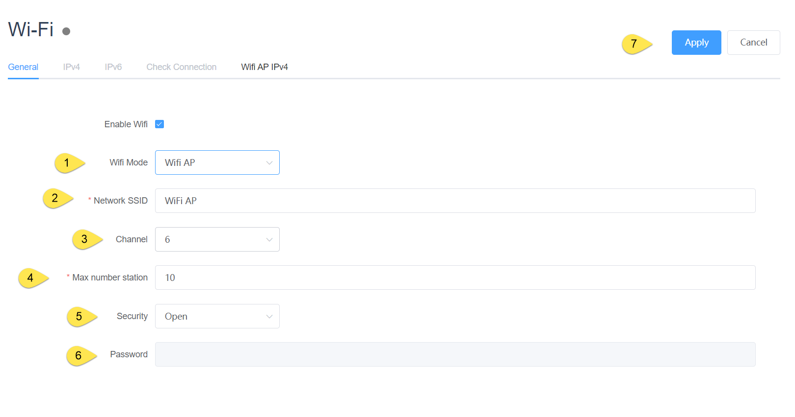
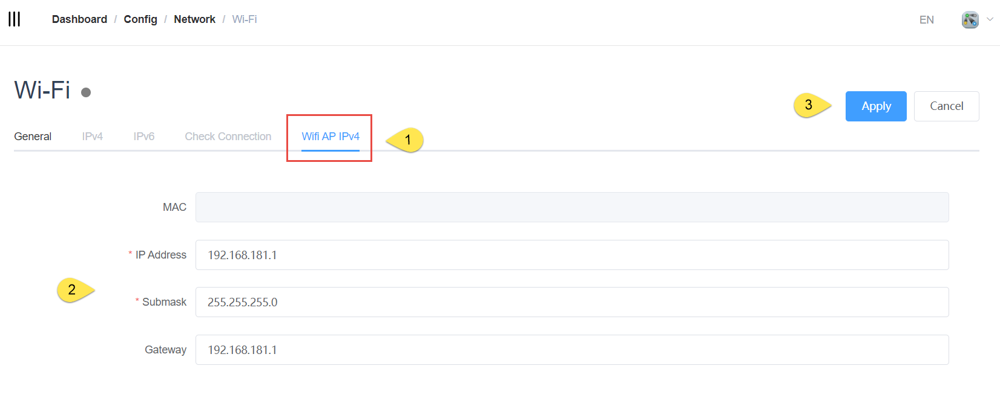
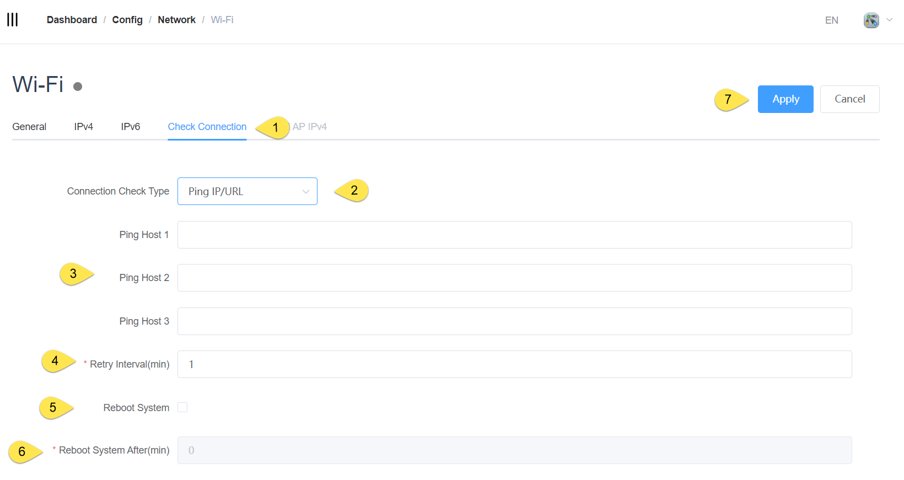

## Configure of Wifi

### General

1. led status

|  Status  |  Description                                                         |
|  ----  | ---------------------------------------------------------------------  |
| grey | The module is unplugged                                                  |
|green| The module has been detected and a network connection has been established  |
|red| Module detected but no network connection is established                     |

2. Whether Wifi networks are enabled

3. Mode：Client or AP

    #### Client Mode

    4. The SSID of the network that the Wifi module connects to in Client mode

    5. BSSID:Optional. Fill in this field when you need to connect to a specific AP.

    6. Security：Open、WEP、WPA/WPA2 PSK

    7. Password

    8. Effective after apply

    #### AP Mode

    

    1. select Wifi AP Mode

    2. The SSID is a unique identifier for a wireless network that is used to distinguish it from other nearby networks.

    3. Channel: Defaults to 6 and depends on the module.

    4. Maximum number of stations: This refers to the maximum number of clients that the AP allows to connect to it.

    5. Security：Open、WPA/WPA2 PSK

    6. Password：Password for AP

    7. Effective after apply
   
    

    1. select Wifi AP IPv4

    2. set up the IP range to be allocated to clients in AP mode

    3. Effective after apply

### 检查连接（Client模式）

The connection mechanism is checked in order to make the network recoverable through some attempts in case the network is not available, including rebooting the network card and rebooting the device (customer choice)

1. Swtich to Check Connection

2. Select the connection judgment mechanism, which currently supports Ping IP/URL

3. Ping host(1\2\3) Please fill in the IP or URL that can be accessed under normal network conditions

4. Retry interval: The interval between ping commands

5. Check whether to restart the device

6. How long to restart the device when checking that the network cannot be connected and the network card cannot be restored by turning it back on

7. Effective after apply
