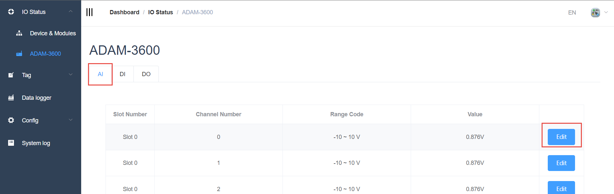
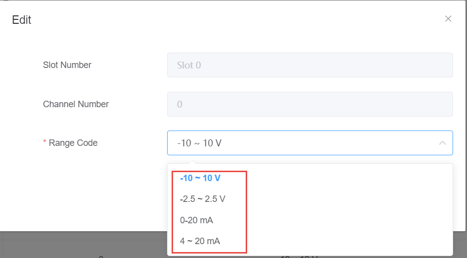

## AI data acquisition and parameter setting　

The data of the AI module is shown in the figure below. The data form items are as follows:

 - Slot number: The module where the AI function block is located, and slot 0 is onboard.

 - Channel number: AI channel number.

 - Range: The range of AI sampled values.

 - Value: The value of the AI.

	

	When you need to configure parameters, click the Edit button

	

	Note: After the parameter is modified, you need to click the Confirm button to take effect

