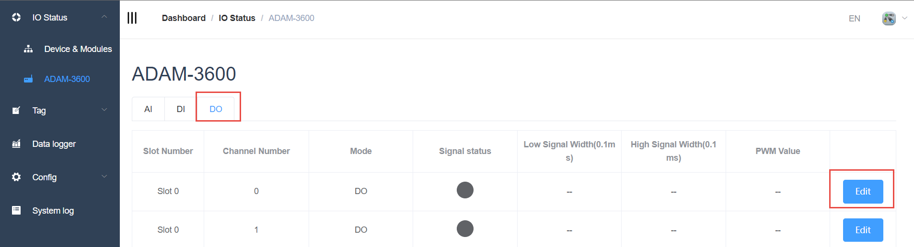
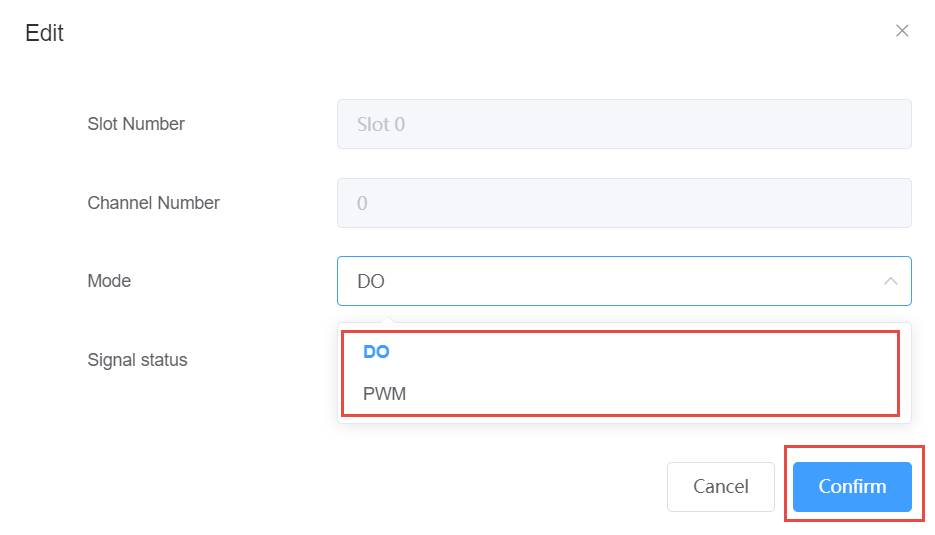
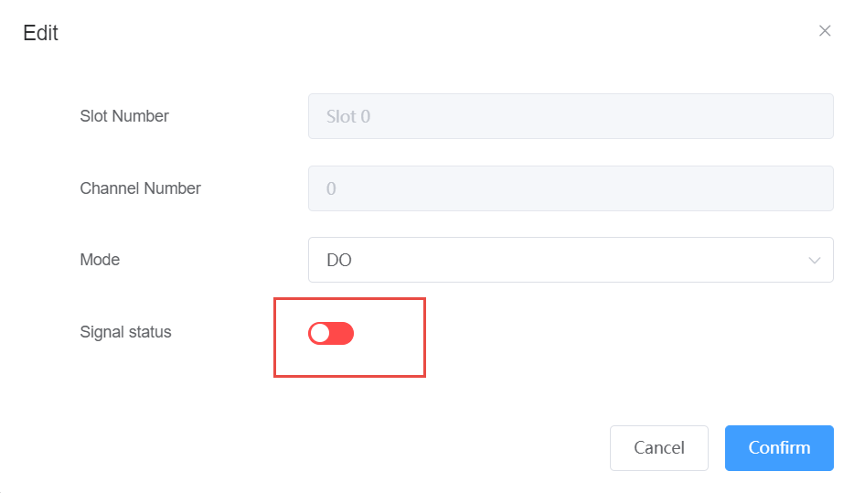
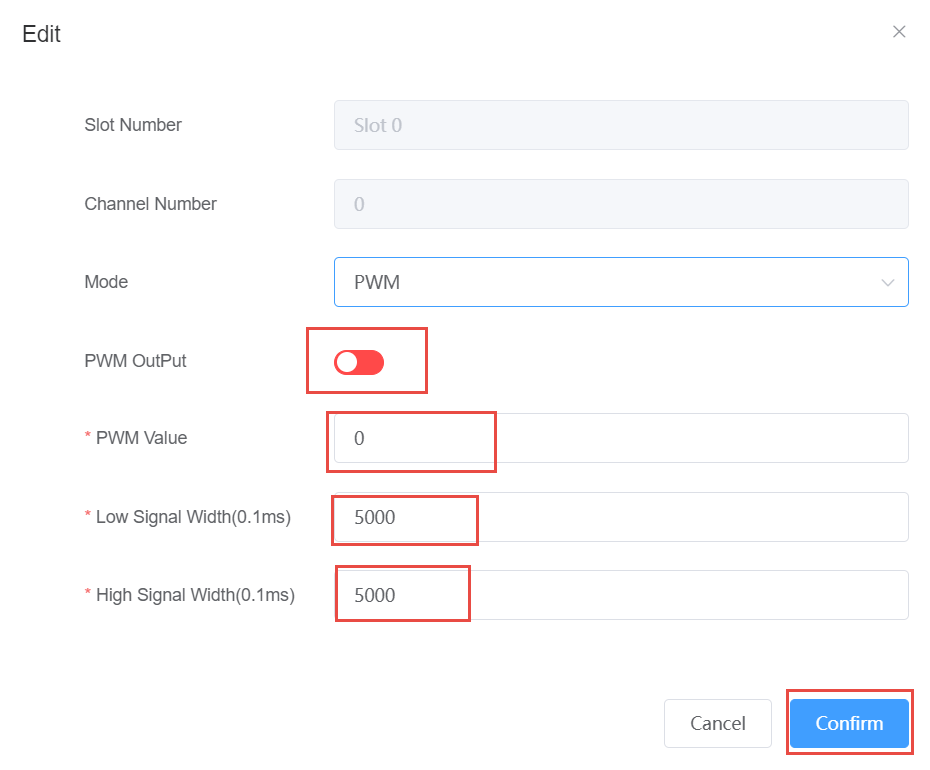

## DO data acquisition and parameter setting　

1. The data of the DO module is displayed in the following figure. The data form items are as follows:

- Slot number: The module where the DO function block is located, slot 0 is onboard.

- Channel number: DO channel number.

- Mode: Normal (i.e. DO) or PWM.

- Signal Status: DO port level value.

- Value: When in Normal mode, the output DO value is displayed here; Counter mode, the count value is displayed here.

- Low width: The low level pulse width of the output in PWM mode.

- High width: The high-level pulse width of the output in PWM mode.

	

    If you need to configure, click the Edit button to set the DO channel mode to DO or PWM

	

2. DO mode: Set the DO output by clicking the signal status, green is high, red is low.
	
	

3. PWM mode:

- PWM output: green is enabled, red is not enabled

- PWM value: Set the number of output PWM waveforms, the default is 0, 0 means always output

- Low signal width: The low level pulse width of the output PWM in 0.1ms, and the pulse width is (0.1* number) ms

- High signal width: The high level pulse width of the output PWM is 0.1ms, and the pulse width is (0.1* number) ms

	

