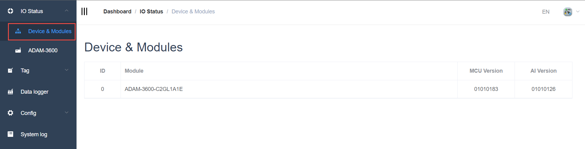
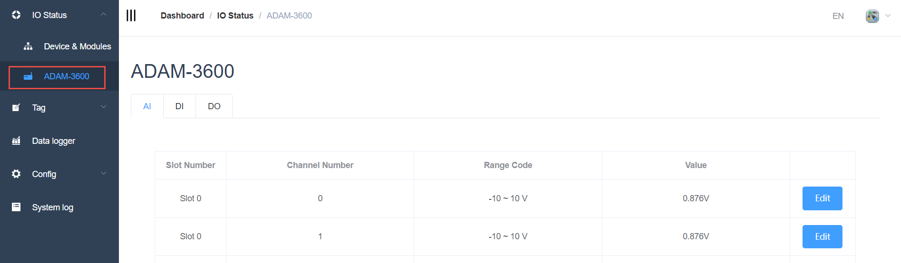

## I/O data acquisition and parameter setting　

EdgeLink online operation provides on-board and extended I/O data acquisition and setting functions, different I/O modules correspond to different tabs, respectively AI, AO, DI and DO four types.　

1. The device displays the current device model, and if there are expansion modules, it will also be listed on this page

2. Select Current Device to display all IO points on the device

