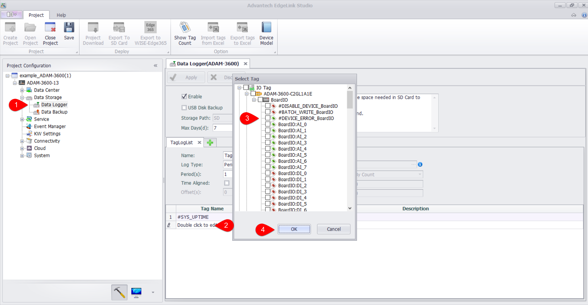
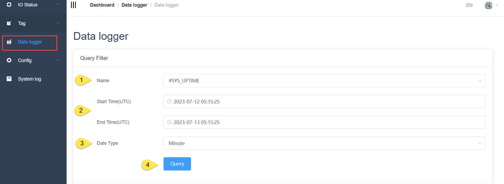
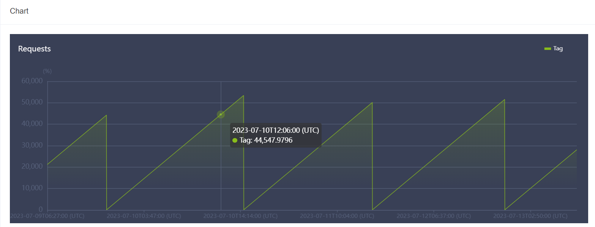
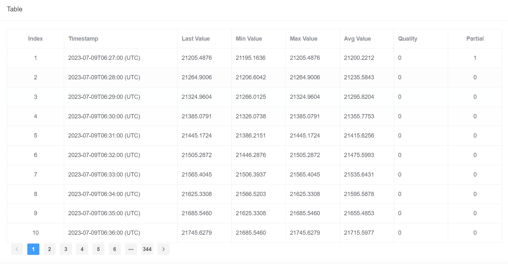
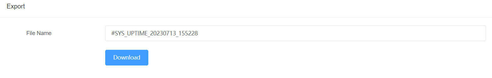
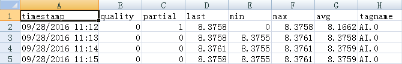

## DataLogger

Users can view historical data stored on the device. First, the user needs to configure the "DataLogger" in the project interface.

　

After downloading the project to the device, you can view the stored data on the "DataLogger" page of the online.

The query properties are as follows:

1. Select the tag name
2. Select the start time and end time of the data storage
3. Select the statistics time of the query, select: minutes/hours/days/all data
4. Click Quary

Users can view data in three ways

1. Chart:

	

2. Table:

	

3. Output to Excel document and download, users can download the document in the browser, this feature is not supported in Studio temporarily.

	

	