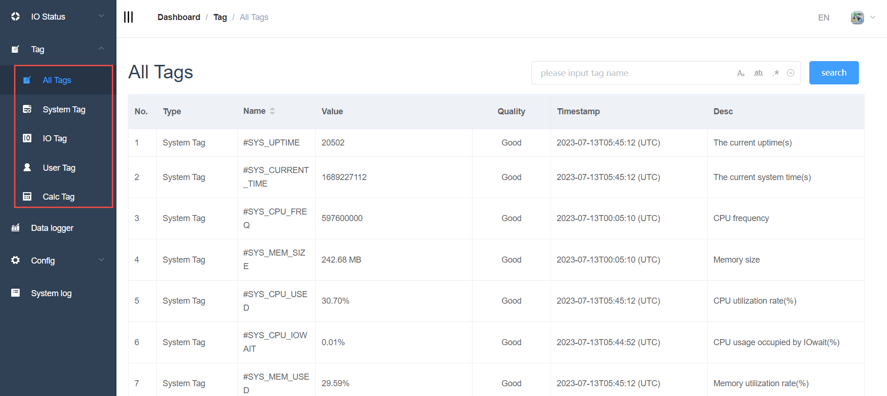
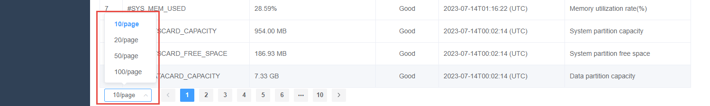
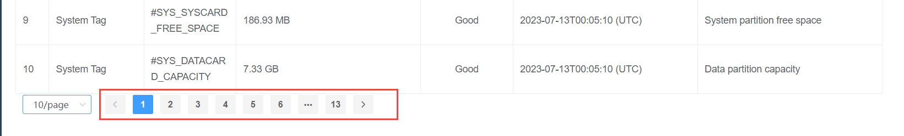

## Tags

EdgeLink online operation provides the function of obtaining and setting Tags, different Tag types correspond to different pages, System Tag, IO Tag, User Tagand and Calculation Tag, and support unified viewing of all tags.　

### Search of Tags：

[Tag Search](./tag_search/tag_search.html)

 

  

>**Note**
>
>1. The default number of displayed rows of the page is 10 rows, or you can choose to display the number of rows per page::10\20\50\100

>
>2. The excess part is paginated and displayed, and you can switch to other tags by clicking the number or arrow in the lower right corner

