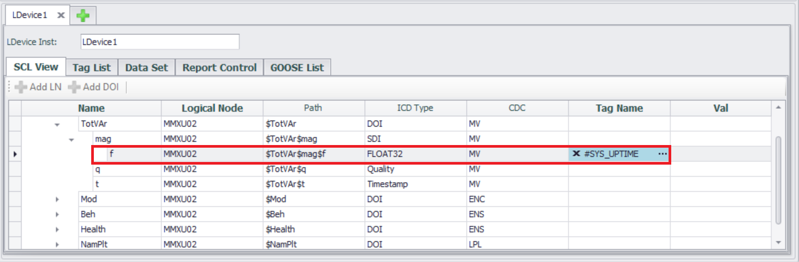
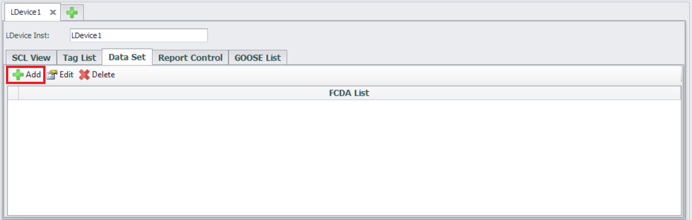
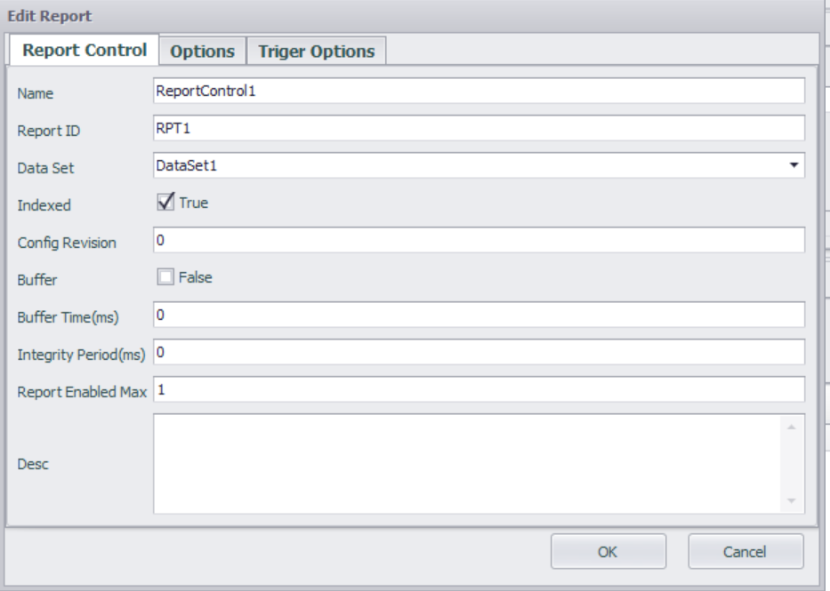
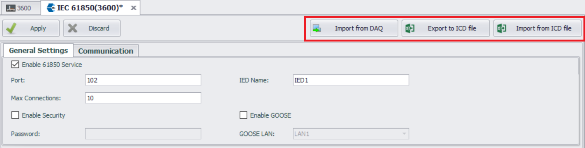
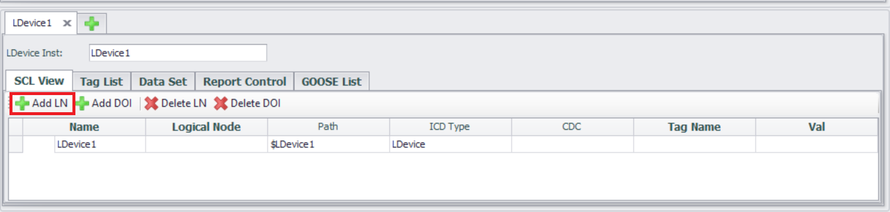
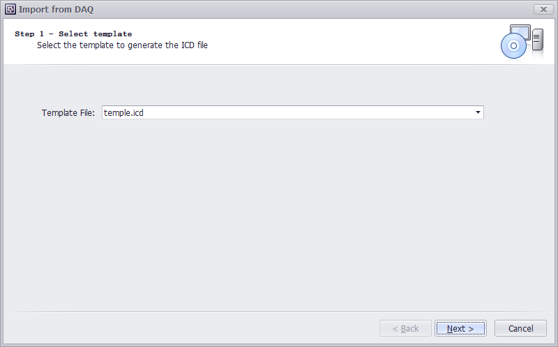

## IEC-61850

EdgeLink can work as IEC-61850 Server to exchange data with IEC-61850 Client of HMI/SCADA. [Purchase and activation](./License/License.html)   

Here will explain the application of IEC-61850 Server in detail.   

- In the menu tree on the left, expand **"Data Service"** and double-click on the **"IEC-61850"** item.  
   
  

   
   
- Enter the **IEC-61850** configuration interface.   

  
  
   
Configure the Communication parameters in the ICD file，SubNetwork-name、ConnectedAP-apName and Address

### Configure IEC-61850 Service
- Check the **"Enable 61850 Service"** option.     

   

### General Settings

   

This configuration page is used to specify general IEC-61850 server options, including:

- **Port**  
  Port number used to accept connections with IEC 61850 client (MMS). The default port number is 102.
- **Maximum Connections**  
  Specify the maximum number of supported connections. The default setting is 10. 
- **IED Name**  
  The name of the current IED. You can change the name of the IED.
- **Enable Security**  
  Set the authentication mode for the IED. By default, the authentication mode is set to 'none'. Check the 'Enable Authentication' option to change the authentication mode to password.
- **Enable GOOSE**  
  Specify whether GOOSE service is supported. By default, GOOSE service is not enabled.  
     

### Configure IEC-61850 Service  

The IEC-61850 service currently supports two types of services: MMS and GOOSE. Please enable them as needed. 

   

   

### Configure SCL
On this page, users configure the IEC-61850 model, datasets, and reports. During project compilation, an ICD file based on the SCL language will be generated.

It is important to note that the IEC-61850 service in EdgeLink only supports one IED from a single ICD file, and this IED can contain multiple LDevices. Configuration for this single LDevice is done in the "SCL View". When the IEC-61850 service is enabled, this LDevice will be automatically created, along with its LN0 node and LPHD node.

   
   

- Access the **LDEVICE** (Logical Device) configuration interface

  The interface displays a list of configured LDEVICE, supporting new, edit, and delete operations.

  **LDevice Inst**: Logical device name, the unique identifier of the logical device under the IED. Ensure that the LDEVICE name does not conflict with other logical devices under the same IED.
  

   
   

- **Associated Logical Node (LN)**

  - Click the **"Add LN"** button
  

   
   

  - Select **Logical Node** Type

    Select from the predefined **"Logical Node Type"** list (e.g. **MMXU**: Multiphase Measurement Logical Node).
  

   
   

  - Configure **Logical Node** Attributes
  

   

  **Select Data Object (DO) and Data Attribute (DA)**
  

   
   

  - **Configure Tag data mapping**

  After adding LN, tags can be associated with configured data attribute (DA) nodes. Double click the **"Tag Name"** cell in the Data Attributes (DA) to select an existing Tag in the project.

   
  Select the associated **Tag** and click the **"OK"** button.     

   
   

   
   

  - **Tag List**
  
**Tag List** page lists all the data attribute (DA) that have been added, and users can easily associate tags with data attributes (DA) in the Tag List page. The Tag List page supports Excel import/export, allowing users to quickly associate data attributes (DA) with tags in Excel.     

   
   
The content of exporting Tag List to EXCEL.   
   

   
   

### Configure DataSet

In the IEC 61850 standard, a dataset is an ordered collection of data attributes (DA) in logical nodes (LN), used for efficiently organizing and transmitting critical information between devices (such as measurement values, status signals, control instructions, etc.). The dataset is the foundation for communication between MMS (Manufacturing Message Specification) and GOOSE (General Object Oriented Substation Events).  

  - **Enter the Data Set configuration interface**  
  
  The interface usually displays a list of created datasets and supports new, edit, and delete operations.   

   

  - **Create a new DataSet**  
  
  
  
Click the **"Add"** button  

   

**Edit Data Set** form will list the data attributes (DA) in all logical nodes (LN) included in the current LDEVICE.     

   

Select **Data Object (DO) or Data Attribute (DA)**  

   
   
Click the **"OK"** button to return to the **Data Set** configuration interface and view the created dataset.  

  
  
  
### Configure Report

The IEC 61850 Report is used to send information such as data changes and status updates from the server to the client.  
   
The IEC 61850 report is configured and managed through the Report Control Block (RCB).  
  

  - **Enter the Report Control configuration interface**  
  
  The interface usually displays a list of created datasets and supports new, edit, and delete operations.   

  - **Create a new Report**  
  
  
Click the **"Add"** button  

  - **Edit Report**  
  
**Report Control Block** Configuration  

| **Parameters**           | **Descriptions**                                                         | 
|---------------|---------------------------------------------------------------|
| Name           | Name of the Report Control Block. This name is relative to the LN hosting the RCB, and shall be unique within the LN. |
| Report ID | Identifier for the Report Control Block. The report identifier field may be used by clients to distinguish between reports from various BRCBs. |
| Data Set | The name of the dataset to be sent by the Report Control Block. |
| Indexed | If true, the Report Control Block instance names are built from the supplied name, followed by an index number from 01 up to maximum 99. The maximum index value is set by **"Report Enabled max"**. |
| Config Revision | The configuration revision number of this Report Control Block. The attribute shall represent a count of the number of times that the configuration of the Dataset referenced has been changed. |
| Buffer | Specifies if reports are buffered or not |
| Buffer Time | Buffer time. After the first event has occurred, this buffer time has to elapse for a Report to be sent. |
| Integrity Period | The integrity period for cyclic reporting in milliseconds. 0 implies no integrity report. |
| Report Enabled max  | Defines the maximum number of report control blocks of this type, which are instantiated at configuration time in the LN (and then used online). The maximum value is 99 |
| Desc | Description text |

**Report Format** Configuration  

Additional information segments to be included in the configuration report.  

| **Parameters**           | **Descriptions**                                                         | 
|---------------|---------------------------------------------------------------|
| sequence-number   | If true, the SqNum shall be included in the report. |
| report-time-stamp | If true, TimeOfEntry shall be included in the report. |
| reason-for-inclusion | If true, ReasonCode shall be included in the report. |
| data-set-name | If true, DatSet shall be included in the report. |
| data-reference  | If true, DataRef or DataAttributeReference shall be included in the report. |
| buffer-overflow | If true, BufOvfl shall be included in the report. |
| entryID | If true, EntryID shall be included in the report. |
| conf-revision | If true, ConfRev shall be included in the report. |

**Trigger condition** Configuration  

The trigger options determine when the Report will be sent.   
   
Configure the required report triggering method (multiple choices), triggered when True.  

| **Parameters**           | **Descriptions**                                                         | 
|---------------|---------------------------------------------------------------|
| data-change   | A report or a log entry shall be generated due to a change of the value of the data attribute (dchg) |
| quality-change | A report or a log entry shall be generated due to a change of the value of the quality attribute (qchg) |
| data-update |  A report or a log entry shall be generated due to freezing the value of a freezable attribute or updating the value of any other attribute. An updated value may have the same value as the old value (dupd) |
| integrity | A report will be sent on the expiration of the integrity period. (IntgPd needs to be set, such as 1000ms) |
| general-interrogation | Caused by setting the attribute GI of the BRCB to TRUE by a client |
  
  
Click the **"OK"** button to return to the **Report** configuration interface and view the created report.  

  
  

### Configure GOOSE  

  
  - **Preconditions**  

**Enable GOOSE** service, LDEVICE (logical devices), LN (logical nodes), and related DataSet have been configured.   
  
  

  - Enter **GOOSE List** configuration interface  
  
  The interface usually displays a list of GOOSE that have been created, and supports new, edit, and delete operations.  

  

**Create GOOSE Control Block (GCB)**  

Click the **"Add"** button  

  
  

**Configure GOOSE message parameters**

  

| **Parameters**           | **Descriptions**                                                         | 
|---------------|---------------------------------------------------------------|
| Name           | The name identifying this GOOSE control block. |
| GOOSE ID | A system wide unique identification of the application to which the GOOSE message belongs |
| Data Set | The name of the data set to be sent by the GSE control block |
| Config revision | The configuration revision number of this control block |
| MAC-Address | Length is 6 Octets and contains the value of the destination Media Access Control (MAC) address to which the GOOSE message is to be sent. The address shall be an Ethernet address that has the multicast bit set TRUE.Address range assignments: Starting address (hexadecimal): 01-0C-CD-01-00-00 Ending address (hexadecimal): 01-0C-CD-01-01-FF |
| APPID | The APPID is used to select ISO/IEC 8802-3 frames containing GSE Management and GOOSE messages and to distinguish the application association. The reserved value range for GOOSE is 0x0000 to 0x3FFF. A unique, source-orientated GOOSE APPID within a system is strongly recommended |
| VLAN-PRIORITY | Priority of outbound messages. Range of values shall be limited from 0 to 7. Where 0 is lowest and 7 is highest priority |
| VLAN-ID | The virtual LAN identifier.  Range of values shall be limited from 0 to 4095 (FFF) |

### ICD File Import and Export

The configuration of IEC-61850 is mostly reflected in the ICD file, and here we provide the import and export functionality for the ICD file, allowing users to directly use the imported ICD file. However, when an ICD file contains multiple IEDs, only the configuration of the first IED will be imported.

The ICD file import and export functions include:

- **Import from DAQ**  
  Configure IED from ICD template.
- **Export to ICD file**  
  Export the current IED configuration to an ICD file. 
- **Import from ICD file**  
  Import existing ICD file.  
     
	 
Click **"Export to ICD file"** button to export the configuration.   
Click **"Import from ICD file"** button to import the ICD file that has been configured in other software. However, when there are multiple IEDs in the imported ICD file, only the first IED configuration will be imported.

### Example of configuring MMS service
- Enter the **IEC-61850** configuration interface  
   
  
   
  
  
- **"Enable 61850 Service"**  
   
  
   
  
  
- **Add LN**    
   
  
   
  
  
- Select **Logical Node** Type **MMXU - (Measurement)**  
   
  
   
  
  
- **Select DO**   
Note: The selected DO should include DA of **Float** or **Double** data type.   
   
   
   
   
   
- **Associate tag with DA of Float or Double data types**  
   
   
   
   
   
- **Project Download**  
   
   
   
   
   
- **Test with client**  
   
  
   
   
   
   
### Example of configuring GOOSE service   
   
      
In the IEC-61850 master station, configure the GOOSE model, including enabling GOOSE services, configuring bound physical network ports, configuring and defining GOOSE related logical nodes, datasets, and GOOSE control blocks.   
   
    

- Enter the **IEC-61850** configuration interface   
   
  
   
  
  
- **"Enable 61850 Service"**  
   
   
   
   
   
- **"Enable GOOSE"**, then set **"GOOSE LAN"**   
   
  
   
  
  
- **Add LN**    
   
  
   
  
  
- Select **Logical Node** Type **MMXU - (Measurement)**  
   
  
   
  
  
- **Select DO**   
Note: The selected DO should include DA of **Float** or **Double** data type.   
   
   
   
   
   
- **Associate tag with DA of Float or Double data types**  
   
   
   
   
   
- **Create or select a Dataset**  
   
   
   
   
   
- **Add data objects to the GOOSE Dataset according to your requirements**  
   
   
   
   
   
- **Associate GOOSE control blocks (GoCB) with the Dataset**  
   
**Add GOOSE control blocks (GoCB)**   
    
   
   
   
   
- **Set communication parameters for GoCB**  
   
Associate with a unique Dataset; Set communication parameters for GoCB, such as MAC address, application ID (APPID), etc.   
   
   
   
   
   
- **Project Download**  
   
   
   
   
   
- **Subscribe to GOOSE through the client and test it**  
   
  
   
   

### Import from DAQ

Users can import configured points with 'Electrical Attribute' into the IEC-61850 service using the template.

1. Click "Import from DAQ" button

    

2. Select template. The default mapping between power attributes and IEC 61850 types in the template file is as follows:：

    | Power attribute | LNode | DO | DA |
    | ------ | ------ | ------ | ------ |
    |    Power Telemetry    |   GGIO     |   Ind     |   mag-f     |
    |    Status Signal    |   GGIO     |   AnIn     |   stVal     |
    |    Control Command    |   GGIO     |   SPCSO     |   stVal     |
    |    Energy Record    |   MMTR     |   SupWh     |   actVal     |
    |    Protection Setting    |   GGIO     |   SetVal     |   setMag-f     |

    

    Users can also modify the template file to change the IEC 61850 type associated with each power attribute.

3. Select tags. By default, these points will be configured within a single LDevice. If "Merge into one LDevice" is unchecked, each meter will generate a separate LDevice containing only its own points.
    

4. Configure limit on the number of tags for LNodes，Maximum Points per LNode, Each LNode has a configurable point limit. When the number of points for a given type exceeds this limit, the system automatically creates additional LNodes.

    Example Implementation: When importing 1,000 telemetering points with a 300-point limit per LNode:

    - The LDevice will contain 4 GGIO-type LNodes
    - The first three LNodes will each contain 300 Ind-type DOs
    - The fourth LNode will contain the remaining 100 Ind-type DO。

    

5. Config
    - rptID Value:
        - Default: None (results in empty ReportControl id)
        - When "Report Index" is selected: {LDevice inst}/LLN0$RP${ReportControl name}
    - Report Enabled Max: Sets the maximum value for RptEnabled
    - Add Device Name as du Prefix:
        - When unchecked: Point's dU value = Point name
        - When checked: Point's dU value = [Device name] + [Point name]
    

6. Import Overview. Counts the number of points to be imported for each type and the number of LNodes to be created.
    
    