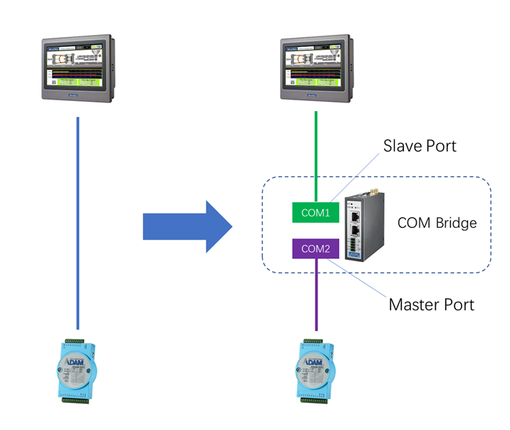
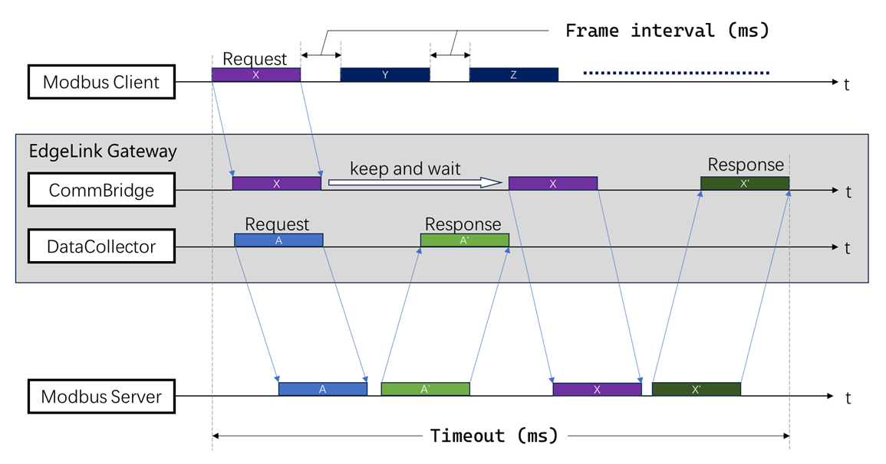
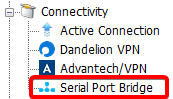
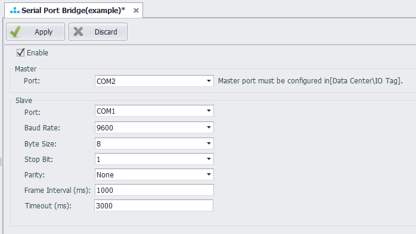

## Serial Port Bridge

Serial Port Bridge is mainly used to add a gateway for data acquisition while retaining the existing serial port connection logic. As shown in the figure below, a gateway is added between the HMI and the end device, by bridging the serial ports in the gateway, the original HMI data acquisition is not affected, and the gateway can also read data from the end device..

### Principle

The serial port bridge program will open two serial ports, one is the slave port connected with the upper master station, and the other is the master port connected with the lower-level end device. When the serial port bridge program receives a request from the upper master station from the slave station port, it will forward the data message to the master station port, accept the response data of the end device, and return it from the slave station port to the upper master station.

Because the serial port is an exclusive resource, in order to realize that the data center of the gateway and the upper master station can collect data from a lower-level collected device at the same time, the serial port bridge program needs to share the same master port with the data center, using time-sharing multiplexing. Because the master station port is used in time-sharing, the scan time of the data center and the upper master station should be coordinated when using the serial port bridge program, otherwise the data acquisition result will be affected.

### Settings

The serial port bridge function is located in the connection settings of the project configuration tree, as shown in the following figure:

Double-click the serial port bridge setting item in the project configuration tree to open the serial port bridge configuration page, and click "Enable" to configure the serial port bridge.

Parameters:

- **Master - Port**: Select a serial port that has been configured in the data center for collection.
- **Slave - Port**: Select a serial port that has not been added to the data center and is not occupied by other applications, which is used as a slave port.
- **Baud Rate/Byte Size/Stop Bit/Parity**: set according to the actual connection with the upper master station.
- **Frame Interval (ms)**: Specify the minimum interval of the upper master station data request, in milliseconds. The serial port bridge program will split the complete data message received from the slave port according to this setting parameter. The value range of this value is generally 30 ~ 100 milliseconds. When the request cycle of the upper master station is greater than 500 milliseconds (for example, a request is sent once per second), the data frame interval is set to 100 milliseconds, which is a more appropriate value. Otherwise, this value should be reduced to ensure that the data frame interval is less than the request cycle of the upper master station, but it should not be less than 30 milliseconds. In fact, if the request cycle of the upper master station is less than 500 milliseconds, it is not suitable to use the serial port bridge function.
- **Timeout (ms)**: Specifies the waiting response timeout of the upper master station data request, in milliseconds. After the serial port bridge program forwards the message, if the waiting response time exceeds this setting parameter, it is considered that the device has no response. At this time, the serial port bridge program will release the occupation of the master station port so that the data center can continue to collect. The request timeout value can be set to `timeout value of the corresponding port of the gateway data center * (number of retries + 1)`. Assuming that the timeout of the corresponding port of the gateway data center is 500 milliseconds and retries 3 times, the request timeout value can be set to 500 * (3 + 1) = 2000 milliseconds. If the collection cycle of the upper master station can be adjusted, the collection cycle of the upper master station can be adjusted to a value greater than this timeout parameter; if the collection cycle of the upper master station cannot be modified, then the timeout and retry times of the corresponding port of the gateway data center should be reduced to ensure that the value of this request timeout is less than the collection cycle of the upper master station. Assuming that the collection cycle of the upper master station is 1 second, the recommended timeout of the corresponding port of the gateway data center should be set to 300 milliseconds, and the number of retries should be set to 1. The request timeout setting value is 300 \* (1 + 1) = 600 milliseconds.
