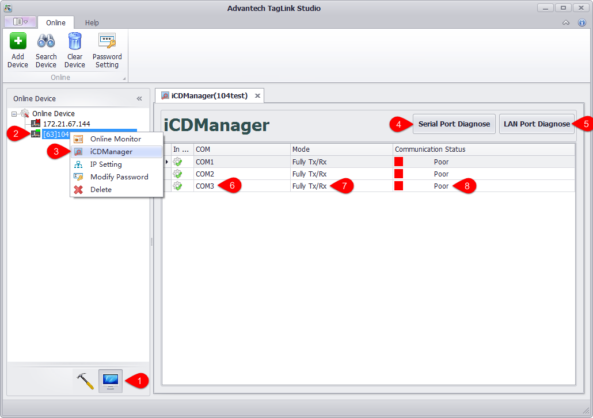
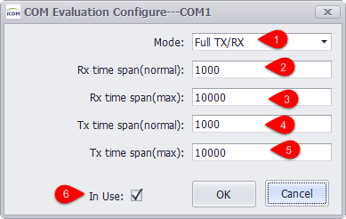
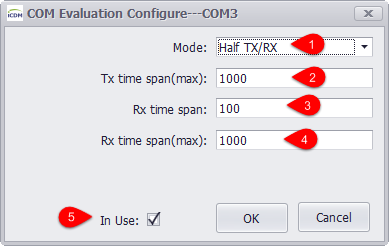
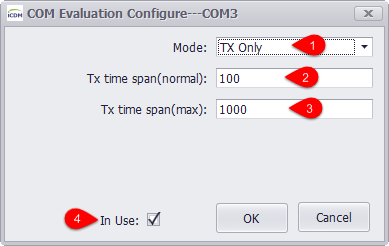
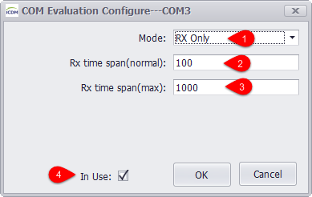
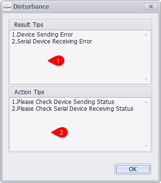
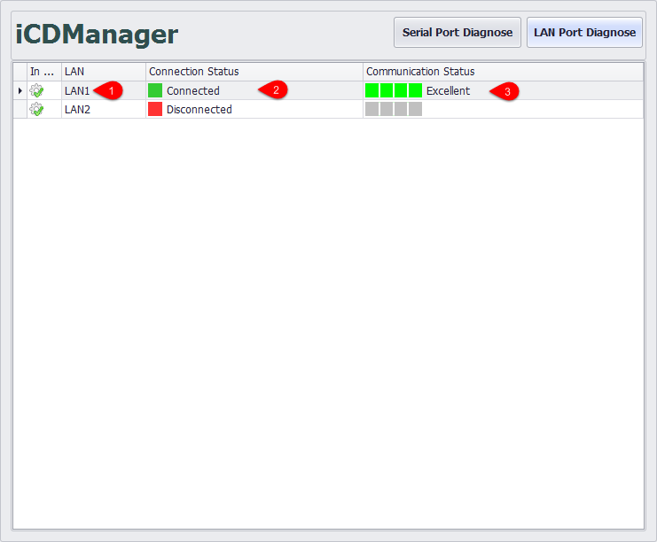

## iCDManager 

iCDManager is a communication monitoring unit which can diagnose both LAN port and serial port. For LAN port, iCDManager will acquire the network status information output by the network card to test its current status; for serial port, iCDManager will acquire the communication signals on physical layer of the serial port to obtain the related information, including its active status and the response time of the data package on serial port.

### Main Interface of iCDManager 

As shown in the figure above, right-click on the device name go to "iCDManager" page.

1. Click "Online" button.

2. Select a device.

3. Right-click on the device name to open "iCDManager" page. 

4. Click "Serial Port Diagnose" button to view the communication status of the serial port. The interface is shown as the above when it is opened for the first time.

5. Click "LAN Port Diagnose" button to view the communication status of the LAN port. Please refer to "Network Monitoring" for its interface.

6. Display the name of the serial port. Double-click it to pop up the parameter configuration window (refer to "Parameter Configurations of Serial Port").

7. Show the monitoring mode (refer to "Parameter Configurations of Serial Port").

8. Show the communication status: "Poor", "Good" and "Excellent" (refer to "Monitoring Status Tips").

### Parameter Configurations of Serial Port 

The time unit here is ms by default.

#####Full tx/rx

The parameters are described as follows:

1. Here the monitoring mode is set to "Full tx/rx" which means full function monitoring mode.

2. The minimum time span for receiving line to monitor the signal level variation. If the actual time span is less than it, the monitoring result will be excellent.

3. The maximum time span for receiving line to monitor the signal level variation. If the actual time span is greater than it, the monitoring result will be poor.

4. The minimum time span for transmitting line to monitor the signal level variation. If the actual time span is less than it, the monitoring result will be excellent.

5. The maximum time span for transmitting line to monitor the signal level variation. If the actual time span is greater than it, the monitoring result will be poor.

6. Choose whether to display the information of this port.

#####Half tx/rx

1. Here the monitoring mode is set to "Half tx/rx" which means heartbeat monitoring mode.

2. The maximum time span for transmitting line to monitor the signal level variation. If the actual time span is greater than it, the monitoring result will be poor; if the actual time span is less than it, the heartbeat packet is sent normally and the response time will be monitored.

3. The minimum time span for receiving line to monitor the signal level variation. If the difference between the transmitting time and the receiving time is less than it, the monitoring result will be excellent.

4. The maximum time span for receiving line to monitor the signal level variation. If the difference between the transmitting time and the receiving time is greater than it, the monitoring result will be poor.

5. Choose whether to display the information of this port.

#####Tx Only

1. Here the monitoring mode is set to "Tx Only" which means only transmitting signals will be monitored. 

2. The minimum time span for transmitting line to monitor the signal level variation. If the actual time span is less than it, the monitoring result will be excellent.

3. The minimum time span for receiving line to monitor the signal level variation. If the actual time span is less than it, the monitoring result will be poor.

4. Choose whether to display the information of this port.

##### Rx Only

1. Here the monitoring mode is set to "Rx Only" which means only receiving signals will be monitored.

2. The minimum time span for receiving line to monitor the signal level variation. If the actual time span is less than it, the monitoring result will be poor.

3. The maximum time span for receiving line to monitor the signal level variation. If the actual time span is greater than it, the monitoring result will be poor.

4. Choose whether to display the information of this port.

### Monitoring Status Tips 

1. Result tips.

2. Action tips.

### Network Monitoring 

1. Network name.

2. Network connection status.

3. Network communication status.

